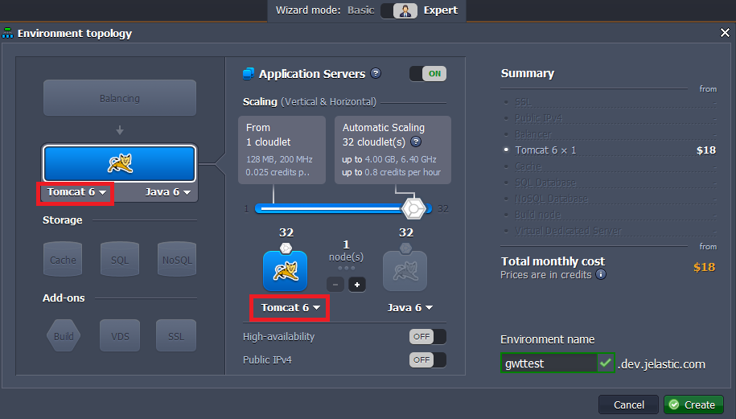
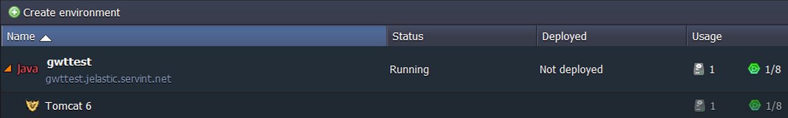
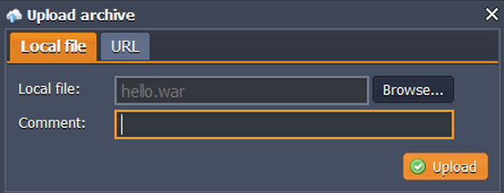
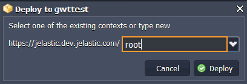
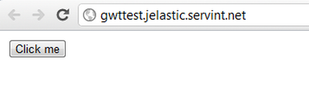

# How to Deploy Google Web Toolkit Applications

**[Google Web Toolkit (GWT)](http://www.gwtproject.org/)** is an open-source set of tools for building and optimizing complex Java applications. GWT is used by many Google products. It's completely free and used by thousands of developers around the world.

Let's deploy the GWT application to the platform and you'll see how easy it is.

## Create an Environment

1\. Log into the platform dashboard.

2\. Click the **Create environment** button at the top left.

3\. Select your application server (for example, **Tomcat**) and specify your environment name, for example, *gwttest*.

In a minute your environment will be created.

## Application Deployment

1\. Create your *GWT* application as you usually do.

2\. Create a **WAR** file in any way you like. To any application, the output of the GWT Compiler is purely static content.

We use simple *GWT hello* application as an example. If you want to deploy this application too, just download **The Google Web Toolkit SDK**, unzip this package and create a ***WAR*** file from the WAR folder contents (e.g. *gwt-2.4.0/samples/Hello/war*).

3\. Upload your Java package to the deployment manager.

4\. Once the package is in the platform, deploy it to the environment you created earlier.

Open your application in a web browser and enjoy!

## What's next?

* [Tutorials by Category](/tutorials-by-category/)
* [Java Tutorials](/java-tutorials/)
* [Setting Up Environment](/setting-up-environment/)