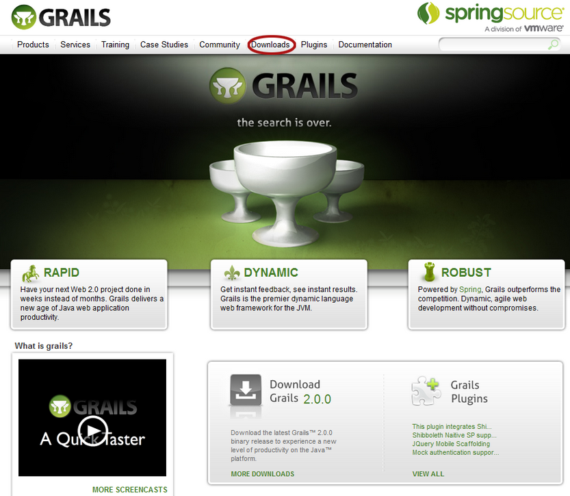
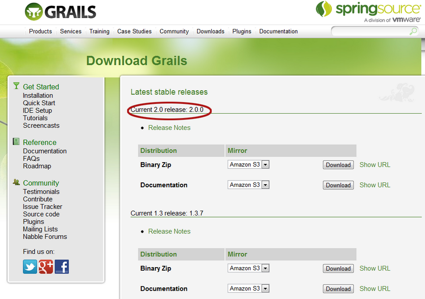
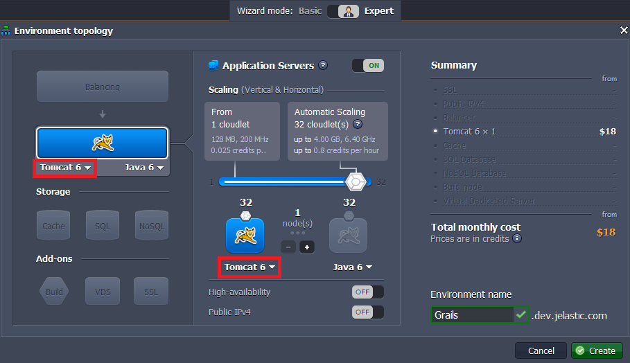
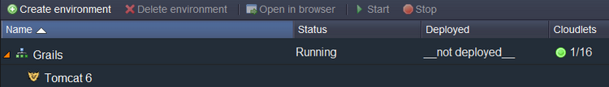
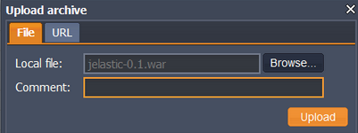
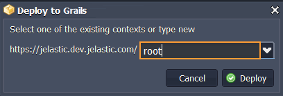
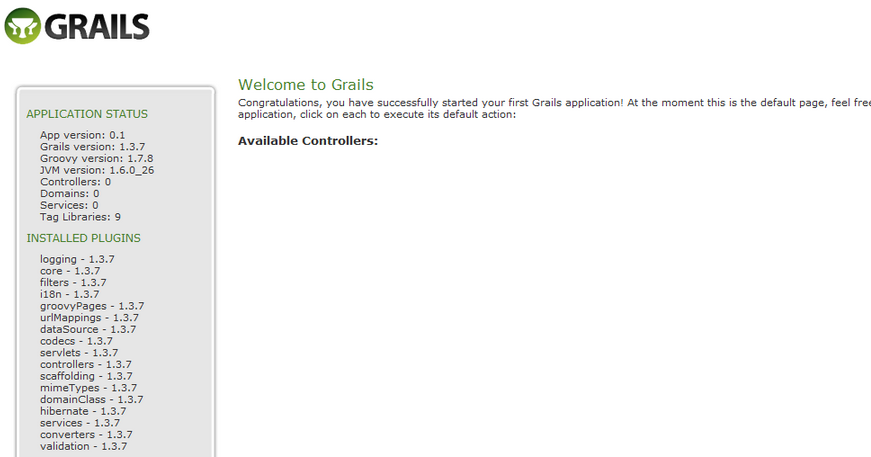

# How to Deploy Grails

**[Grails](https://grails.org/)** is an innovative, high-productivity framework that follows the principle of "Convention over Configuration", making it quite popular. It provides a stand-alone development environment while  maintaining a simplicity that allows the developer to  focus on what really matters: creating high quality, easy to use applications that users love. Grails supplients Java application development quite easily because it is built on [Spring](https://spring.io/) and based on [Groovy](https://groovy-lang.org/).

Get all the benefits of Grails with the PaaS!


## Create the Application

1\. Go to [grails.org](https://grails.org/) and download the lastest version of **Grails**.





2\. Unzip the package you have just downloaded.

3\. Add the environment variables (this step is optional):
    
* **GRAILS_HOME** (...\grails-2.0.0) specifies to the path where you extracted the archive;
* **PATH** (...\grails-2.0.0\bin) contains the path to the **bin** directory.

4\. Create your app using the command line.

**With environment variables** (C:\grails on Windows, ~/grails on Linux):  
```
...\grails-1.3.7 grails create-app {app_name}
```

**Without environment variables**:
```
...\grails-1.3.7\bin\grails create-app {app_name}
```

{}**Note:** Application will be created in the **C:\grails-1.3.7\bin\5** directory.{}

5\. Create ***.war*** archive with just one command:

**With environment variables** (C:\grails on Windows, ~/grails on Linux):
```
...\grails-1.3.7\{app_name} grails war {app_name}.war
```

**Without environment variables** (C:\grails on Windows, ~/grails on Linux):
```
...\grails-1.3.7\bin\{app_name}
...\grails-1.3.7\bin\grails war {app_name}.war
```

WAR archive will be saved at **C:\grails-1.3.7\bin\{app_name}\\**.


## Create the Environment

1\. Log into the platform dashboard.

2\. Create a new environment.


3\. In the **Environment topology** dialog pick your application server (e.g. [Tomcat](/tomcat/)) and type your environment name, for example, *grails*, then click on **Create** button.



It will take just a minute for your environment to be created.




## Upload the Java Package

1\. Upload your WAR file to the **Deployment manager**.



2\. Once the package uploaded to the platform, deploy it to your environment.



That's it. Launch your application and enjoy!




## What's next?

* [Tutorials by Category](/tutorials-by-category/)
* [Java Tutorials](/java-tutorials/)
* [Setting Up Environment](/setting-up-environment/)