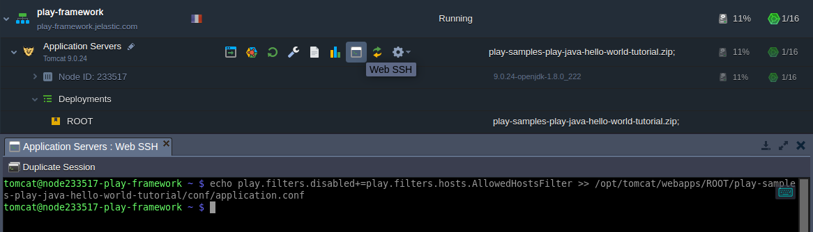

# Play Framework for Web Application Development

**[Play](https://www.playframework.com/)** is one of the most popular frameworks powered by Java, which integrates components and APIs for modern web application development.

In this tutorial, you'll see how to deploy **Play** at the platform without any code changes.

1\. ***Java 8*** is required for using the Play framework, so let's [create](/setting-up-environment/) a suitable environment. For example, we'll use the *Oracle OpenJDK 8.0.22* version of the **Tomcat** application server.


2\. Once the environment is ready, you can [deploy](/deployment-guide/) your Play application. We are using the following *Hello World* package as a sample:

[https://example.lightbend.com/v1/download/play-samples-play-java-hello-world-tutorial](https://example.lightbend.com/v1/download/play-samples-play-java-hello-world-tutorial)


{}**Note:** The provided package includes the ***sbt*** build tool, which is used to work with Play. If your project does not include this or a similar one, you'll need to install it manually. For example, follow the steps from the official [Play requirements](https://www.playframework.com/documentation/2.7.x/Requirements) page.{}

3\. Our application works on the *9000* port, so it should be opened via the [container firewall](/custom-firewall/). Add a new inbound rule similar to the image below.


4\. Now, you should allow access to your application's *9000* port from outside the platform (i.e. via [SLB](/shared-load-balancer/)) by adding an [endpoint](/endpoints/).

{}**Note:** This step should be skipped if your application is working over [public IP](/public-ip/).{}


5\. Next, let's access application via SSH (e.g. [Web SSH](/web-ssh-client/)) to manage it. Use the following command to disable default [Play filter](https://www.playframework.com/documentation/2.7.x/Filters) for allowed hosts:

```bash
echo play.filters.disabled+=play.filters.hosts.AllowedHostsFilter >> /opt/tomcat/webapps/ROOT/play-samples-play-java-hello-world-tutorial/conf/application.conf
```



6\. Execute the next two commands sequentially to move into the application's directory and run it.

```bash
cd /opt/tomcat/webapps/ROOT/play-samples-play-java-hello-world-tutorial/
bash ./sbt-dist/bin/sbt run
```


7\. Now, you can access your application in the browser using the *Access URL* of the endpoint you've created earlier.


In our case, the following page should be displayed:


That's it! Your Play application is up and running, try the platform for yourself with a [two-weeks trial](https://www.virtuozzo.com/application-platform-partners/) at one of our partners.


## What's next?

* [Play on Docker & VPS](https://www.virtuozzo.com/company/blog/play-framework-for-java-and-scala-apps-in-the-cloud/)
* [Java Tutorials](/java-tutorials/)
* [Tutorials by Category](/tutorials-by-category/)