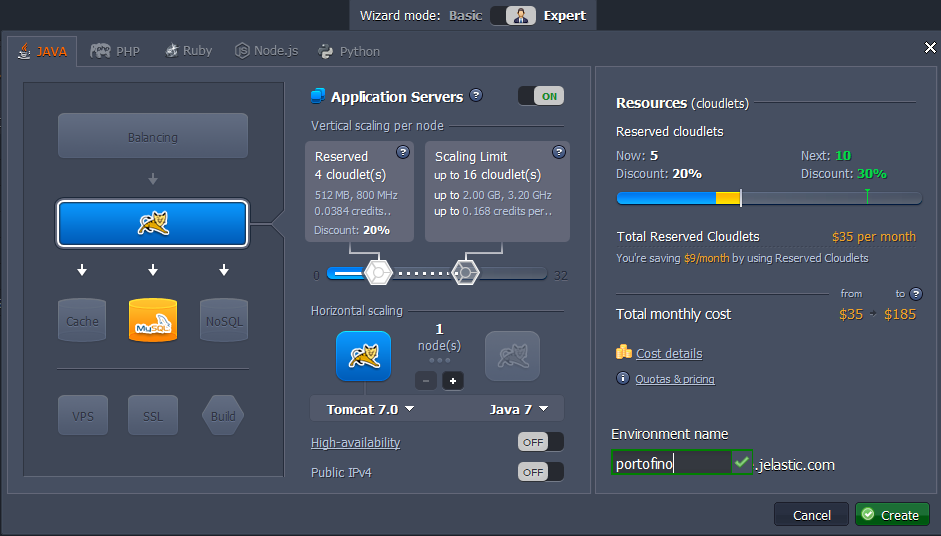
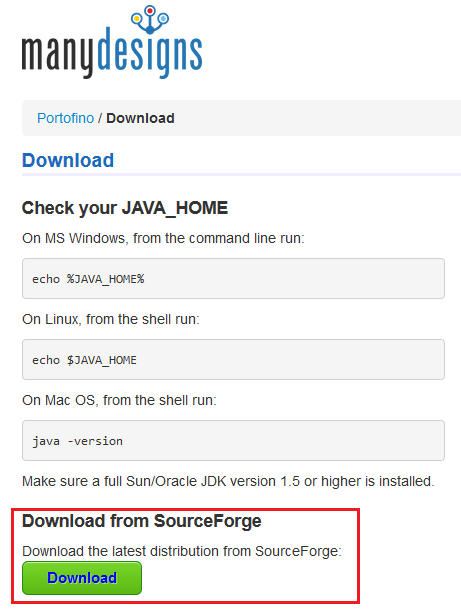
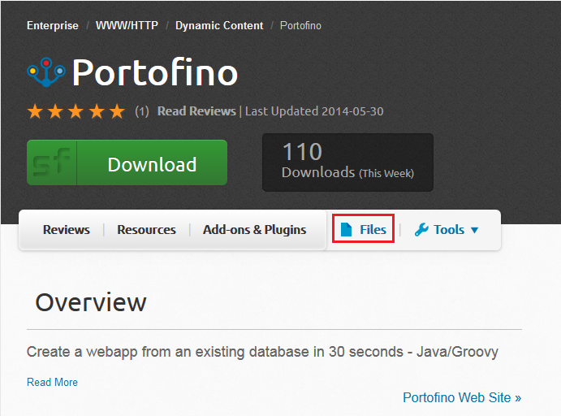
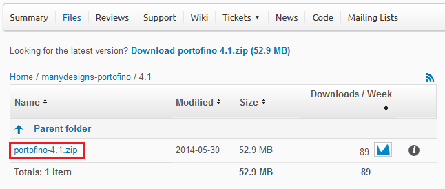
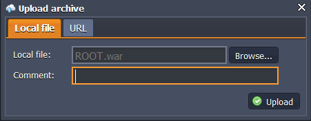
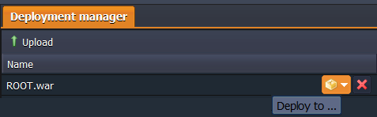
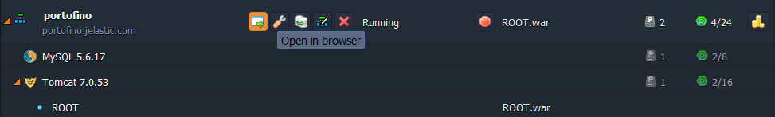
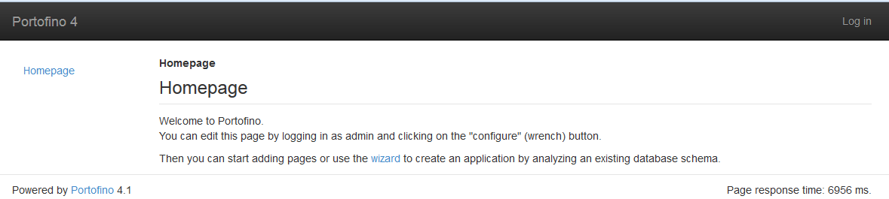

# How to Install Portofino

**Portofino** is an open source web framework, which helps developers to create the outstanding enterprise applications. It was designed to comply with the following widely-spread requirements:

* *productivity*: Portofino gives results quickly (using its wizard you can create webapp just in a 30 seconds!) and allows developers to stay productive during the whole cycle of project implementation.
* *features*: Portofino package includes the set of features for common enterprise needs, that users will appreciate.
* *architecture*: Portofino has a well layered, flexible, and secure architecture, which is simple to understand.

So, let's find out how to get the Portofino application hosted with the help of the platform.

## Create Environment

1\. Log in to the platform and click **Create environment** button in the upper left corner of the dashboard.

2\. Choose **Tomcat** and **MySQL** instances at the **Java** tab. Name your environment (e.g. *portofino*), define the required amount of resources within cloudlets sliders, and click **Create** button.

3\. Wait just a minute for your environment to be created.

## Upload and Deploy Application

1\. Navigate to the [Portofino website](https://portofino.manydesigns.com/en#download) and click **Download** button in order to get the application package.

2\. After you were automatically redirected to the SourceForge site, navigate to the **Files** section.

3\. Open the ***manydesigns-portofino*** directory and select a folder with the latest Portofino version. Download the archive (named **portofino-x.x.zip**) it contains.

4\. Unzip the archive you've just downloaded.

5\. Go to your platform dashboard and click **Upload** button at the **Deployment Manager** tab. In the opened frame browse to the **ROOT.war** file, located in the *portofino-x.x/apache-tomcat-7.0.54/webapps/* folder of the extracted archive, and click **Upload**.

6\. Then press **Deploy to** icon next to the Portofino ***.war*** file, choose the environment you've created before, and confirm the deployment in the opened window.

7\. Once the deployment is successfully finished, launch the application by means of pressing **Open in browser** button next to your environment.

Congrats! For now you can start working with your own Portofino web framework, easily hosted within the platform.

Enjoy!

## What's next?

* [Tutorials by Category](/tutorials-by-category/)
* [Java Tutorials](/java-tutorials/)
* [Setting Up Environment](/setting-up-environment/)