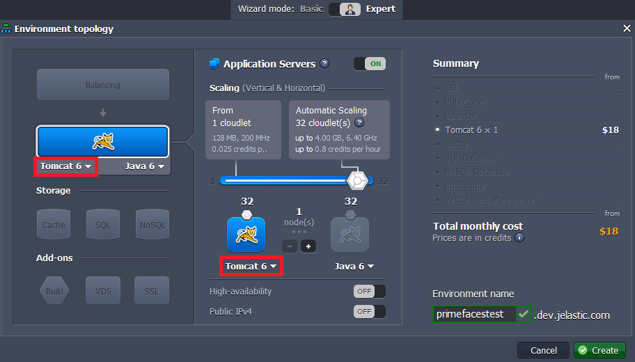
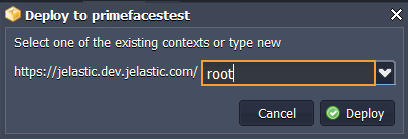
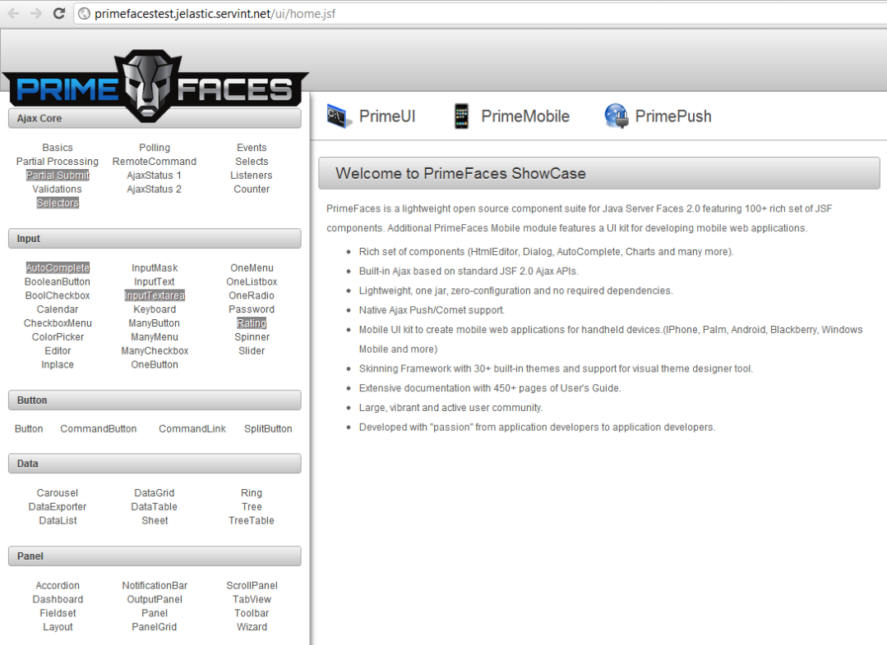

# How to Deploy PrimeFaces Applications

**[PrimeFaces](https://www.primefaces.org/)** is one of the most popular UI frameworks in Java Ecosystem.

Let's deploy PrimeFaces application to the platform and you'll see how easy it is!

## Create Environment

1\. Log into the platform dashboard.

2\. Click the **Create environment** button at the top left.

3\. In the **Environment Topology** dialog, pick your application server (for example, **Tomcat**). Then type your environment name, for example, *primefacestest*.

Wait just a minute for your environment to be created.

## Upload Java Package

1\. Upload your **war** file to the **Deployment manager** (we use *[prime-showcase-1.0.0-SNAPSHOT.war](http://repository.primefaces.org/org/primefaces/prime-showcase/1.0.0-SNAPSHOT/prime-showcase-1.0.0-SNAPSHOT.war)* as an example).

 
2\. Once the package is in the platform, deploy it to the environment you have created earlier.

## Start Application

That's all you have to do! Now you can launch your application in a web browser and enjoy.

## What's next?

* [Tutorials by Category](/tutorials-by-category/)
* [Java Tutorials](/java-tutorials/)
* [Setting Up Environment](/setting-up-environment/)