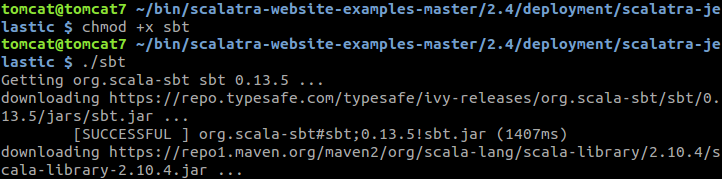

# How to Host Scala App with Scalatra

{}{}

**[Scalatra](https://scalatra.org/)** is a tiny open-source web micro-framework, written in Scala. It's most appropriate for construction of RESTful APIs, building high-performance web sites and mobile applications. Being extremely quick and simple, this framework could be considered as one of the best choices for beginners to learn Scala. At the same time, Scalatra is powerful enough to accomplish almost any widely required task thanks to the attachable libraries, which can greatly expand this tool's basic possibilities.

So, let's learn how to create and deploy an application into the platform with the help of Scalatra.


## Environment Creation

1\. To start with, log in to your PaaS account and click the **New environment** button in the upper left corner of the dashboard.


2\. In the opened environment wizard, choose the **Tomcat** application server within the ***Java*** tab. Define the required amount of resources using the *Vertical scaling* section, select the preferred [environment region](/environment-regions/) and name your environment (e.g. *scalatra*).


After all the rest of parameters are configured (if needed), click on the **Create** button at the bottom right corner of the frame.

3\. Wait a minute for your environment to be created.


## Installing Required Utilities

For the further operations to be performed, you need to access your account via the [SSH Gateway](/ssh-gate/), select the appropriate environment (*scalatra* in our case) and enter your *Tomcat* container.


{}**Tip:** In case you haven't performed similar operations before, you need to:

* [generate](/ssh-generate-key/) an SSH keypair
* [add your public SSH key](/ssh-add-key/) to the dashboard
* [establish the connection](/ssh-access/) over SSH protocol{}

1\. First of all, after connecting to the shell, add path to the Tomcat */bin* folder to the corresponding variable for the comprised scripts to be easily executable:

```bash
PATH=$PATH:/opt/tomcat/temp/bin
export PATH
source ~/.bash_profile
```


2\. Now let's install a few necessary utilities:

* [Conscript](https://github.com/n8han/conscript) represents a plugin, required for building and updating Scala code. Execute the following command in order to download and install it:

```bash
curl https://raw.githubusercontent.com/n8han/conscript/master/setup.sh | sh
```


* [giter8](https://github.com/foundweekends/giter8) is a tool, intended for generating the required project structure (i.e. the hierarchy of directories and files inside) based on project template, fetched from the appropriate Git repo. Get it downloaded using the previously installed Conscript utility:

```bash
cs n8han/giter8
```


3\. Once these processes are completed, navigate to the **bin** folder and download the *sbt-launch* java-archive. It will install the *sbt* build tool, which represents an interactive shell for the scala-based applications' building:

```bash
cd bin
wget https://repo.typesafe.com/typesafe/ivy-releases/org.scala-sbt/sbt-launch/0.13.8/sbt-launch.jar
```


4\. Now create a new *sbt* file here (using, for example, the ***vim sbt*** command) and paste the following lines to it:

```
#!/bin/bash
SBT_OPTS="-Xms512M -Xmx1536M -Xss1M -XX:+CMSClassUnloadingEnabled -XX:MaxPermSize=256M" java $SBT_OPTS -jar \`dirname $0\`/sbt-launch.jar "$@"
```


When everything is done, don't forget to save the changes with typing ***:wq***.

5\. The next steps are to set the just added script to be executable by the current user with the *chmod* command, download and unpack an archive with an example app, and remove its zipped version for not occupying the extra disk space:

```bash
chmod u+x sbt
wget https://github.com/scalatra/scalatra-website-examples/archive/master.zip; unzip master.zip; rm master.zip
```


6\. Then, switch to the folder with the platform-dedicated project example and open the comprised ***build.sbt*** file (which represents a special deployment plugin) for editing:

```bash
cd scalatra-website-examples-master/2.4/deployment/scalatra-jelastic
vim build.sbt
```


7\. While inside, substitute the ***JelasticKeys.apiHoster*** parameter's value with your hosting service provider's domain (e.g. *app.jelastic.com*) and specify your environment's name within the ***JelasticKeys.deploy*** parameter (*scalatra* in our case).


Save the changes and quit from the *vim* editor with the ***:wq*** command.

{}**Note:** You need to additionally export your platform login and password to the current user's profile, as these variables will be required during the further scripts' running. So, execute the following lines:

```bash
export JELASTIC_USERNAME="{platform_login}"
export JELASTIC_PWD="{platform_password}"
source ~/.bash_profile
```
where:

* ***{platform_login}*** - an email address you use to access the platform dashboard
* ***{platform_password}*** - the corresponding account password

{}


## Build and Deploy Application

Now, as everything is configured, you can proceed to the actual deployment of your project just from the interactive shell.

1\. For that, set ***sbt*** file to be executable (by means of the *chmod* command as shown below) and then call this tool to be started:

```bash
chmod +x sbt
./sbt
```



On the first run, all the required dependencies are to be downloaded, so be patient - it may take some time.

2\. Now you can make your project to be built and deployed directly to the platform through simply typing the next command inside the shell:

```bash
deploy
```


Through the output, you can track how the project and its libraries are uploading to the platform dashboard and deploying to the earlier specified environment.


When everything is done, you'll be shown the corresponding **success** message with the process duration specified.

3\. Now, enter the platform dashboard (or refresh the page if you have it already opened) and click **Open in Browser** for your environment to see what we've got:


Great! As a result, you've just deployed your first example Scalatra app into the platform.


It was pretty simple, wasn't it? So, for now you can have fun and learn Scalatra further to create your own stunning apps and get them hosted directly in the Cloud within a few commands!


## What's next?

* [Tutorials by Category](/tutorials-by-category/)
* [Java Tutorials](/java-tutorials/)
* [Setting Up Environment](/setting-up-environment/)