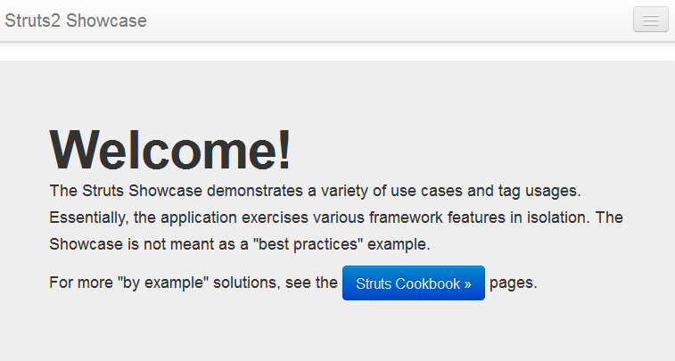

# Web Applications in the Cloud with Struts

The **Struts** framework is designed to help developers create web applications that utilize a MVC (Model-View-Controller) architecture. It  is a free open-source solution for creating Java web applications.

Struts provides three key components:

* A *"request" handler* provided by the application developer that is mapped to a standard URI.
* A *"response" handler* that transfers control to another resource which completes the response.
* A *tag library* that helps developers create interactive form-based applications with server pages.

Wondering how to get all these benefits in the cloud? It's easy! Just follow the next steps.

## Create Environment

1\. Log into the platform dashboard.

2\. Click the **Create environment** button:

3\. In the **Environment topology** window, select **Tomcat** as your application server, set the Cloudlets limit, type your environment name, for example, *struts*, and click **Create**.

In a minute your environment will be created and will appear in the environments list.

## Upload Java Package

1\. You can download some examples for testing [here](http://struts.apache.org/download.cgi#struts2341). Just execute the downloaded ZIP and choose the necessary ***.war*** file.

2\. Upload your war package to the **Deployment manager** (we use *struts2-showcase.war* as an example).

3\. Once the upload process is finished, deploy a **WAR** archive to the environment you have just created: specify the context name, for example *struts*, and click on the **Deploy** button.

If you use the same app for testing don't deploy it to the *ROOT* context (otherwise you will get configuration errors later on).

4\. After the deployment is successfully finished, launch the application in a web browser.

As you can see, now your application is up and running!

## What's next?

* [Tutorials by Category](/tutorials-by-category/)
* [Java Tutorials](/java-tutorials/)
* [Setting Up Environment](/setting-up-environment/)