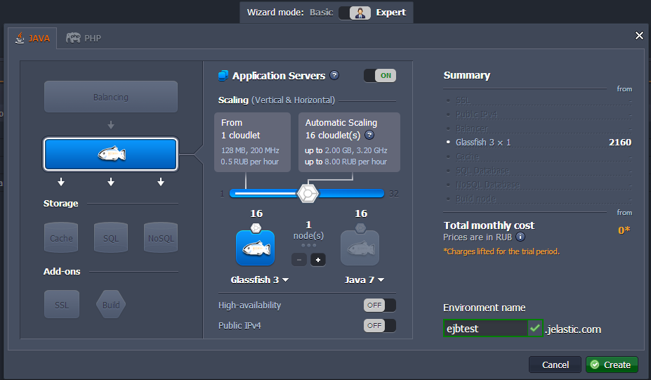
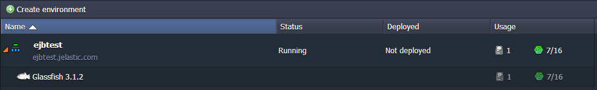
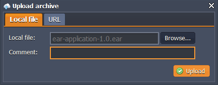
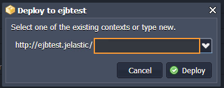
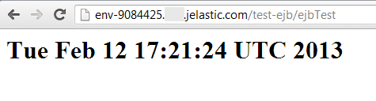

# How to Deploy EJB to the PaaS

This instruction shows you how easy it is to deploy your **Enterprise JavaBeans (EJB)** applications to the platform. You don't have to change a single line of code or custom configuration.

It's just a few simple steps.

## Create Environment

1\. Log into the platform dashboard.

2\. Click the **Create environment** button:

3\. In the **Environment topology** window, select **GlassFish** as your application server, set the cloudlets limit, type your environment name, for example, *ejbtest*, and click **Create**.

In a minute your environment will be created and will appear in the environments list.

## Upload Java Package

1\. Upload your **EAR** archive to the **Deployment manager**.

2\. Deploy it to the environment you have created earlier.

Now you can open your application in a web browser and enjoy!

## What's next?

* [Tutorials by Category](/tutorials-by-category/)
* [Java Tutorials](/java-tutorials/)
* [Setting Up Environment](/setting-up-environment/)