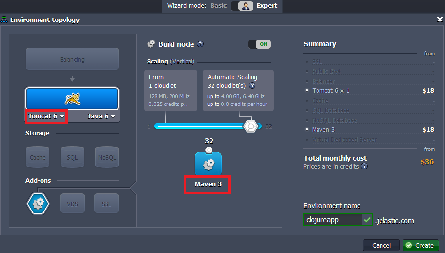
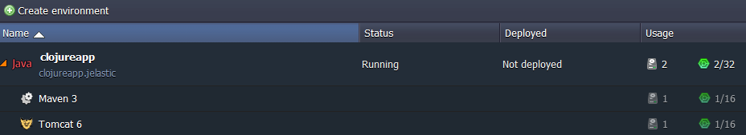
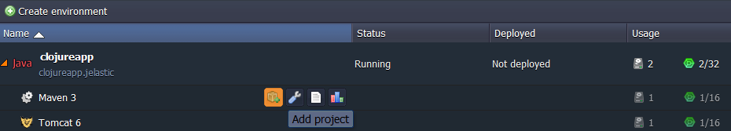
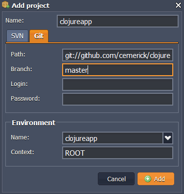
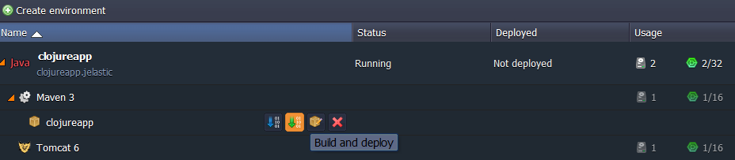
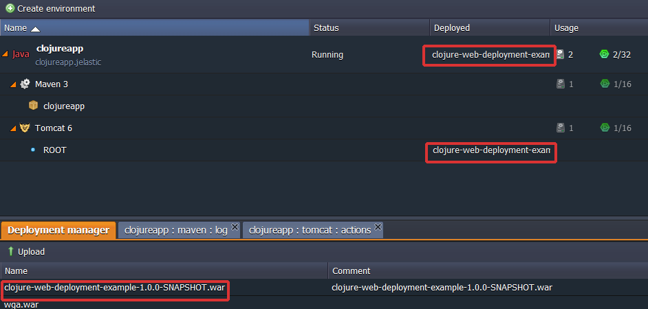
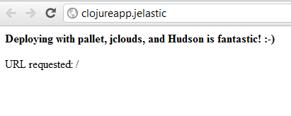

# Deploying Clojure Applications to the PaaS

**[Clojure](https://clojure.org/)** is a rather recently developed language, a dialect of **Lisp** targeted for the **JVM**. Every feature supported by Clojure is supported at runtime. It also provides easy access to the Java frameworks, with optional type hints and type inference, to ensure that calls to Java can avoid reflection. With the platform, you can take advantage of all the benefits of coding with Clojure without the limitations placed on you with other platforms.

The instruction below show you how to deploy Clojure applications to the platform using the [Maven build node](/java-vcs-deployment/). It's super easy and you can be up and running in no time.

## Create the Environment

1\. Log into the platform dashboard.

2\. Click the **Create environment** button:

3\. In the **Environment topology** dialog which opens, pick **[Tomcat](/tomcat/)** as your application server and **Maven** as your building tool, type your environment name, for example, *clojureapp* and click **Create**.

In just a minute the environment with both **Tomcat** and **Maven** will be created.

## Build and Deploy the Project

1\. Click on **Add project** button for Maven.

2\. In the dialog, navigate to the **Git** tab (or SVN). Specify your project **Name**, **Path** to your project, **Branch, Login** and **Password** of your repository, name of your **Environment**, **Context** in which you will deploy your project, and click **Add**.

We'll use a simple [Clojure application](https://github.com/cemerick/clojure-web-deploy-conj) as an example.

Now your project is successfully added.

3\. Click on the **Build and deploy** button for your project.

This process will take a few minutes. Your project will appear in the context that you have specified and in the **Deployment Manager**.

That's all you have to do! Now you can open your **Clojure** application in a web browser and enjoy.

## What's next?

* [Tutorials by Category](/tutorials-by-category/)
* [Java Tutorials](/java-tutorials/)
* [Setting Up Environment](/setting-up-environment/)