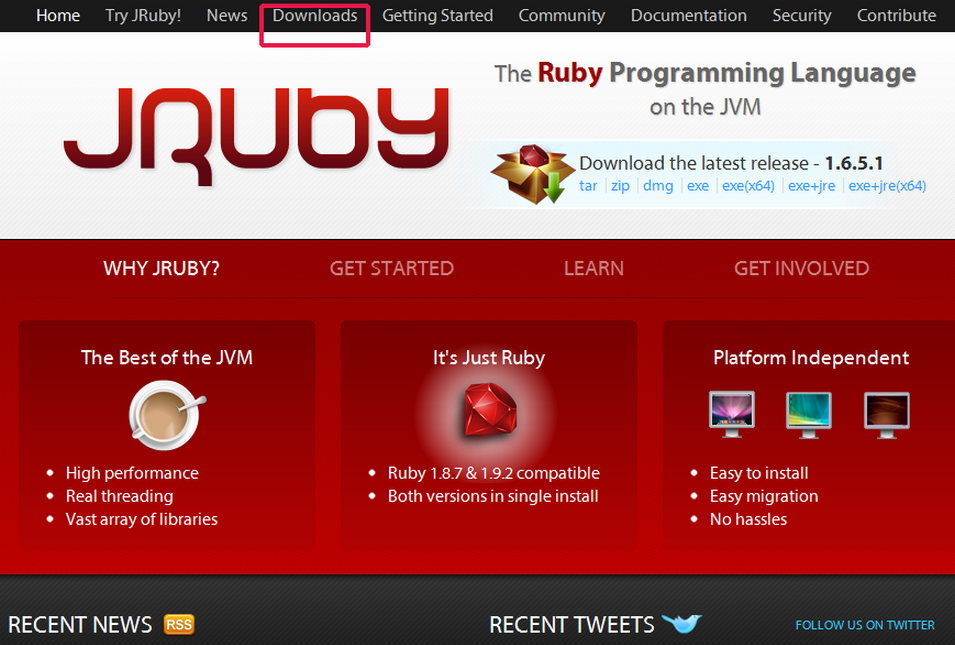
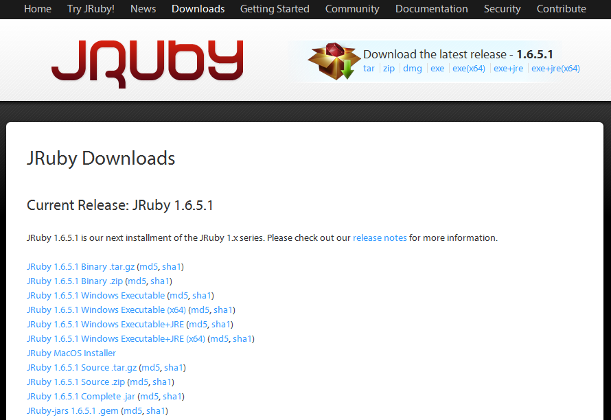
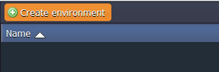
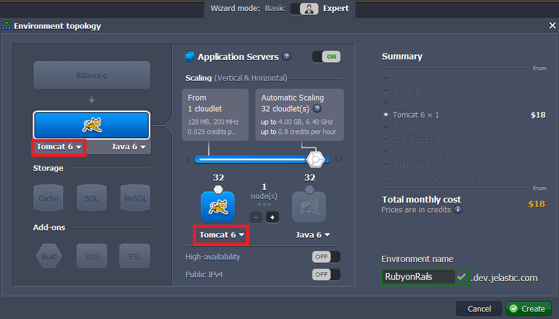
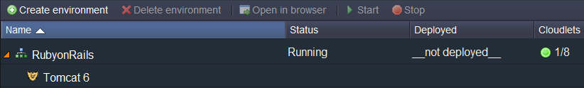
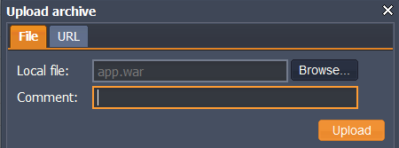
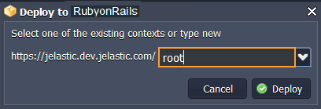
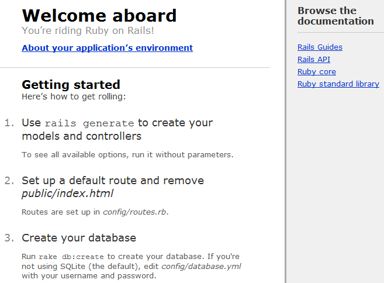

# How to Deploy JRuby

**[JRuby](https://www.jruby.org/)** is a Java implementation of the [Ruby](https://www.ruby-lang.org/en/) programming language. It allows embedding of the interpreter into any Java application with full, two-way access between the Java and the Ruby code. So, if you are a Ruby developer and you would like to deploy your application to the cloud, the PaaS is the best way. It's easy and fast.

To see how easy it is just follow the next steps:


## Create Application

1\. First of all you have to install JVM for your OS.

2\. Navigate to [jruby.org](https://www.jruby.org/) and download the latest JRuby release (the platform supports JVM-based languages). Don't worry: it is Ruby for the JVM and and there won't be any problems.





3\. Extract the files from the zip package you have just downloaded.

4\. Install [Rails](https://rubyonrails.org/), an open-source web framework that lets you write "beautiful code by favoring convention over configuration". It's pretty easy, just type the following strings at command line:

```
c:\cd jruby-1.6.5.1
c:\ jruby-1.6.5.1>cd bin
c:\ jruby-1.6.5.1\ bin>gem install rails
```

**Gem** is the command-line interface for **RubyGems**, the standard Ruby package manager. Using **RubyGems** you can install **Rails** and its dependencies through the command line.

5\. Install **warbler**, which allows to make jar and war files out of application.

```
c:\jruby-1.6.5.1\bin>gem install warbler
```

6\. Create a new project in **rails_projects**, for example *app*:

```
c:\rails_projects>rails new app
```

7\. Create your .WAR file with just one command *warble*:

```
c: rails_projects\app>warble
```


## Create Environment

1\. Log into the platform dashboard.

2\. Create a [new environment](/setting-up-environment/).



3\. In the **Environment topology** window select your application server (e.g. Tomcat 6) and type your environment name, for example, *RubyonRails*, then click on **Create** button.



4\. In a minute your environment with [Tomcat](/tomcat/) will be successfully created.




## Upload Java Package

1\. Upload your WAR file to the **[Deployment manager](/deployment-manager/)**.



2\. Once the package is in the dashboard, deploy it to the environment you have just created.



3\. Finally, you can open you app in a browser and enjoy!




## What's next?

* [Tutorials by Category](/tutorials-by-category/)
* [Java Tutorials](/java-tutorials/)
* [Setting Up Environment](/setting-up-environment/)