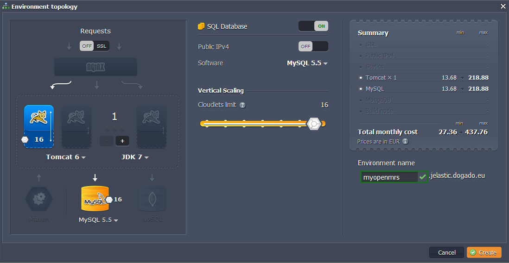
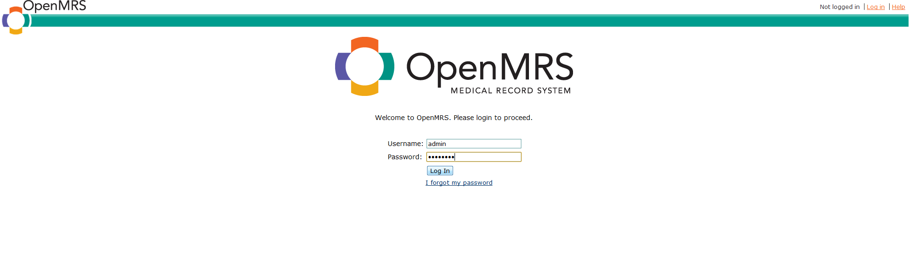

# Health IT in the Cloud: How to Deploy OpenMRS

This instruction shows you how to deploy one of the most popular web-based electronic medical records **[OpenMRS](https://openmrs.org/)** to the platform. Actually OpenMRS is both software and a community. They have come together to specifically respond to those actively building and managing health systems in the developing world, where AIDS, tuberculosis, and malaria afflict the lives of millions of people.

So let's deploy **OpenMRS** to the cloud right now!


## Create Environment

1\. Log into the platform dashboard.

2\. Click the **Create environment** button:


3\. Choose the instances you want to use (for example, **Tomcat** application server and **MySQL** database), set the cloudlets limit and type the name of the environment. Then click **Create**.



In a minute your environment will be created.


## Upload Java Package

1\. Go to [OpenMRS web-site](https://openmrs.org/) and copy the **OpenMRS Enterprise WAR Package** URL address.


2\. Switch back to the platform dashboard and upload Java **WAR** package using the URL you have just copied.


3\. Once the package is in the platform, deploy it to the environment you have just created.


{}**Note:** Do not deploy OpenMRS to the *ROOT* context (otherwise you will get configuration errors later on!).{}


## Configure Database

1\. Click **Open in Browser** button for **MySQL**.

2\. While you were creating the environment, the platform sent you the email with credentials to the database. Create an account and the database with the application using these credentials.


## Configure OpenMRS

1\. Click **Config** button for Tomcat and upload **MySQL connector** to the **lib** folder.


2\. Create ***-runtime.properties*** file in the **.OpenMRS** folder (*home* directory) and specify database connection properties there.

```properties
# OpenMRS Runtime Properties file
#
# (comments starting with a pound sign "#" are ignored)
### Database connection properties
### Database connection properties
connection.username=root
connection.password=password
connection.url=jdbc:mysql://mysql-myopenmrs.jelastic.dogado.eu/openmrs?autoReconnect=true
# Allow/Disallow uploading of a module via the web
module.allow_web_admin=false
# If set to true, all patients will be names will be displayed as below
obscure_patients=false
obscure_patients.given_name=John
obscure_patients.middle_name=P.
obscure_patients.family_name=Smith
### Debugging options
hibernate.show_sql=false
###Customization Options
## If the custom setting is a folder, only files contained in the customization will be overwritten
#custom.images.dir={APPDATA}**/OpenMRS/custom/images
#custom.template.dir={APPDATA}**/OpenMRS/custom/template
#custom.style.css.file={APPDATA}**/OpenMRS/custom/style.css
#custom.index.jsp.file={APPDATA}**/OpenMRS/custom/index.jsp
#custom.messages={APPDATA}**/OpenMRS/custom/messages.properties
#custom.messages_fr={APPDATA}**/OpenMRS/custom/messages_fr.properties
### Other
## Set the directory that OpenMRS uses for its application data
## Will be used as base dir for modules, generated reports, etc
## Defaults to C:/Docs&Settings/username/Application Data/OpenMRS for windows
## Defaults to ~/.OpenMRS for *nix
## (As of build 1.2.0.3426)
# application_data_directory=/opt/openmrs
### The following properties are deprecated as of 1.0.43
### Properties can be modified in the Global Properties section of the webapp
###
###formentry.infopath.output_dir={APPDATA}**/OpenMRS/FormEntry/forms
###formentry.starter_xsn_folder_path=C:/Program Files/Apache Group/Tomcat/webapps/openmrs/formentry/forms/starter
###formentry.infopath.server_url=http://localhost:8080/openmrs
###formentry.infopath.initial_url=http://localhost:8080/openmrs/formTaskpane.htm
###formentry.infopath.taskpane_caption=Welcome!
###scheduler.username=admin
###scheduler.password=test
```
    


3\. **Save** the changes and **restart** Tomcat.


## OpenMRS Installation

1\. When the deployment is successfully finished, launch the application in web browser. You'll see **OpenMRS** setup wizard. Select the language and proceed to the next step.


2\. Choose the **Advanced** type of installation.


3\. Specify how to connect to your currently installed database server and the name of the database you have created earlier.


4\. Ask **OpenMRS** to create the tables for your current database and specify the log in user name and password for your database user.


5\. If you want to be able to upload modules from the web interface and updates to the database to be automatically applied on startup when a new web application is deployed, pick **Yes**.


6\. Currently the default administrator user/pass is **admin:test**. Specify a new password for that user.


7\. Step 5 is optional. You can skip it or fill in all the fields if you wish.

8\. When all required input has been collected and is ready to be processed, click the finish button to create tables, data, etc.

9\. In a several minutes installation will be completed and you will be taken to the **OpenMRS** main screen. Now you can login and start using it.



Here is also a video version of OpenMRS deployment process:

<iframe src="https://www.youtube.com/embed/ldo9sDlPc20" allowfullscreen="" frameborder="0" height="349" width="560"></iframe>

Enjoy!


## What's next?

* [Tutorials by Category](/tutorials-by-category/)
* [Java Tutorials](/java-tutorials/)
* [Setting Up Environment](/setting-up-environment/)