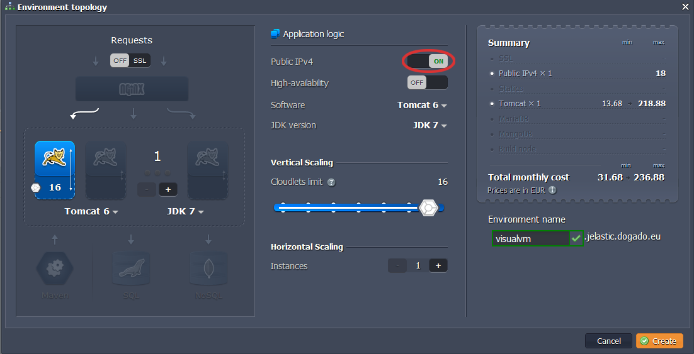
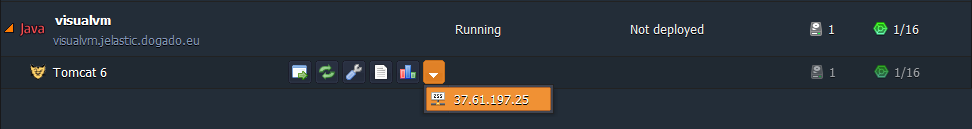
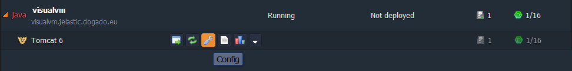
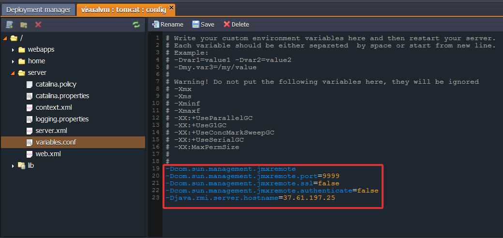
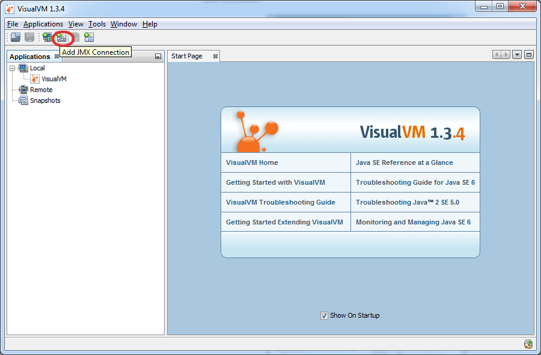
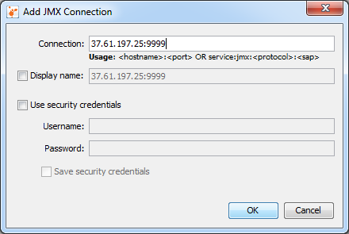
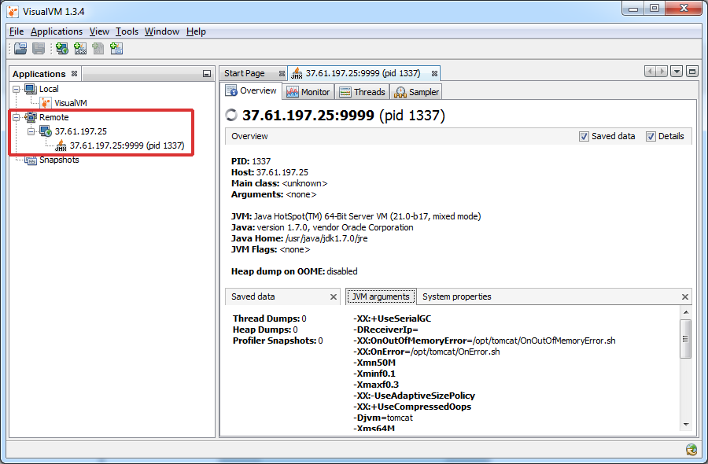
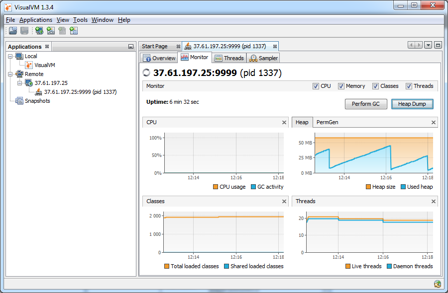
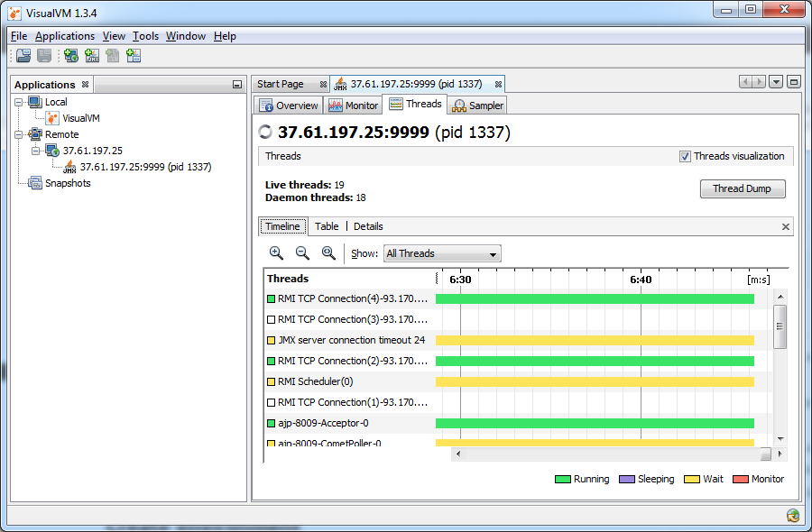
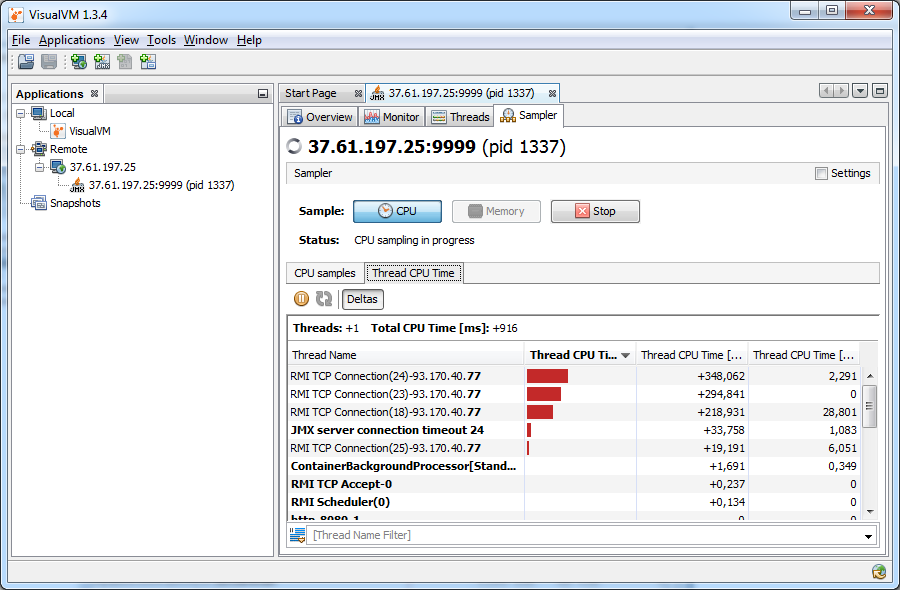

# Remote Monitoring with JMX Tools: VisualVM

With Public IP addresses available in the platform, you can use **[JMX](https://www.oracle.com/java/technologies/javase/javamanagement.html)** (Java Management Extension) tools to monitor your applications. It's pretty easy.

In this quick tutorial, we'll show you how to use JMX tools through the **[VisualVM](https://visualvm.github.io/)** tool, which integrates several commandline JDK tools and lightweight profiling capabilities. It enhances the capability of monitoring and performance analysis for the Java SE platform. This great tool is commonly used by application developers for monitoring, profile, taking thread dumps and browsing heap dumps. System administrators use it very often for monitoring and control of Java apps across the entire network. Even Java application users can create bug reports containing all the necessary information with VisualVM.

So, you have to go through the steps below to start **VisualVM** monitoring of your application in the PaaS:

1\. Log into the platform dashboard.

2\. Click the **Create environment** button:


3\. In the **Environment Topology** dialog,  pick your application server (for example, **Tomcat**), switch on **Public IPv4** for your server and type your environment name, for example, *visualvm*.



Wait just a minute for your environment to be created. You can see your **public IP** in the dropdown list for Tomcat.



4\. Click on **config** button for Tomcat.



5\. Navigate to **variables.conf** file (**server** directory) and set the following system properties:

```conf
-Dcom.sun.management.jmxremote  
-Dcom.sun.management.jmxremote.port={your_port_number}  
-Dcom.sun.management.jmxremote.ssl=false  
-Dcom.sun.management.jmxremote.authenticate=false  
-Djava.rmi.server.hostname={your_server_public_ip}
```



**Save** the changes and **Restart** Tomcat.

6\. If you have **Sun JDK 6** or **7** installed on your computer, run **VisualVM** (*.../jdk/jre/bin/visualvm*). Also you can download and install VisualVM separately. Then add a new **JMX connection** (enter Tomcat's public IP address and the port number that you have specified in **variables.conf**).





In a few seconds your connection will be established and your application will appear in the list with remote connections. Also you'll see short overview of your server, including server data, JVM arguments and system properties.



7\. Navigate to the **Monitor** tab to follow the high-level statistics. Here are the reports with charts which demonstrate CPU utilization including GC (garbage collection) activity, memory state and number of uploaded classes and created threads.



8\. If you switch to the **Threads** tab you can monitor detailed stats on all your threads. There are several views of this statistic report: timeline, table and details.



9\. **Sampler** has two modes: CPU and Memory. The first one profiles methods according to the spent time, the second profiles them according to the created and removed objects.



Also here is a video version of the same procedure:

<iframe src="https://www.youtube.com/embed/-6xayuqHGhM" allowfullscreen="" frameborder="0" height="349" width="560"></iframe>

Hope the instruction above will be useful for you. Stay tuned!


## What's next?

* [Tutorials by Category](/tutorials-by-category/)
* [Java Tutorials](/java-tutorials/)
* [Setting Up Environment](/setting-up-environment/)