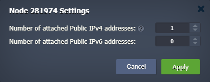

# Remote Monitoring via JConsole

In this tutorial, we'll show you how to configure your Java application with **[JMX](https://www.oracle.com/java/technologies/javase/javamanagement.html)** (Java Management Extension) tools to allow remote monitoring via **JConsole** (Java Monitoring and Management Console). The application provides information on the performance and resource consumption of your Java instances.


## What is JMX?

JMX lets you implement management interfaces for Java applications and control your applications remotely. It provides tools for managing and monitoring applications, system objects, devices, and service-oriented networks. The JMX architecture dynamics enable you to use it for monitoring and controlling resources as they are implemented and installed.

Some of the main benefits that you get using JMX remote monitoring are:

- ability to manage Java applications and servers without heavy investment
- scalable management architecture
- ability to leverage future management concepts


## Preparing Java Environment

You need to ensure that your Java environment allows external access, which requires [public IP](/public-ip/) attached to it.

{}**Tip:** If you don't have a Java environment yet, you can [create](/setting-up-environment/) one in a minute - click the **New Environment** button, select the ***Java*** tab in the opened wizard, choose and configure any preferred application server. Do not forget to add **public IP** and click **Create** to proceed.

{}

1\. Expand your Java node in the dashboard to view its IPs. If no public IP is attached, click on the appropriate **Attach/Detach IP(s)** button to add one.


2\. For example, set one public IPv4 and click **Apply**.



3\. Once you've ensured that public IP is attached to the node, you need to allow a TCP port that will be used by RMI (e.g. *9999*) in the [firewall](/custom-firewall/). Open environment **Settings > Firewall > Inbound Rules** and **Add** the appropriate rule.


4\. Next, you need to enable JMX for the Java application server. Click the **Config** button for your node and add the following system properties to the ***/opt/tomcat/conf/variables.conf*** file:

```
-Dcom.sun.management.jmxremote
-Dcom.sun.management.jmxremote.port={port}
-Dcom.sun.management.jmxremote.rmi.port={port}
-Dcom.sun.management.jmxremote.ssl=false
-Dcom.sun.management.jmxremote.authenticate=false
-Djava.rmi.server.hostname={publicIp}
```

Here:

* ***{port}*** - port that will be used by RMI (same as in firewall, *9999* in our example)
* ***{publicIp}*** - external address attached to the Java node


**Save** the changes and **Restart** your application server.


## Connect via JConsole

In our tutorial, we use the JConsole tool for the remote connection. So, run JConsole (*…/jdk/bin/jconsole*) on your local computer and create a new remote connection (enter the public IP address of your Java application server and the **port** number that you have specified in *variables.conf*).

{}**Note:** You need a **JDK** installed on your computer to use JConsole.{}


After providing a remote host, click **Connect** to monitor your server.


That's all! Remote connection via JConsole to your Java server at the platform is successfully established.


## What's next?

* [Tutorials by Category](/tutorials-by-category/)
* [Java Tutorials](/java-tutorials/)
* [Setting Up Environment](/setting-up-environment/)