# How to Deploy Ganib to PaaS
**Ganib** Enterprises is one of the world's most popular and widely used open source project management software. The open source Ganib product suite includes an array of modules that provide project management system (PMS), project portfolio management (PPM), project plans, project dashboard, documents management, time and attendance tracking (PTO), timesheet, desktop time tracking and screen capture tool, etc.

Let's see how to deploy Ganib to the platform.

## A. Create an Environment

1\. Open environment topology wizard by clicking **Create environment** button and choose **Tomcat** application server and **MySQL** database nodes. Set resource limits for them, enter environment name, and press **Create**.
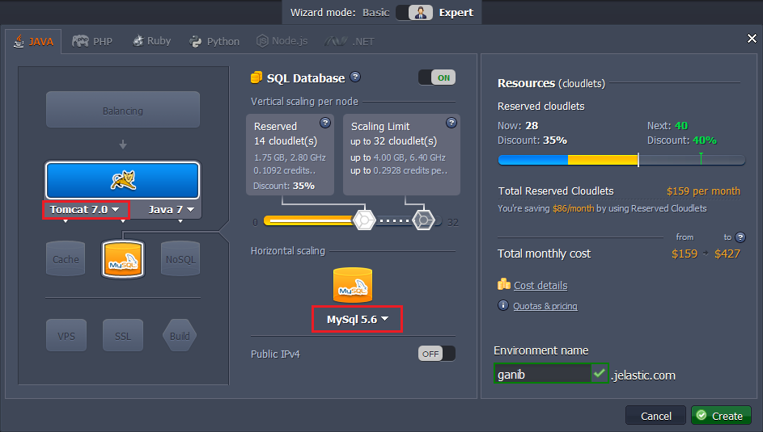

2\. In a few moments your new environment will appear at the panel.
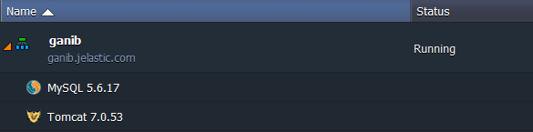

## B. Ganib Deployment

1\. To download Ganib project management system's community edition navigate to the [Sourceforge](http://sourceforge.net/projects/ganib/files/?source=navbar) page.
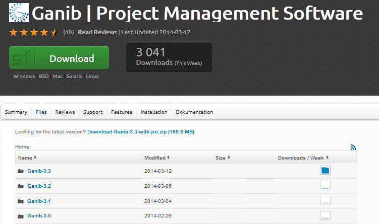

2\. Open the latest release folder (*Ganib 3.3* in our case) and download ***ganib.war*** file it contains.
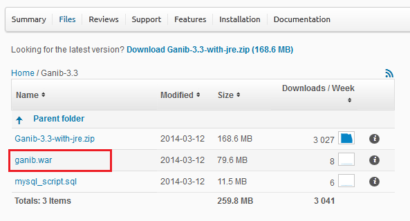

3\. Navigate back to the platform dashboard and upload **.war** file you've just downloaded.
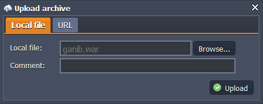

4\. Finally, click **Deploy to** button and choose previously created environment in the list.
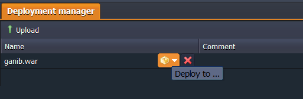

5\. In a minute Ganib application will be deployed to the chosen environment.
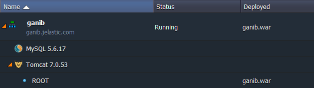


## C. MySQL Configuration

1\. Click **Open in browser** button next to the MySQL node in your environment.
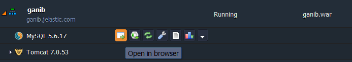

2\. While you were creating the environment, the platform sent you the email with credentials to the database. Create a user and a database (e.g. *ganib*) using these credentials.
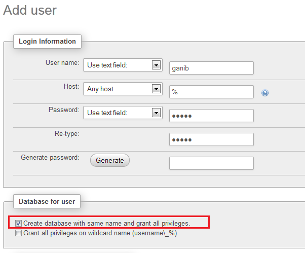

3\. After that unpack the downloaded Ganib **.war** file and find ***ganib.sql*** file in the **database** folder. Import it to the database you've created at the previous step.
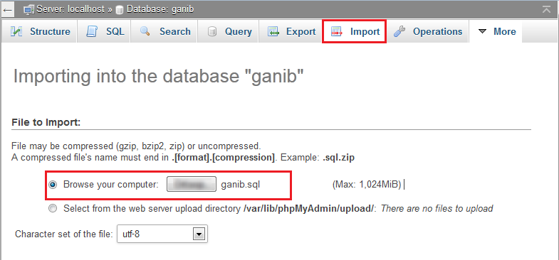

Wait for a few minutes till this operation will be completed.


## D. Ganib Configuration

1\. Navigate back to the dashboard and click **Config** button for **Tomcat** server:
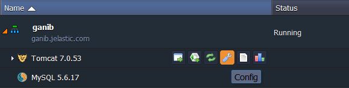

2\. Open the lib folder and upload [MySQL connector](http://dev.mysql.com/downloads/connector/j/) and [Java mail library](http://www.java2s.com/Code/Jar/j/java-mail.htm).
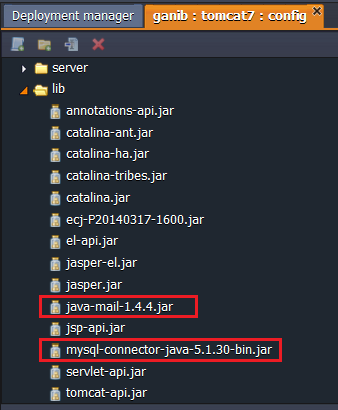

3\. Then navigate to the **server &gt; context.xml** file and add the following lines at the very bottom before closing Context tag.  
*&lt;Resource name="jdbc/GanibDB" auth="Container" type="javax.sql.DataSource" username="root" password="" driverClassName="com.mysql.jdbc.Driver" url="" maxActive="125" maxIdle="25" /&gt;*

{}
Note you should specify settings of your database in these strings:

* credentials you've received while environment creation
* URL for your database in the following format:   
```
jdbc:mysql://mysql-{env_name}.{[hoster's_domain](/paas-hosting-providers/)}:3306/{database_name}?useUnicode=true&characterEncoding=utf-8&autoReconnect=true
```
{}

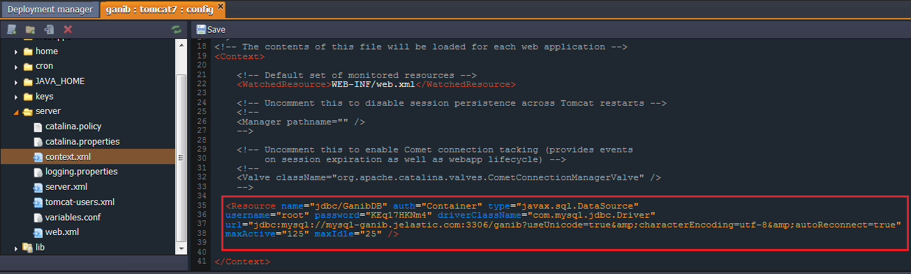

4\. **Save** the changes you've made.

5\. Press **Restart** next to the Tomcat node in order to apply the configuration changes.
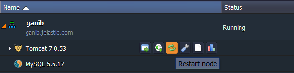


## E. Start the Application

1\. Finally, click **Open in browser** button near your environment.
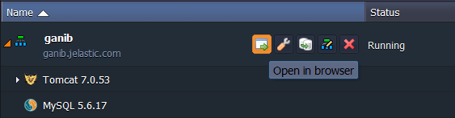

2\. You will see the Ganib start page and can proceed to using it.
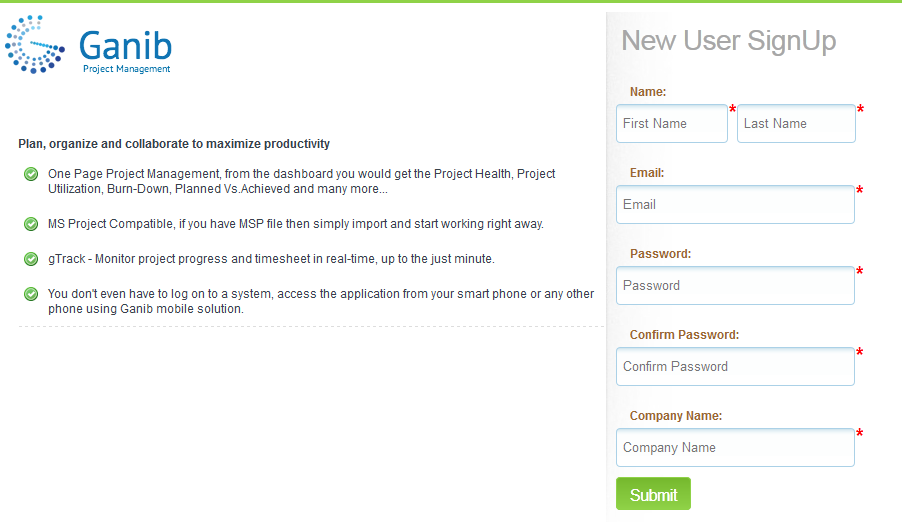

Now, you have your own Ganib application deployed to the platform. Enjoy!