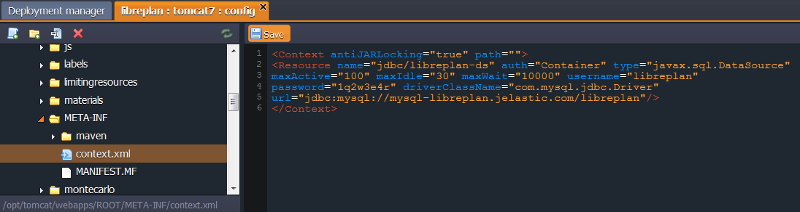

# How to Install LibrePlan

**LibrePlan** is an open source web application for projects' planning, monitoring and control through a rich web-interface which adjusts according to user experience. It allows all the team members to take part in the planning, making a real-time planning possible.

With LibrePlan you can manage multiple projects at a time even in situations when resources participate in more than one project. Application provides a wide set of web services for data import/export in case of situation when some data needed for planning is stored in other applications. LibrePlan is also ready to share and update plans among different companies if they collaborate to deliver a project on time.

Thus, let's find out the easy way to install LibrePlan tool to the platform.


## Create Environment

1\. Log in to the platform and click **Create environment** button in the upper left corner of the dashboard.


2\. Go to the **Java** tab in the appeared environment topology wizard and choose **Tomcat 7** and **MySQL** instances. Then specify the amount of resources needed with the help of cloudlets sliders and type the name for your environment, for example, *libreplan*. Proceed by clicking **Create** button.


3\. In a few moments your environment will be created.


## Upload and Deploy Application

1\. Navigate to the [LibrePlan download page](https://sourceforge.net/projects/libreplan/files/LibrePlan/) at the SourceForge storage and download the latest versions of **libreplan_mysql_x.x.x.war** and **install_mysql_x.x.x.sql** files (*1.4.0* in our case).


2\. Return to your platform dashboard and click **Upload** icon at the **Deployment Manager** tab. Within the opened frame browse to the downloaded ***.war*** file.


3\. After uploading is successfully finished, click the **Deploy to** icon next to your ***.war*** file in the list of available packages. Then choose the environment you've previously created and confirm the deployment by clicking **Deploy** in the opened frame.


## Database Configuration

1\. To start the database configuring you need to open **phpMyAdmin** panel by means of pressing **Open in browser** button next to your MySQL node.


2\. Now log in using the credentials, that were sent to you via email earlier.


3\. In the opened window switch to **Users** tab and click **Add user** link.


4\. Now you need to specify **User name** (e.g. *libreplan*) and **Password** in the appeared frame. Confirm password in the **Re-type** field and mark *Create database with same name and grant all privileges* and *Grant all privileges on wildcard name (username\\_%)* options as active. Proceed by pressing **Go** button in the bottom right corner.


5\. Then navigate to the **Databases** tab and click on your newly created database (*libreplan* in our case).


6\. Navigate to the **Import** tab in the opened database frame. Then click **Browse** button and select the previously downloaded **install_mysql_x.x.x.sql** file. Finally, press **Go** button in the bottom left corner to start importing.


7\. Wait until notification about successful import appears. Be patient - it can take a few minutes. 


## Server Configuration

1\. LibrePlan application requires an additional **mysql-connector-java** library for the proper work. You can download it [here](http://dev.mysql.com/downloads/connector/j/). 

Just select the **Platform Independent** line in the **Select Platform** drop-down list and press **Download** button next to its *.zip* version.


2\. Log in to your Oracle Web account (you can sign up for free) or just click *No thanks, just start my download* link in opened window.


3\. Unzip the archive you've just downloaded.

4\. Now press **Config** next to your Tomcat node.


5\. Find the **lib** folder in the appeared configuration manager and press **Upload** button in front of it.


6\. Locate the necessary **mysql-connector-java-x.x.x-bin.jar** file in the root of the previously extracted archive and select it for uploading.


7\. Then go to the **webapps/ROOT/META-INF/** folder in the same Tomcat configurations tab and edit the **context.xml** file by replacing its content with the next code:

```
<Context antiJARLocking="true" path="">  
<Resource name="jdbc/libreplan-ds" auth="Container" type="javax.sql.DataSource"  
maxActive="100" maxIdle="30" maxWait="10000" username="{db-username}"  
password="{db-password}" driverClassName="com.mysql.jdbc.Driver"  
url="jdbc:mysql://{mysql-url}/{db-name}"/>  
</Context>
```  

You need to substitute the following values with your own data:

* **{db-username}** - enter name of the user you've created at the *Database Configuration* step (*libreplan* in our case)
* **{db-password}** - type a password for this user
* **{mysql-url}/{db-name}** - specify the URL to your MySQL server and name of your database, separated with slash (so we receive *mysql-libreplan.jelastic.com/libreplan* for this example)



8\. Press **Save** button just above the code you've edited and restart your **Tomcat** server with **Restart node** button for applying the changes.


9\. Finally, launch the application by means of pressing **Open in browser** button next to your environment.


Congratulations! You can start using your own LibrePlan now.


Enjoy the power of hosting inside the cloud with PaaS!


## What's next?

* [Tutorials by Category](/tutorials-by-category/)
* [Java Tutorials](/java-tutorials/)
* [Setting Up Environment](/setting-up-environment/)