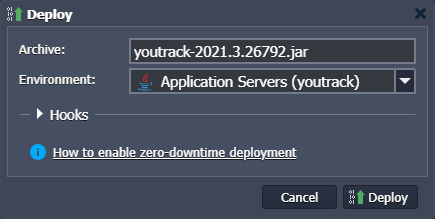

# How to Deploy YouTrack

**[YouTrack](https://www.jetbrains.com/youtrack/)** is an innovative issue tracking and project management tool that helps deliver great products and boost your team's productivity. Flexible customization options ensure the best experience not just for the whole team but for every team member.

This guide below provides detailed steps on the few simple actions required to deploy and launch YouTrack at the platform.


## Create and Configure Environment

1\. Log in to the platform dashboard and click the **New Environment** button to [set up a new environment](/setting-up-environment/).


2\. YouTrack requires root permission in order to be installed and run, so let's create a **[Java Engine](/java-engine/)** server.

Switch to the ***Java*** tab and select **Java Engine** in the application servers block. In the middle part of the wizard, you can configure the necessary number of cloudlets, select the JDK version, and set other parameters.


Type the preferred name (e.g. *youtrack*) and click **Create**. In a minute, your environment will be created and added to the environments list.

3\. YouTrack uses a [unique Java agent](https://www.jetbrains.com/help/youtrack/standalone/install-youtrack-jar.html#run-youtrack-jar) that only processes options started with **-J** or **-\-J**. So, let's connect to the container via **[Web SSH](/web-ssh-client/)** and remove the default Java agent:

```
bash /java_agent/java --uninstall
```


4\. Next, add the required *host* and *port* value to the ***JAVA_ARGS*** [variable](/container-variables/):

```
JAVA_ARGS=0.0.0.0:8080
```


Now, you are ready to deploy YouTrack.


## Deploy YouTrack

1\. Go to the official website and copy a link to the JAR file of the [YouTrack standalone server](https://www.jetbrains.com/youtrack/download/get_youtrack.html#section=standalone).


2\. Return to the dashboard and upload JAR to the **[Deployment Manager](/deployment-manager/)** via URL. In our case:

*https\://download.jetbrains.com/charisma/youtrack-2021.3.26792.jar*


3\. Now, deploy it to the environment you've created earlier.



After deployment, <u>*wait several minutes*</u> for YouTrack to initialize and proceed to the application set up.


## Set Up YouTrack

1\. Click the **Open in Browser** button for your environment with deployed YouTrack.

You need to set up YouTrack before you can use it, so provide a special *Token* and click **Log in**.

{}**Tip:** You can get a token from the:

- dedicated ***/home/jelastic/teamsysdata/conf/internal/services/configurationWizard/wizard_token.txt*** [file](/configuration-file-manager/)
- container [logs](/view-log-files/) (displayed in the ***run.log*** file after the application deployment)
{}


2\. Next, select the **Set up** option.


3\. You can learn all the possible parameters at the [official documentation](https://www.jetbrains.com/help/youtrack/standalone/Installation-and-Upgrade.html). For this example, we'll just use all the default values.


4\. Once YouTrack starts up, log in with the admin credentials you've provided during the configuration.


That's it! You can start working with your own YouTrack server.


Hopefully, this instruction will be helpful to you!


## What's next?

* [Tutorials by Category](/tutorials-by-category/)
* [Java Tutorials](/java-tutorials/)
* [Setting Up Environment](/setting-up-environment/)