# How to Deploy Apache Solr

**[Apache Solr](https://lucene.apache.org/solr/)** is an open source enterprise level search platform with high scalability and such significant features as faceted search, full-text search, database integration, handling most of the widely spread documents extensions and so on.

So, let's find out how to deploy the **Solr** Java engine to the platform.


## Create the Environment

1\. Log in to the platform dashboard.

2\. Click **Create environment** button at the top left corner of the dashboard in order to set up a new environment.


3\. In the opened **Environment topology** wizard navigate to the **Java** language tab. Then choose **Jetty** as your application server, set the resource limits using cloudlet slider and type the environment name (e.g. *solr451*).

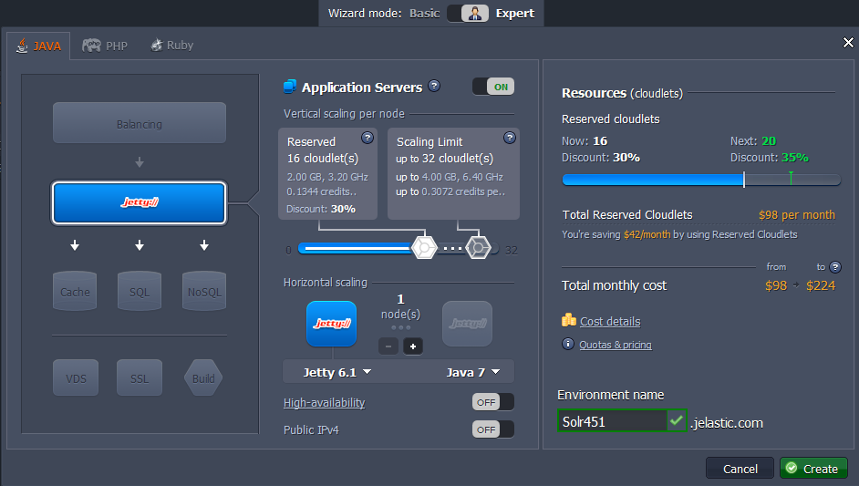

In just a few moments your environment will appear in the dashboard.


## Upload Solr Package

1\. Go to the **Solr** [web-site](https://lucene.apache.org/solr/downloads.html) in order to download its latest version package (we use *v.4.5.1* in this instruction). Extract the archive you've got.

2\. Open the ***dist*** folder of the extracted archive and find **solr-4.5.1.war** file in it.

3\. Paste the libs from the **example > lib > ext** folder (shown below) into the **WEB-INF/lib** directory of the war package and repack it.

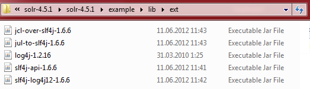

The already repacked **.war** file for *Solr 4.5.1* version you can download [here](https://download.jelastic.com/public.php?service=files&t=1c0e6f02fd2da054818b86182fc5747d&download&path=//solr-repacked.war).

4\. Use the **Deployment manager** to upload the repacked **.war** package to the platform dashboard.

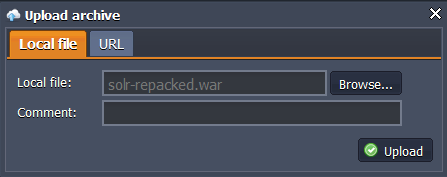


## Configure Solr

1\. Expand the list with your environment nodes and open the **Config** manager for Jetty application server.

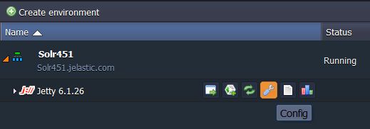

2\. In the opened tab navigate to the **home** folder and create a new one there, named **solr**.

3\. In this example we work with a simple multicore configuration using two **core** folders (*core0* and *core1*). Each core folder contains **conf** directory with two config files - ***solrconfig.xml*** and ***schema.xml***. These files can bу found in the *example>multicore>core\*>conf* folders of the extracted Solr archive.

So, create the appropriate directory structure and upload the necessary files, obtaining the **directory layout** shown below. 

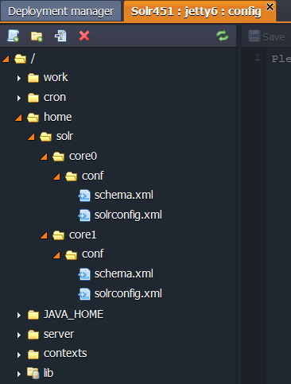

4\. After that upload the ***solr.xml*** file from **example > multicore** archive folder to the **solr** appliccation server's folder. 

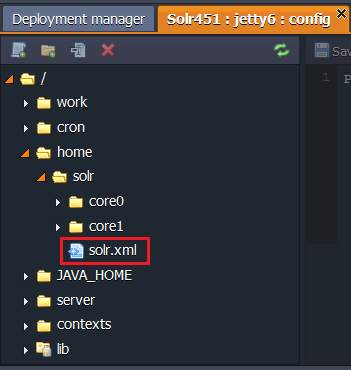

5\. After that you should specify the ***solr.home*** environment variable to point the path to the Solr configuration files. Open the **server > variables.conf** file and add the following line there:
```
-Dsolr.solr.home=/opt/jetty/home/solr
```

Don't forget to **save** the changes you've made.

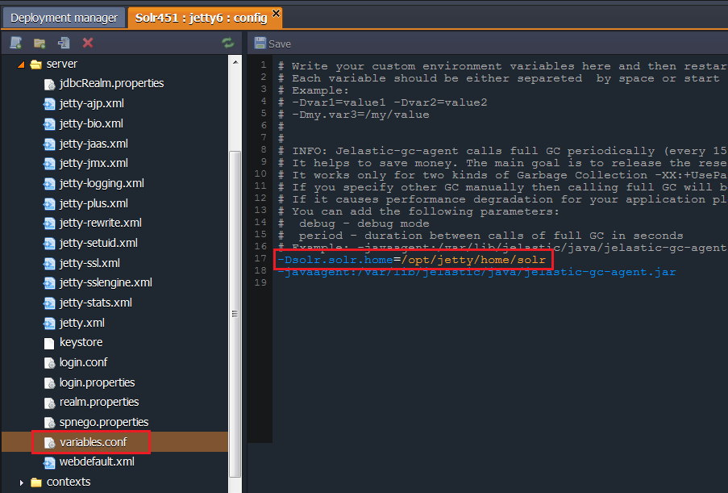


## Solr Deployment

1\. Now all the necessary configurations are performed, therefore you can navigate back to the **Deployment Manager** with your repacked Solr archive uploaded and deploy it to the appropriate environment.

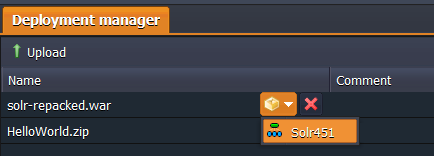

2\. Specify the context if you need it or just live this field empty, and press **Deploy**.

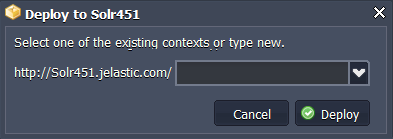

Congratulations! Now you have your own instance with Solr search platform hosted.

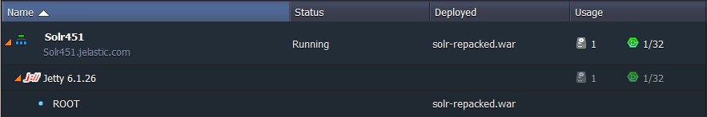

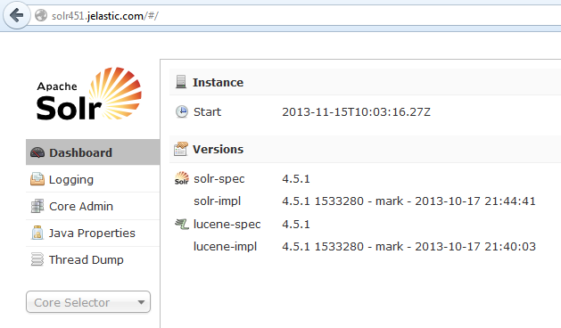


## What's next?

* [Tutorials by Category](/tutorials-by-category/)
* [Java Tutorials](/java-tutorials/)
* [Setting Up Environment](/setting-up-environment/)