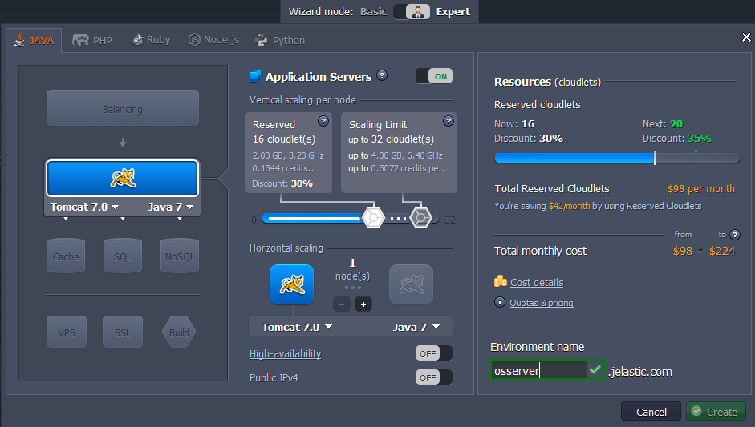
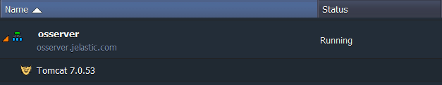
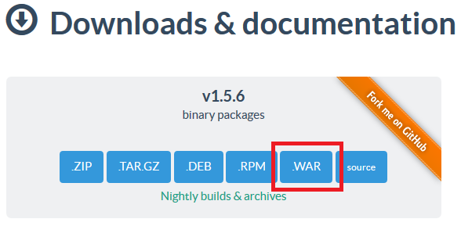
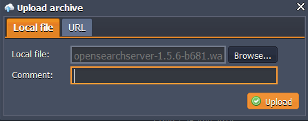
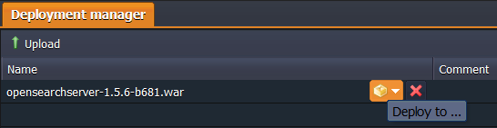
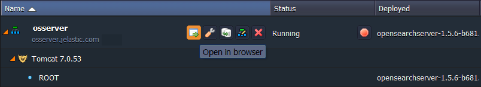
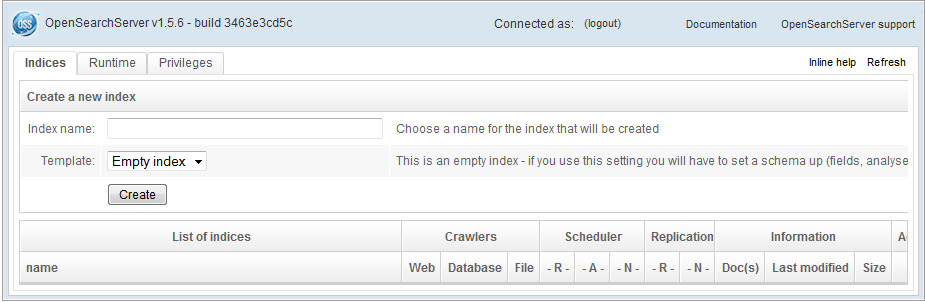

# How to Install OpenSearchServer

**OpenSearchServer** is an open source application server that allows to easily develop index-based applications such as search engines. It provides a set of advanced searching functions, such as full-text, boolean and phonetic search, filtered search, automatic language detection, relevance customization, etc.

OpenSearchServer is written in Java and can be integrated into almost any kind of application without the need to produce Java code. REST/XML APIs make OpenSearchServer connectable to other programming languages, and "advanced plugins" capability allows sophisticated customizations.

So, let's find out how to get the OpenSearchServer application hosted just in a few minutes with the help of the platform.

## Create Environment

1\. Log in to the platform and click **Create environment** button in the upper left corner of the dashboard.

2\. In the opened window select **Java** tab and choose **Tomcat** as your application server. Use the cloudlets sliders to determine the required resources usage, type your environment name (e.g. *osserver*) and click **Create** button.

3\. Wait just about a minute for your environment to be created.

## Upload and Deploy Application

1\. Navigate to the OpenSearchServer [official web-site](https://www.opensearchserver.com/) and click **.WAR** button in the ***Downloads & documentation*** section to download the required distributive package.

2\. Return to your platform dashboard and click **Upload** button at the **Deployment Manager** tab. In the opened frame browse to the downloaded file and click **Upload**.

3\. Now press **Deploy to** icon next to the uploaded ***.war*** file, choose the environment you've created before, and confirm the deployment in the opened frame.

4\. Wait until the deployment is successfully finished and run the application by means of pressing **Open in Browser** icon next to your environment.

Now you have your OpenSearchServer hosted and ready for work at the platform.

Congrats!

## What's next?

* [Tutorials by Category](/tutorials-by-category/)
* [Java Tutorials](/java-tutorials/)
* [Setting Up Environment](/setting-up-environment/)