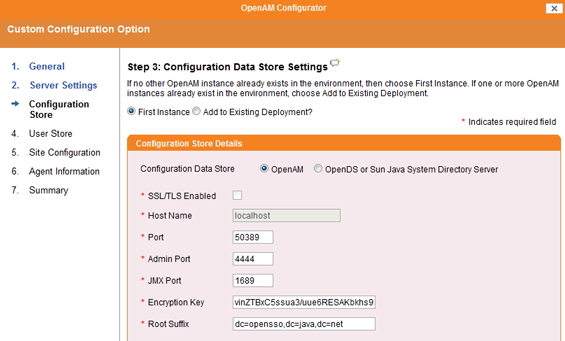

# How to Deploy OpenAM

**[OpenAM](https://www.forgerock.com/platform/access-management)** is a market leading open-source access management, entitlements, and federation server platform.

As with any Java applications and frameworks, this one is very easy to deploy to the PaaS! Here's how.

## Create Environment

1\. Log into the platform dashboard.

2\. Click the **Create environment** button at the top left:

3\. In the **Environment topology** window,  choose your application server (for example, [Tomcat](/tomcat/)) and specify your environment name, for example, *OpenAM*, then click **Create**.

In a minute your environment will be created.

## Upload Java Package

1\. Navigate to [ForgeRock web site](https://www.forgerock.com/platform/access-management)  and click on **Download Stack**.

2\. Select **OpenAM**, fill in the required form and copy to clipboard the URL of the latest OpenAM release (WAR archive).

3\. Go back to the platform dashboard, click **Upload** and paste the URL you have just copied.

4\. Once the package is in the platform, deploy it to the environment you have just created.

{}**Note:** Do not deploy OpenAM to the **ROOT** context (otherwise you will get configuration errors later on).{}

5\. Once the deployment is successfully finished, launch the application in web browser.

## Configure OpenAM

1\. Select **Create New Configuration** in **Configuration Options** window.

2\. Specify the default user password that you want to have and click **Next**.

3\. In the **Server Settings** window, confirm the server URL, cookie domain, platform locate, and configuration directory settings.

4\. At the **Configuration Data Store Settings** step, select the **First Instance** and confirm configuration store details.

5\. In **User Store Settings**, select **OpenAM User Data Store**. You can ignore the warning message and go ahead.

6\. Type the password for the **Default Policy Agent User** different from the default user password.

7\. View the **Summary**. If the information is correct, click **Create Configuration**.

In few minutes the configuration process will be finished.

Now you can use **OpenAM** in your applications in the PaaS!

## What's next?

* [Tutorials by Category](/tutorials-by-category/)
* [Java Tutorials](/java-tutorials/)
* [Setting Up Environment](/setting-up-environment/)