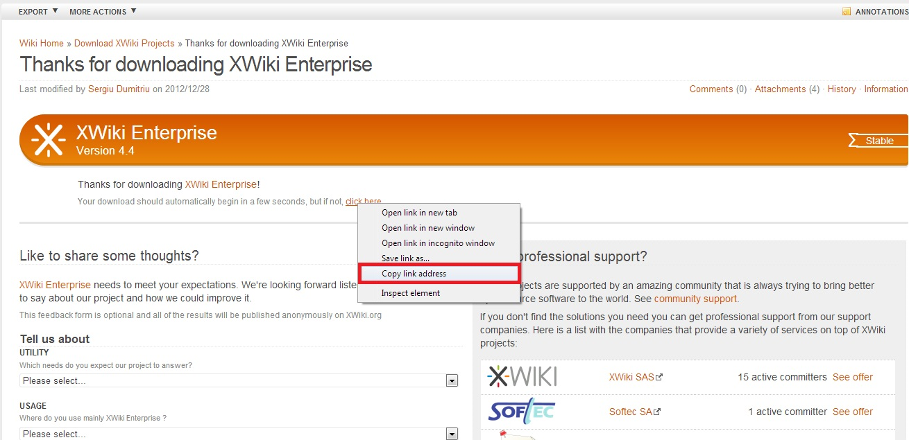

# How to Deploy XWiki

You can have a **XWiki** instance up and running within minutes using one-click install option.

<div data-app="xwiki" data-width="280" data-theme="modern" data-text="Get it hosted now!" data-tx-empty="Type your email and click the button" data-tx-invalid-email="Invalid email, please check the spelling" data-tx-error="An error has occurred, please try again later" data-tx-success="Check your email" class="je-app">
</div>

The process is simple - just click **Get it hosted now**, type your email and install XWiki in a minute skipping the steps of manual installation.

Find the full list of applications available for one-click installation at our [Marketplace page](https://www.virtuozzo.com/application-platform/marketplace/).


## Manual XWiki Installation

[XWiki](https://www.xwiki.org/xwiki/bin/view/Main/WebHome) is a free wiki software platform written in Java with a design emphasis on extensibility.

Let's deploy XWiki to the platform right now!

### Create Environment

1\. Log into the platform dashboard.

2\. Create a new environment:


3\. In the **Environment Topology** dialog,  pick your application server (for example, **[Tomcat](/tomcat/)**) and the database you want to use (for example, **MySQL**). Then specify your environment name, for example, *xwikitest*.


It will take just a minute for your environment to be created.

### Upload Java Package

1\. Navigate to [xwiki.org](https://www.xwiki.org/xwiki/bin/view/Main/WebHome) and select **Download & Play > XWiki  Enterprise**.


2\. Stop the started downloading and copy the link to the package by right-click on the **click here** line and choosing **Copy link address** in the opened menu.



3\. Go back to the platform and upload the package you have just downloaded to the **Deployment manager**. For that navigate to **URL** tab and enter there link you've just copied.


4\. Once the package is in the platform, deploy it to your environment.


### Configure Database

1\. Click the **Open in Browser** button for MySQL.


2\. When you created the environment, the platform sent you an email with credentials to the database. Use these credentials to create a user account and the database with the application.


### Configure XWiki

1\. Upload *MySQL connector* to the **lib** folder.


2\. Pick **Config** for Tomcat and navigate to **hibernate.cfg.xml** file (webapps/ROOT/WEB-INF)


3\. Comment the part of file which is responsible for the default database configuration, uncomment MySQL configuration and type the correct database connection URL, your database name and password. Also add following lines in the MySQL part as it is shown in the picture below:

```xml
<property name="connection.provider_class"<com.xpn.xwiki.store.DBCPConnectionProvider</property>
<property name="connection.pool_size"<2>/property>
<property name="statement_cache.size"<2>/property>
```


Save the changes and restart Tomcat!

### Start XWiki

Now you can open XWiki in a browser and create your spaces and pages there. Enjoy!


Hope this instruction will be useful for you.


## What's next?

* [Tutorials by Category](/tutorials-by-category/)
* [Java Tutorials](/java-tutorials/)
* [Setting Up Environment](/setting-up-environment/)

<script>
    (function(d, s, id) {
        var js, fjs = d.getElementsByTagName(s)[0];
        if (d.getElementById(id)) return;
        js = d.createElement(s); js.id = id;
        js.async = true;
        js.src = "//go.jelastic.com/widgets.js";
        fjs.parentNode.insertBefore(js, fjs);
    }(document, 'script', 'jelastic-jssdk'));
</script>
