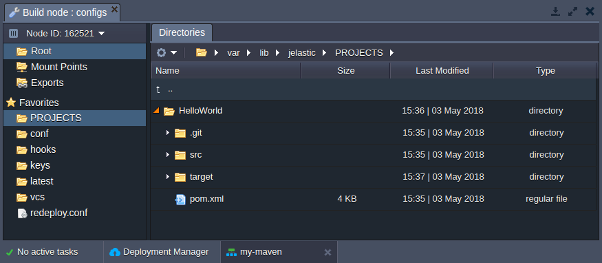
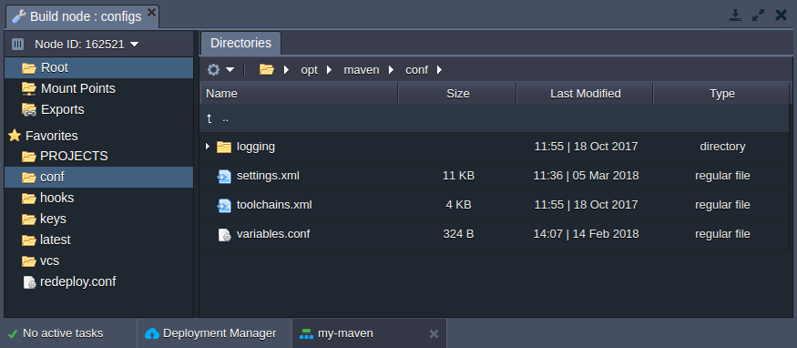
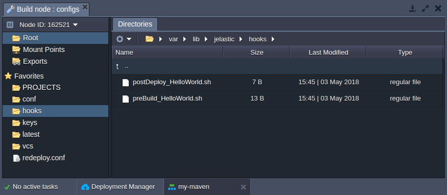
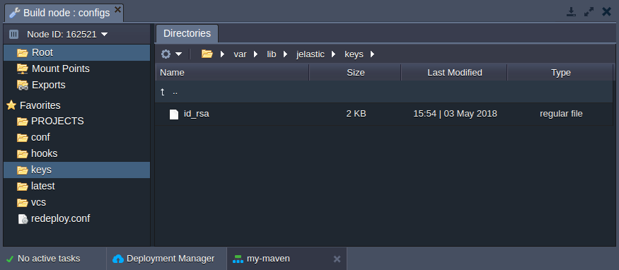
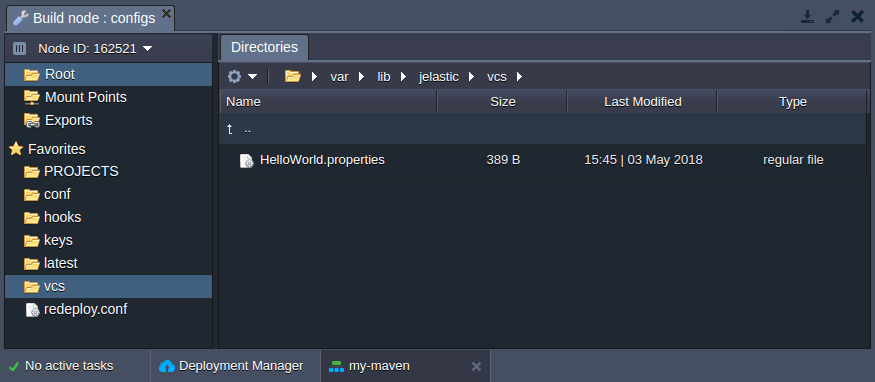
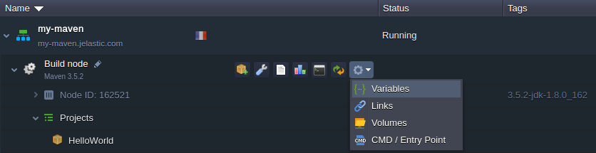
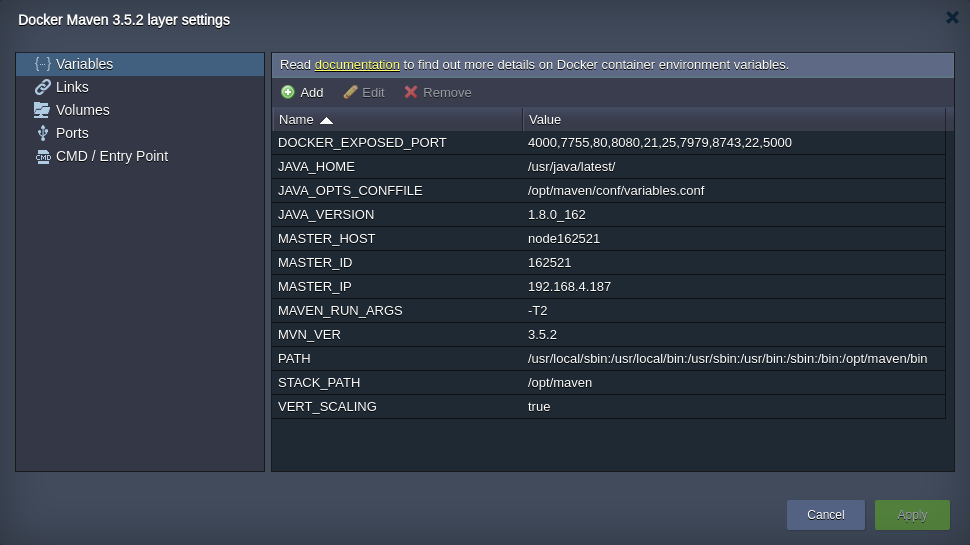

# Maven Build Node Configuration

**Maven** is a tool for compiling and managing Java projects. At PaaS, it's provisioned out-of-box to cover all the main stages of your Java application lifecycle - from building & deploying till their pushing onto production.

All the adjustable Maven server settings can be set and/or changed with:

* [configuration files](#maven-configuration-files)
* [environment variables](#maven-specific-variables)

## Maven Configuration Files

The main Maven build node configuration files can be located within the following server directories:

Folder|Path
---|---
[PROJECTS](#projects)|*/var/lib/jelastic/PROJECTS*
[conf](#conf)|*/opt/maven/conf*
[hooks](#hooks)|*/var/lib/jelastic/hooks*
[latest](#latest)|*/usr/java/latest*
[keys](#keys)|*/var/lib/jelastic/keys*
[vcs](#vcs)|*/var/lib/jelastic/vcs*

### PROJECTS

The **PROJECTS** folder is used for storing files of the unpacked project that were added to, built and deployed via Maven node.

### conf

The **conf** directory contains the following files:

* ***[settings.xml](https://maven.apache.org/ref/3.5.3/maven-settings/settings.html)*** - contains the main Maven configurations
* ***[toolchains.xml](https://maven.apache.org/guides/mini/guide-using-toolchains.html)*** - allows to set which JDK (or other tool) should be used by embedded plugins during the project build
* ***[variables.conf](/java-application-server-config#s)*** - is used to set your custom variables, to configure memory settings, etc

### hooks

The **hooks** folder stores custom scripts (so-called [hooks](/deployment-hooks/)), which should be executed prior or after application build/deploy operations.

### keys

The **keys** directory is used as a location for uploading private keys which are needed for your application.

Just generate your key, save it as a simple file and upload to the **keys** folder. Now, you can use it for different cases (e.g. for authentication between nodes) by simply stating the appropriate ***/var/lib/jelastic/keys/{key}*** path.

### latest

The **latest** folder contains all JDK libraries, tools, binaries, etc. Here you can edit already available files or upload additional if required.

### vcs

In the **vcs** directory, you can find a list of ***{project_name}.properties*** files, which contain all information about your projects. Herewith, these configuration files are not editable, but can be viewed to inspect parameters for a particular project.

## Maven-Specific Variables

In addition to the configuration files, Maven build node can be managed through providing (or adjusting) some of the environment variables, integrated specifically for this stack template:

1\. Click the **Additionally** button next to your Maven node and navigate to the **Variables** section.

2\. In the opened window, you'll see the list of default variables for the stack, which can be adjusted up to your needs.

Below, the Maven-specific variables are listed:

* ***MAVEN_OPTS*** - allows to define values for the most essential Java server options, e.g. *-Xmx*, *-Xms*, *-Xmn*, etc
* ***MAVEN_RUN_ARGS*** - specifies additional [Maven command-line parameters](http://maven.apache.org/ref/3.1.0/maven-embedder/cli.html), which should be set for all Maven projects (for example, to define the number of process threads)
* ***MAVEN_RUN_ARGS\_{project}*** - sets additional parameters for a particular project; herewith, **note** that the ***{project}*** name should be stated with underscores "*_*" instead of spaces and dashes
* ***MAVEN_DEPLOY_ARTIFACT*** - defines an artifact to be deployed (all projects)
* ***MAVEN_DEPLOY_ARTIFACT\_{project}*** - provides an artifact for a particular project (higher priority than *MAVEN_DEPLOY_ARTIFACT*)

In this way, with the platform you can take a full control over the Maven build node and configure it as required according to your Java project specifics.

## What's next?

* [Java Deployment with Maven](/java-vcs-deployment/)
* [File Manager](/configuration-file-manager/)
* [Environment Variables](/environment-variables/)