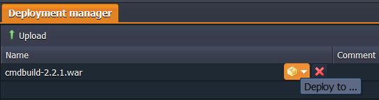
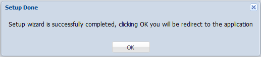

# How to Install CMDBuild

**CMDBuild** (where CMDB stands for "Configuration and Management Data Base") is a configurable web application to model and control a database containing assets and handle related workflow operations.

CMDBuild provides operators with a full control over the assets used, as well as with knowing exactly their composition, position, functional relations and history.

It also gives such a possibilities as automatic inventory, documents management, text processing, directory services, mailing, monitoring systems, intranet portals and other information systems.

So, here is step-by-step instruction on how to host CMDBuild application at the platform.

## Create an Environment

1\. Log in to the platform and click **Create environment** button in the upper left corner of the dashboard.

2\. In the opened dialog window ensure you are at the **Java** programming languages tab and choose **Tomcat** as your application server and **PostgreSQL** as a database. Then specify the amount of resources needed with the help of cloudlets sliders, type your environment name (e.g. *cmdbuild*) and proceed by clicking **Create** button.

3\. Wait just a minute for your environment to be created.

## Upload and Deploy the Application

1\. Navigate to the [CMDBuild website](https://www.cmdbuild.org/en/download) and click **Download** button in the central pane.

2\. Unzip the downloaded archive.

3\. Go to your platform dashboard and click **Upload** icon at the **Deployment Manager** tab. Within the opened frame choose **cmdbuild-x.x.x.war** file in the root of the extracted archive.

4\. For a proper work of your CMDBuild application you need to upload **postgresql-9.1-901.jdbc4.jar** library to your Tomcat application server. For that click **Config** button next to it.

5\. Then find the ***lib*** folder in the appeared list and press **Upload** button in front of it.

6\. Locate the above-mentioned **postgresql-9.1-901.jdbc4.jar** file in the *cmdbuild-x.x.x\extras\tomcat-libs\6.0* folder of the previously unzipped archive and select it for uploading. Check the result.

7\. Restart **Tomcat** server for applying the changes.

8\. After that click the **Deploy to** icon next to the CMDBuild ***.war*** file at your dashboard, choose the environment you've created before, and click **Deploy** in the opened window.

## Install Application

1\. Once the deployment is successfully finished, launch the application by means of pressing **Open in browser** button next to your environment.

2\. In the opened browser tab choose the desired language within the appropriate drop-down list and press **Next**.

3\. Fill in the required fields:

* **CMDBuild Database type** - select *Empty* in a drop-down list
* **CMDBuild Database name** - enter database name (e.g. *cmdb*)
* put a tick next to the **Create a Shark schema** line

For the next section use the database information you've received via email:

* **Host** - paste the Access URL to your database without *https://* part
* **Port** - enter *5432* port number
* **Super user** - specify Login from the email (*webadmin* is the default one)
* **Password** - paste password from the email

Leave the last section unchanged and press **Next** button.

4\. In the opened frame state the preferable administrator credentials by entering the **User name** (e.g. *admin*) and **Password**. Confirm your password and press **Finish** button.

5\. Wait until installation is finished and press **Ok** in the opened window.

6\. Finally, log in using the previously specified credentials and enjoy your application!

## What's next?

* [Tutorials by Category](/tutorials-by-category/)
* [Java Tutorials](/java-tutorials/)
* [Setting Up Environment](/setting-up-environment/)