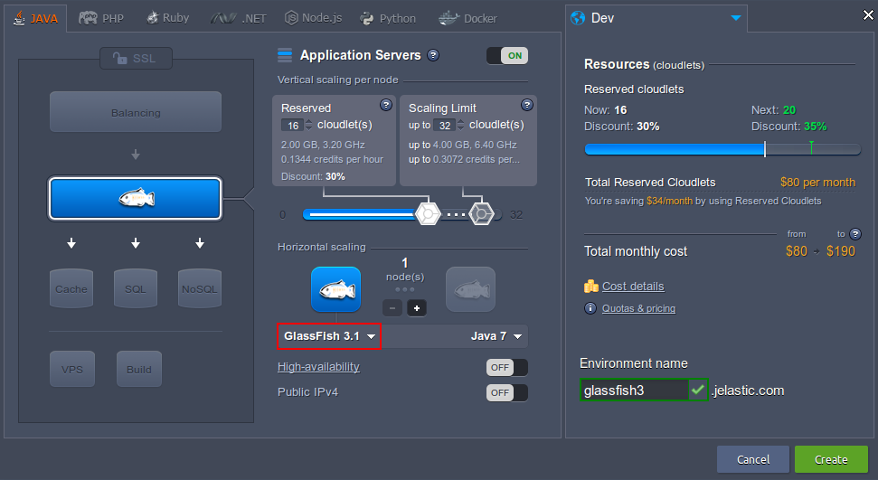
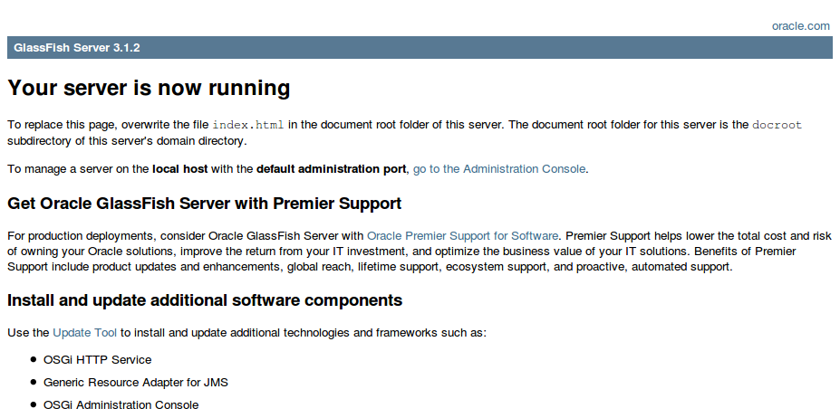
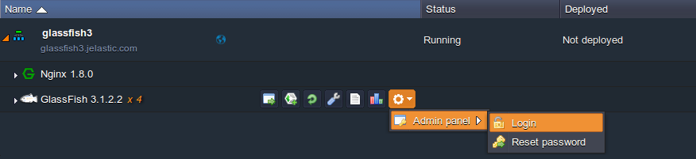
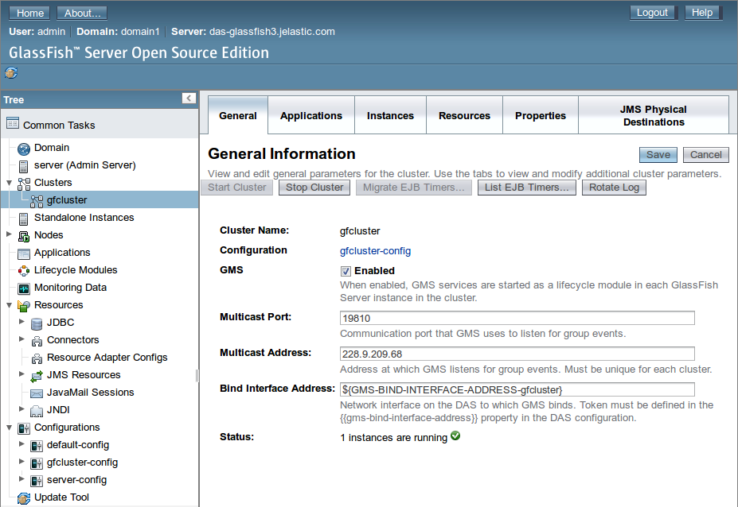
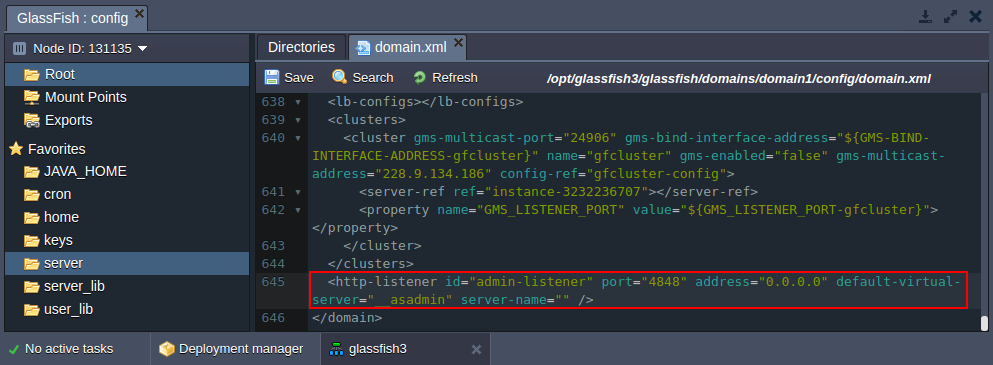

# GlassFish

**[GlassFish](https://glassfish.java.net/)** is an open source application server project started by Sun Microsystems for the Java EE platform and now sponsored by Oracle Corporation. The supported version is called Oracle GlassFish Server. GlassFish is free software, dual-licensed under two free software licences: the Common Development and Distribution License (CDDL) and the GNU General Public License (GPL) with the classpath exception.

GlassFish provides the enterprise level reliability and performance with full clustering and has a wide functionality range. It is quite cool in that it allows you to manage the central repository via the admin panel, which supports all features available in GlassFish. However, as you know, more functions = more resources.


## GlassFish Installation

To get your GlassFish server in the platform, simply:

1\. Log into your PaaS dashboard and click **New Environment.**

2\. Switch to the **Java** tab and pick **GlassFish** within the application servers section as shown in the picture below:


3\. Once the environment is created, you can click **Open in browser** button next to the GlassFish server it comprises (expand the environment in the *Environments* pane at the top of the screen):


4\. Now you can upload the Java application WAR package and [deploy](/upload-deploy-application) it to the environment.

5\. The Glassfish administration panel can be accessed directly from the platform dashboard:
Admin page will be available in a new tab.
{}**Note:** 

* The platform uses *gfcluster* as a cluster, so if you want to modify something, please apply changes to *gfcluster*.

* If you have [Public IP](/public-ipv4) attached to application server node, the default GlassFish admin panel port (*4848*) can be changed in **/opt/glassfish3/glassfish/domains/domain1/config/<i>domain.xml**</i> configuration file (a **server** shortcut in *Favorites*) by adding the following string:
```xml
<http-listener id="admin-listener" port="4848" address="0.0.0.0" default-virtual-server="__asadmin" 
server-name="" />
```

* **Glassfish Derby Internal** database is switched off by default in order to decrease the resource consumption.
{}


## Resource Consumption

If we compare different application servers, GlassFish starts looking a little like a resource hog, but its greediness is offset by its functionality, reliability and numerous other advantages provided.

<div><center><table allign="middle" border="10" cellpadding="10" cellspacing="10"><tbody>
<tr><th rowspan="2" style="text-align: center;">Servlet containers configuration</th>
<th colspan="2" style="text-align: center;">Resources being consumed by environment</th></tr>
<tr><th style="text-align: center;width: 50%;">Idle</th><th style="text-align: center;">With launched admin panel</th></tr>
<tr><td>1 GF</td><td>530-540 Mb (5 cloudlet)</td><td>800-820 Mb (7 cloudlets)</td></tr>
<tr><td>2 GF (HA off)</td><td>820-830 Mb (9 cloudlets)</td><td>980-1000 Mb (10 cloudlets)</td></tr>
<tr><td>3 GF</td><td>1050-1060 Mb (11 cloudlets)</td><td>1210-1220 Mb (13 cloudlets)</td></tr>
<tr><td>4 GF (HA off)</td><td>1430-1450 Mb (14 cloudlets)</td><td>1560-1580 Mb (15 cloudlets)</td></tr>
<tr><td>2 GF (HA on)</td><td>830-850 Mb (9 cloudlets)</td><td>1030-1050 Mb (10 cloudlets)</td></tr>
<tr><td>4 GF (HA on)</td><td>1360-1380 Mb (14 cloudlets)</td><td>1590-1610 Mb (16 cloudlets)</td></tr>
</tbody>
</table></center></div>


## What's next?
* [Environment Variables in GlassFish Admin Console](/environment-variables-in-glassfish/)
* [Java Application Server Configuration](/java-application-server-config/)
* [GlassFish Cluster](/glassfish-server-clustering/)
* [GlassFish Auto-Clustering](https://www.virtuozzo.com/company/blog/glassfish-payara-auto-clustering-cloud-hosting/)