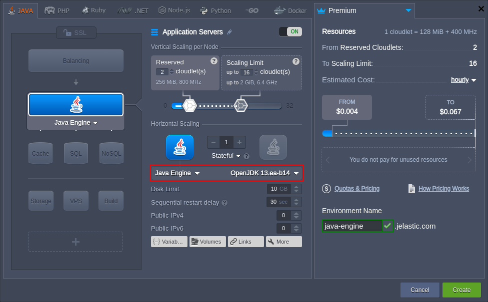
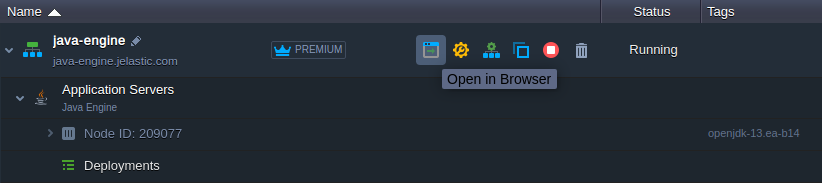

# Java Engine Server

**Java Engine** software stack is an image of a base CentOS/AlmaLinux template with the preinstalled JDK. It provides a bare minimum required for Java application hosting, while ensuring compatibility with all of the [platform features](/what-is-paas-and-caas) (automated vertical and horizontal scaling, public IP, isolation groups, firewall rules, API and SSH access, etc.).

Java Engine is designed for the deployment and hosting of Java applications based on the *fat JAR* / *uber JAR* (i.e. executable JAR with all the classes, resources, and dependencies). It utilized the [Java Memory Agent](https://github.com/jelastic-jps/java-memory-agent) to automatically optimize your application by tuning configs according to the load and available resources.

{}**Note:** This template utilizes a modern ***systemd*** initialization daemon.{}

## Create Java Engine

Follow the next simple steps to create a new environment with Java Engine server.

1\. Log into the platform dashboard and click the **New Environment** button at the top-left corner.

2\. Within the opened topology wizard, switch to the ***Java*** tab, select the **Java Engine** server and the required JDK version (circled in the image below).

Customize any other parameter up to your needs, e.g. resources limits, disk space, external IPs, [region](/environment-regions/) (if available), etc. Click **Create** to proceed.

3\. Your environment should be ready in a minute.

Now, you can start managing your environment:

* [Deploy Application](/deployment-guide/)
* [Bind Custom Domain](/custom-domains/)
* [Monitor the Statistics](/view-app-statistics/) & [View Log Files](/view-log-files/)
* [Tune the Server Configurations](/configuration-file-manager/)
* [Access Environment via SSH](/ssh-access/)

Refer to the [Java Developers Center](/java-center/) for a complete overview of the Java hosting within the platform.

## What's next?

* [Java Dev Center](/java-center/)
* [Deployment Guide](/deployment-guide/)
* [Tomcat Server](/tomcat/)
* [GlassFish Server](/glassfish/)