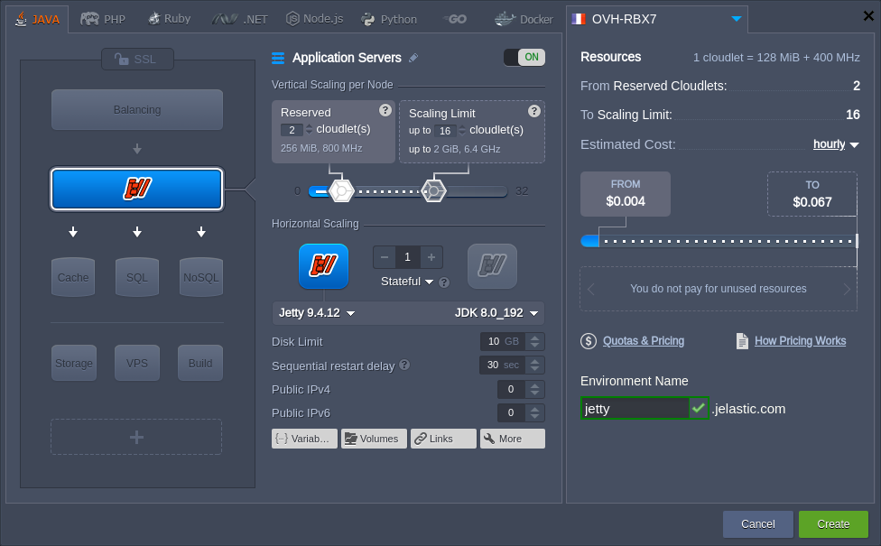
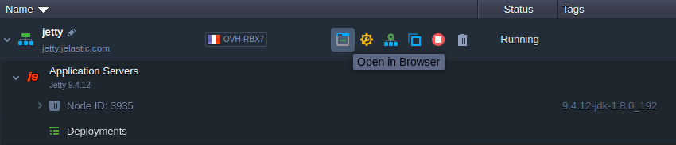
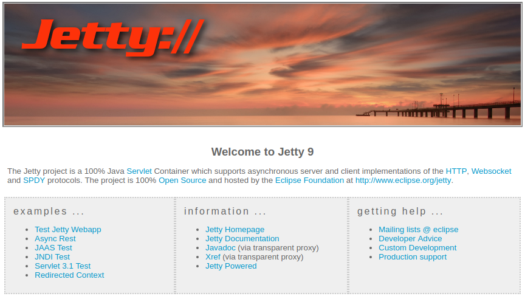

# Eclipse Jetty

**[Eclipse Jetty](https://www.eclipse.org/jetty/)** is an open source Java-based HTTP (web) server, which provides the latest Java Servlet API, HTTP/2 protocol, WebSocket support and more. Jetty is widely used within various projects and products (both in development and production) due to the following features:

* *open source and commercially usable*
* *flexible and extensible*
* *asynchronous*
* *small footprint*
* *enterprise scalable*

{}**Note:** This template utilizes a modern ***systemd*** initialization daemon.{}

To get an Eclipse Jetty application server at the platform, you need to:

1\. Access your PaaS account and click **New Environment** button at the top.

2\. Within the opened topology wizard, switch to the ***Java*** tab and pick **Jetty** as your application servers:

Adjust other settings up to your needs (e.g. [vertical](/automatic-vertical-scaling/) and [horizontal](/horizontal-scaling/) scaling or [public IPs](/public-ip/)) and click **Create**.

3\. Once the environment is created, you can click the **Open in Browser** button next to it.

A Jetty server home page will be opened in a new browser page:

As you can see the Eclipse Jetty server is up and running, so you can proceed to the [application deployment](/deployment-guide/).

## What's next?

* [Jetty Environment Variables](/jetty-variables/)
* [Jetty Security](/jetty-security/)
* [Java App Server Configuration](/java-application-server-config/)
* [Deployment Guide](/deployment-guide/)