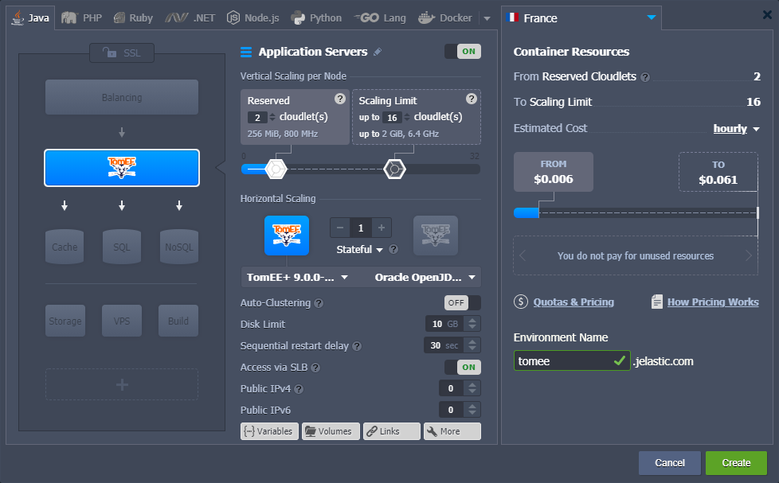
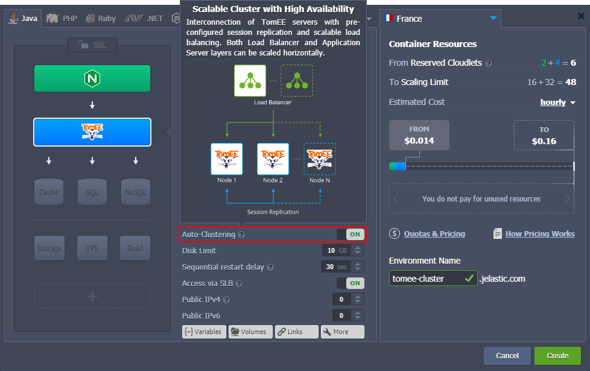
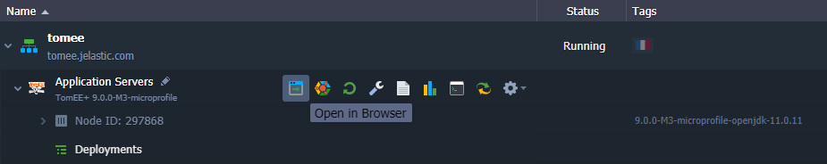
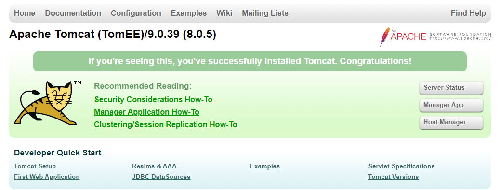
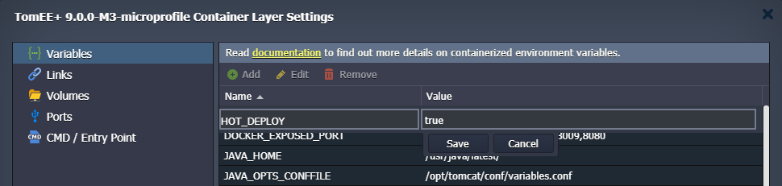

# Apache TomEE

**[Apache TomEE](https://tomee.apache.org/index.html)** is an enterprise-ready Java server, created based on Apache Tomcat with the implementation of the *MicroProfile* and *Jakarta EE* features. The extended [comparison](https://tomee.apache.org/comparison.html) of the supported functionality is provided on the official documentation page.

The platform provides four different distributions of TomEE:

- **WebProfile** - delivers the [Jakarta EE](https://tomee.apache.org/jakartaee-9.0/javadoc/) implementation, including Servlets, JSP, JSF, JTA, JPA, CDI, Bean Validation and EJB Lite
- **MicroProfile** - extends WebProfile options with full support for [MicroProfile](https://tomee.apache.org/microprofile-2.0/javadoc/)
- **Plus** - contains all technologies in the *MicroProfile* with addition of JAX-WS, JEE Connectors, and JMS
- **PluME** - supports all in the *Plus* profile, includes Eclipse Mojarra and EclipseLink (this distribution is needed for organizations that are migrating from Eclipse Glassfish to the Apache TomEE project)

{}**Note:** This template utilizes a modern ***systemd*** initialization daemon.{}

TomEE application server runs without any additional runtime requirements or startup time for larger applications and is compatible with most of the Tomcat-aware and Tomcat-tested tools. Below, we’ll describe how to get Apache TomEE up and running on the platform.

1\. Log into the PaaS dashboard and click the **New Environment** button.

2\. In the topology wizard dialog, select **TomEE** as your application server (on the ***Java*** tab). If needed, configure node scaling ([vertical](/automatic-vertical-scaling/) and [horizontal](/horizontal-scaling/)), [public IPs](/public-ip/), environment name, etc. Click **Create** when ready.

{}**Tip:** The platform provides a one-click **[Auto-Clustering](/auto-clustering/)** option that automatically configures a highly available TomEE cluster.

As a result, you’ll get a ready-to-go Java cluster with the scalable number of the interconnected TomEE servers with pre-configured session replication and load balancing.{}

3\. Your new environment with the Apache TomEE Java application server will be created in a minute.

Click the **Open in Browser** button to access the server’s default page.

Now, you can proceed to the [application deployment](/deployment-guide/).

{}**Tip:** Tomcat and TomEE servers are provided with a special ***HOT_DEPLOY*** variable (not set by default) that defines whether the server should be restarted (*false*, *disabled*, *0*) or not (*true*, *enabled*, *1*) during the application deployment.

**Hot deploy** (without restart) is relatively faster and allows avoiding downtime during the deployment process. However, it is not supported by some applications and thus is disabled by default.{}

## What's next?

* [Tomcat Server](/tomcat/)
* [Java Application Server Configuration](/java-application-server-config/)
* [Tomcat Multiple Domains](/multiple-domains-tomcat-server/)
* [Deployment Guide](/deployment-guide/)
* [Environment Variables](/environment-variables/)
* [Tomcat Security](/tomcat-security/)