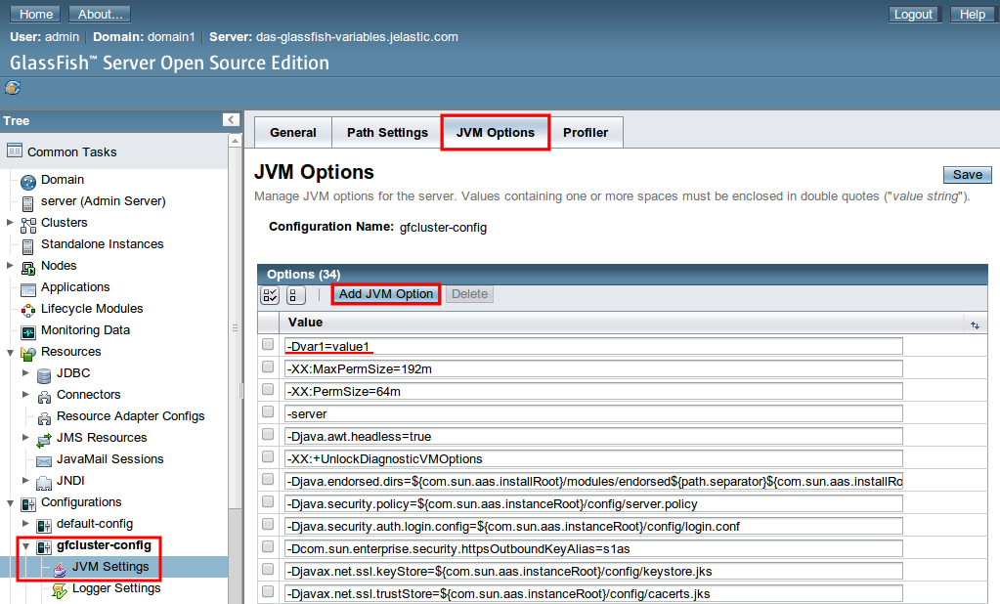

# Custom Environment Variables for Java Application Servers

Environment variables represent a kind of placeholders, where you can store the frequently used parameters' values or strings in order not to specify them manually in the code each time they are needed. There is a number of [default environment variables](/environment-variables) which are preconfigured at the platform application servers and can be easily integrated into your app, hosted within these servers, to make your work with the platform even more convenient.

The following guide will acquaint you with the details on how to add your custom environment variables to particular Java application servers:
 
* [Tomcat, TomEE or Jetty](#tom-jetty)
* [GlassFish](#glassfish)

**Note** that the same operations can be done by means of establishing the SSH connection to any of your servers and declaring variables in the corresponding configuration file [via console](/custom-environment-variables-ssh).

## Tomcat, TomEE and Jetty Variables
The following workflow is pretty simple and identical for the majority of supported Java application servers, so let's check it out first.

1\. Click the **Config** button for your application server (**Tomca**, **TomEE** or **Jetty**).

2\. In the opened tab, navigate to the **/opt/tomcat/conf** directory and choose the ***variables.conf*** file within it. There you'll see a short instruction on setting your custom environment variables.  
Follow it, by means of adding the desired custom variables here. Each variable should be either separated by a space from the next one or started from a new line.    
For example:  
***-Dvar1=value1 -Dvar2=value2***  
***-Dmy.var3=/my/value***  

{}**Note:** you can also set ***JVM options*** in this file. As an example, you can see the [Garbage Collection agent](/garbage-collector-agent) option declared just above the circled area at the image.{}

Do not forget to **Save** the configurations you've made.

3\. Then make the appropriate changes in your application's code with the help of the *System.getProperty("your_variable")* method to appoint the specified values to the needed arguments.  
For example:   
<i>String **var1** = System.getProperty("**var1**");</i>  
<i>String **var2** = System.getProperty("**var2**");</i>  
<i>String **var3** = System.getProperty("**var3**")</i>  

4\. Once this is completed, **Restart** your application server using the corresponding button next to it.

As a result, all the newly stated configurations will be applied.

## GlassFish Variables
For Glassfish, variables configuration is performed through its **Administration Console**, so the process will be the following:

1\. Click the last button (with gear icon) for **GlassFish** in your environment and choose **Admin panel > Login** in the appeared list (or follow the link to the Admin console which you've received via email after environment creation).

2\. Fill in the **Username** and **Password** fields with the credentials from the same email received earlier.

3\. Once inside, choose the **gfcluster-config &gt; JVM Settings** option within the *Configuration's* section at the left-hand menu list.

4\. Then select the **JVM Options** tab and click on the **Add JVM Option** button above the ***Options*** list. A new empty field will appear at the top of the list, wherein you can enter your custom environment variable (e.g. *-Dvar1=value1*).

If you'd like to call a JAR file as the option's argument, just upload it to the **home** folder of your GlassFish server and specify the path to it for the desired option, for example:
*-javaagent:/opt/glassfish3/temp/newrelic.jar*  

After all the desired parameters are set, click the **Save** button.

5\. If everything is OK, you'll get the next message:

6\. Finally, switch back to your platform dashboard and restart **GlassFish** using the corresponding button.
.png)

That's all. In such a way, you can manage GlassFish environment variables through the Admin Console.

## What's next?
* [Environment Variables](/environment-variables/)
* [Custom Variables via SSH](/custom-environment-variables-ssh/)
* [Tomcat](/tomcat/)
* [TomEE](/tomee/)
* [Jetty](/jetty/)
* [GlassFish](/glassfish/)