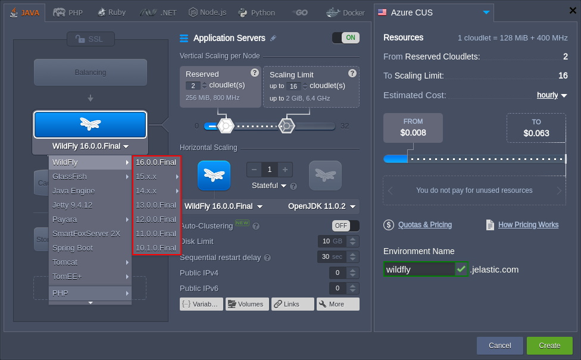
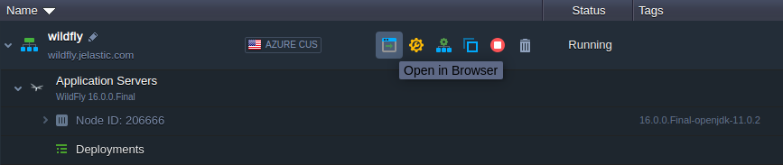
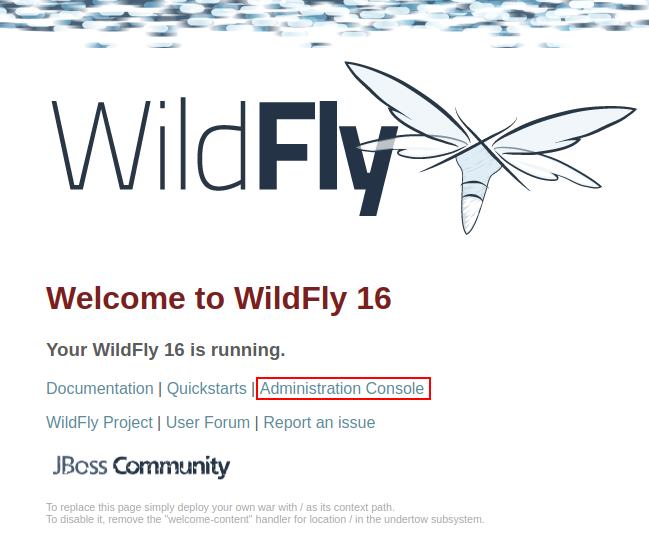
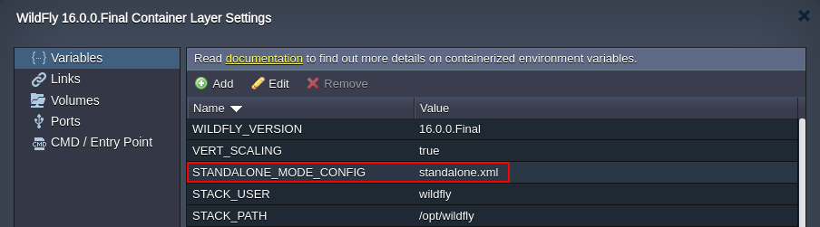

# WildFly Application Server

**[WildFly](https://wildfly.org/)** is a modern, flexible, lightweight and managed application runtime, which is written in Java and implements the latest standards and technology of the Java Platform Enterprise Edition (Java EE) specification. WildFly is entirely free and open source, available to be run on multiple platforms.
Among the main features of this application server:

* customizable runtime based on the pluggable subsystems, which can be integrated or removed on demand
* Java EE8 support to implement the latest enterprise Java standards in easy to consume framework
* modular approach with an ability to start each service in isolation
* fast, lightweight and optimized for ultimate performance

To create a **WildFly** application server for Java project hosting within the platform, follow the simple steps below.

{}**Note:** This template utilizes a modern ***systemd*** initialization daemon.{}

## Creating WildFly Server

1\. Log in to your PaaS account and click the **New Environment** button in the upper left corner of the dashboard.

2\. In the opened environment topology wizard, navigate to the **Java** tab and select **WildFly** (the ***10-16*** versions are supported) from the list of available application servers. Then, specify the allocated resources limit using cloudlet sliders, choose a [region](/environment-regions/) (if several ones are available) and edit the name of your environment.

{}**Notes:**

* WildFly is [not compatible](https://docs.wildfly.org/16/Getting_Started_Guide.html#requirements) with Java 6 and 7; therefore these versions are not available
* due to the minimal WildFly resources requirements, it is strongly recommended to allocate **more than 1 cloudlet** for this node. Otherwise, you can experience low server performance and even its failure
* WildFly can be launched in the *[Standalone](#standalone-mode)* mode using the configuration file defined in the ***STANDALONE_MODE_CONFIG*** environment variable
* the platform provides out-of-box support of the WildFly servers ***Auto-Clustering*** in the *[Managed Domain](https://www.virtuozzo.com/company/blog/wildfly-managed-domain-in-containers-auto-micro-clustering-and-scaling/)* mode via the appropriate switcher in topology wizard{}

Click the **Create** button when ready.

3\. Wait for a couple of minutes for your environment to be created and click the **Open in Browser** button next to it.

4\. The WildFly default welcome page lists some useful links to help you get started.

In order to access the WildFly ***Administration Console***, click the appropriate link (circled in the image above) or get URL from the email (received after server creation) alongside with other access credentials.

Also, you can establish an [SSH connection](/ssh-access/) to your WildFly server and use the [WildFly CLI](https://docs.wildfly.org/16/Admin_Guide.html#CLI_Recipes) inbuilt utility for managing.

## Standalone Mode

The WildFly application server is run in the "*standalone*" mode by default so that each instance is an independent process based on the configuration file defined via the ***STANDALONE_MODE_CONFIG*** [environment variable](/environment-variables/).

There are four certified profiles for standalone mode:

* ***standalone.xml*** (*default*) - configurations for *Java Enterprise Edition 8 Web* with the required technologies
* ***standalone-full.xml*** - configurations for *Java Enterprise Edition 8 Full* with all the EE 8 technologies
* ***standalone-ha.xml*** - configurations for *Java Enterprise Edition 8 Web* with high availability
* ***standalone-full-ha.xml*** - configurations for *Java Enterprise Edition 8 Full* with high availability

In case of using the HA configs (the last two options), the ***[jgroups](http://www.jgroups.org/)*** protocol is used for messaging between nodes. It is configured to use the authorization with the MD5 token and asymmetrical encryption by default. Such an implementation prevents non-authorized nodes from being able to join a cluster and non-members from communicating with cluster members.

{}**Note:** It is highly recommended to change the default ***auth_value*** parameter within your standalone HA configuration file on the production environments.{}

This concludes our tutorial on the WildFly server installation! Now, you can configure it in a way you need and proceed to the [application deployment](/deployment-guide/).

## What's next?

* [Setting Up Environment](/setting-up-environment/)
* [Deployment Guide](/deployment-guide/)
* [Environment Variables](/environment-variables/)
* [Configuration File Manager](/configuration-file-manager/)