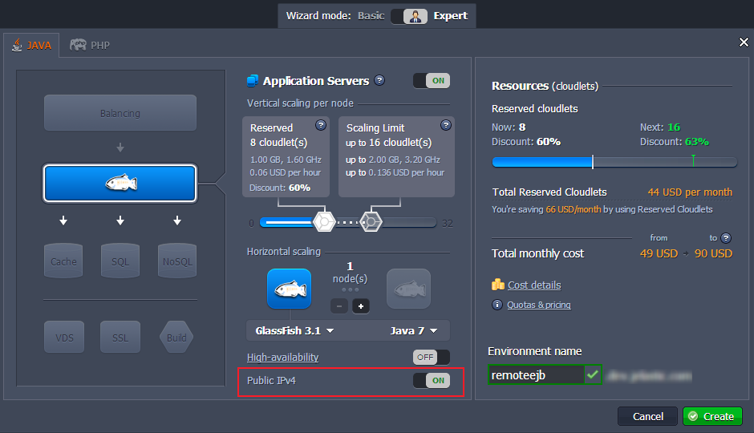
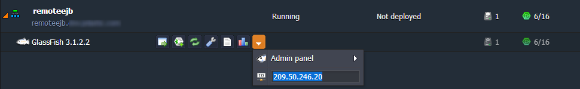
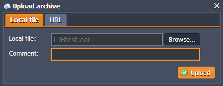
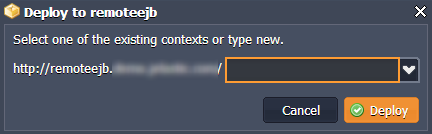
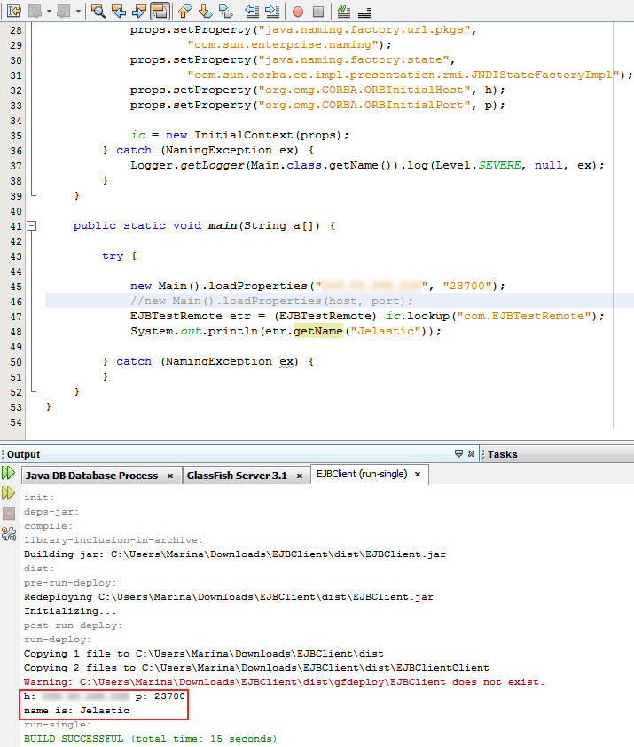

# Remote Access to EJB on GlassFish
**Enterprise Java Beans** (EJB) is a server-side architecture part of Java EE. Its specification contains two kinds of client views: remote and local ones. In one case, your Java app may require the session and entity beans with local home and component interfaces and in another case - with remote ones.

Let's find out what are the differences between these interfaces and which of them you need to choose to work with.

If you are sure that other clients and EJBs will access your bean via a single JVM, you can use a ***local client view***. It is also suitable for the case your beans are associated one with another. Such an access is performed within direct calling of methods, not through the remote method invocation (RMI).

For the case your client is placed on the other JVM, i.e. you would like to use your bean in the distributed environment, then there is a necessity to work with the ***remote client view***. All the methods' calls from the remote interfaces will be handled by it. It is also preferably to use RCV while working with parameters, passed by value between the client application and bean.

Let's examine how to deploy Java Bean to the PaaS hosting and use EJB remote client to work with it.

### A. Create the environment

1\. Log in to your PaaS account.

2\. Click the **Create environment** button in order to open the environment topology wizard. Pick up **GlassFish** as your application server and set cloudlet limits for it accordingly to the resources consumption needs of your Java enterprise application. Enable the **Public IP** for GlassFish, type the name for your environment and click **Create**. 

 Wait about a minute for your environment to be created.

3\. In order to see the **Public IP** of your GF server press the additional button next to it. 


 
### B. Create the application

1\. At the very beginning, create a new directory to place your EJB and client application files in.

2\. Then create your **Session Bean**. It will be used to access the deployed application via the remote client app through executing business tasks inside the server.
```java
package com;
import javax.ejb.Stateless;
 
@Stateless
public class EJBTest implements EJBTestRemote {
 
    @Override
    public String getName(String name) {
        return "name is: " + name;
    }
}
```

3\. The next step is creating the **Enterprise Java Beans** interface. It is necessary for the remote client in order to access the beans.

```java
package com;
import javax.ejb.Remote;
 
public interface EJBTestRemote {
    public String getName (String name);
}
```

4\. Build a new module and pack it into the file with **.ear** extension. 

5\. The following code is an example of remote client application, which is used to access the bean. It performs the remote connection to your EJB through the Public IP of GlassFish application server and calls the **getName()** method, which, in its turn, returns the data to the client.
```java
package ejbclient; 
import com.EJBTestRemote;
import java.util.Properties;
import java.util.logging.Level;
import java.util.logging.Logger;
import javax.naming.InitialContext;
import javax.naming.NamingException;
 
public class Main {
 
    private static InitialContext ic;
    //private String host="",port="";
 
    public void loadProperties(String h, String p) {
        try {
            Properties props = new Properties();
 
            System.out.println("h: " + h + " p: " + p);
 
            props.setProperty("java.naming.factory.initial",
                    "com.sun.enterprise.naming.SerialInitContextFactory");
            props.setProperty("java.naming.factory.url.pkgs",
                    "com.sun.enterprise.naming");
            props.setProperty("java.naming.factory.state",
                    "com.sun.corba.ee.impl.presentation.rmi.JNDIStateFactoryImpl");
            props.setProperty("org.omg.CORBA.ORBInitialHost", h);
            props.setProperty("org.omg.CORBA.ORBInitialPort", p);
 
            ic = new InitialContext(props);
        } catch (NamingException ex) {
            Logger.getLogger(Main.class.getName()).log(Level.SEVERE, null, ex);
        }
    }
 
    public static void main(String a[]) {
 
        try {
 
            new Main().loadProperties("{GlassFish_Public_IP}", "23700");
            EJBTestRemote etr = (EJBTestRemote) ic.lookup("com.EJBTestRemote");
            System.out.println(etr.getName("Jelastic"));
 
        } catch (NamingException ex) {
        }
    }
}
```

**Note:** All the numbers of ports begin with additional 2 digit for the reason the platform works with **gfcluster** only.

As an example of **.ear** file you can use [this](https://download.jelastic.com/public.php?service=files&t=5af859deae8519d5b58dbdb2d09fef80&download) package. 


### C. Deploy the application

1\. Navigate to the platform dashboard, open the **Deployment manager** and upload the created **.ear** within it.Hope this tutorial on the basics of remote interfaces usage helped you. Enjoy!


2\. Deploy the uploaded package to the GlassFish environment, created in the step A of this instruction. 

 
3\. Finally, run your application (press **Open in browser** button next to the environment) and check the results. 

 
Hope this tutorial on the basics of remote interfaces usage helped you. Enjoy! 


## What's next?

* [Public IP](/public-ip/)
* [Deploy Java Application via Archive/URL](/upload-deploy-application/)