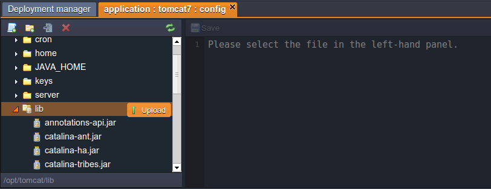

# Upload JAR Files

You can also upload **JAR files** to your application. All uploaded JAR files are available on all of your application nodes. The platform is compatible with all libraries and has no limitations or restrictions on uploading Java files.

To upload **.jar** files:

* Click the **Config** button for the desired instance.

* In the opened tab, hover your mouse over the folder **lib** and click on **Upload**.

**Multi upload of Java files is available!**

Now you can use the uploaded libraries in your projects!</ol>

## What's next?
* [Java Agent](/javaagent/)
* [Application configuration](/application-configuration/)