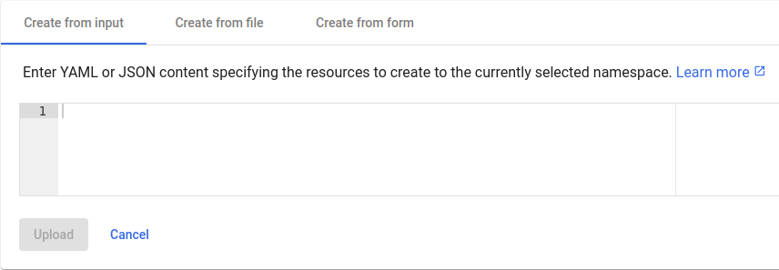

# Kubernetes Cluster: YAML Deployments

Kubernetes natively supports deployments from both JSON and YAML files. However, among the community, YAML is a more frequent option and can be considered a standard.

Deployment from YAMLs is somewhat similar to the [Helm](/kubernetes-helm-integration) charts - the ***.yaml*** or ***.yml*** file provides object definition or a list of objects. Herewith, it can be directly applied in *Kubernetes Dashboard* or with the *kubectl* command-line tool without any additional software installation.



When working over *kubectl*, use the ***[apply](https://kubernetes.io/docs/reference/kubectl/cheatsheet/#apply)*** command with the correct path to your deployment YAML file:

```bash
kubectl apply -f /path/to/deployment.yaml
```
On the other hand, the benefit of the [Helm](/kubernetes-helm-integration) charts is advanced flexibility (support of the conditions, replacements, parameters, etc.).


## What's next?
* [K8s Helm Integration](/kubernetes-helm-integration)
* [K8s Internal Networking](/kubernetes-internal-networking)
* [K8s Exposing Services](/kubernetes-exposing-services)
* [K8s Creating Ingresses](/kubernetes-creating-ingresses)


