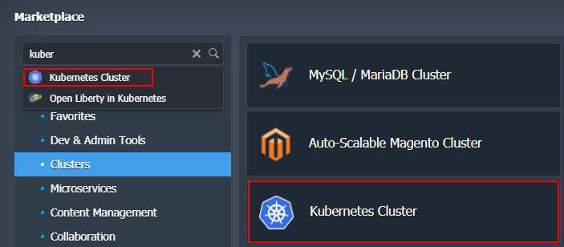
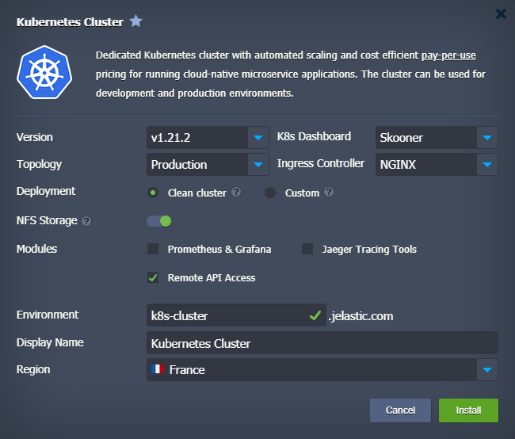

# Kubernetes Cluster: Package Installation

The **Kubernetes Cluster** solution is available for automatic installation via [platform Marketplace](/marketplace/) under the *Clusters* category (or use *Search* to locate). Note that this clustered solution is available for *billing* customers only.

Within the opened installation frame, customize the available options to get a cluster specifically for your needs:

- **Version** - choose a [Kubernetes version](/kubernetes-cluster-versions/#current-versions) for your cluster
- **K8s Dashboard** - select between the *v2* and *Skooner* options (note that some metrics in the *skooner* dashboard don't work with the *HAProxy* ingress controller)
- **Topology**
  - *Development* - one control-plane (1) and one scalable worker (1+)
  - *Production* - multi control-plane (3) with API balancers (2+) and scalable workers (2+)
{}**Note:** The *development* topology is not recommended for production projects as it cannot handle high load reliably due to a single control-plane instance.{}
- **Ingress Controller** - choose the preferable [ingress controller](/kubernetes-creating-ingresses/) for your cluster (*NGINX*, *Traefik*, or *HAProxy*). We recommended using *NGINX* as it provides the most flexibility
- **Deployment**
  - *Clean cluster* with pre-deployed HelloWorld example
  - *Custom* helm or stack deployed via shell command - chose this option to manually provide commands for custom application deployment from the *[helm](/kubernetes-helm-integration/)* repository
- **NFS Storage** - enable to attach a dedicated NFS Storage with dynamic volume provisioning (disable if you want to register own storage class, requires in-depth K8s knowledge)
- **Modules** (can be enabled later via the add-ons)
  - *Prometheus & Grafana* - check to install these monitoring tools (recommended). This deployment requires an additional 5GB of disk space for persistent volumes and consumes about 500 MB of RAM
  - *Jaeger Tracing Tools* - tick to install *Jaeger* tracing system for monitoring and troubleshooting
  - *Remote API Access* - check if you plan on using the *kubectl* command-line tool or some other remote clients
- **Environment** - provide a name for your environment
- **Display Name** - specify an [alias](/environment-aliases/)
- **Region** - choose a [region](/environment-regions/) (if available)

Click **Install** and wait a few minutes for the platform to automatically configure your Kubernetes cluster.

## What's next?

* [Platform Marketplace](/marketplace/)
* [Kubernetes Overview](/kubernetes-cluster/)
* [K8s System Requirements](/kubernetes-cluster-requirements/)
* [K8s Cluster Versions](/kubernetes-cluster-versions/)