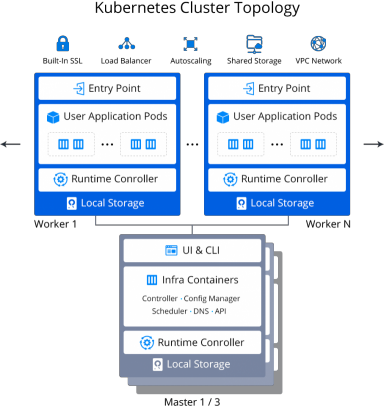

# Kubernetes Cluster: Versions & Change Logs

The platform provides a pre-packages ***Kubernetes (K8s) Cluster*** solution with automatic installation. [Kubernetes](https://kubernetes.io/docs/concepts/overview/what-is-kubernetes/) is a portable, extensible, open-source platform for managing container-based workload and services, that facilitates both declarative configuration and automation. It correlates greatly with the PaaS, allowing to set up applications based on the Kubernetes system directly inside the platform.

By hosting a Kubernetes Cluster at the platform, you can get the following benefits:

* ***Easy Start*** - automated installation in several clicks do not require manual intervention
* ***Hyper Scalability*** - the cluster can be automatically scaled vertically and horizontally
* ***Multi-Cloud Availability*** - mix and match cloud options due to the project needs
* ***Simplified Management*** - a single point of management via intuitive UI and built-in Web SSH
* ***Flexible Automation*** - automate DevOps processes with open API and Cloud Scripting
* ***Cost Efficiency*** - pay only for consumed resources benefiting from container density and scalability

{}**Tip:** More specifics and in-depth description with use case examples are provided in the appropriate **[Kubernetes Cluster](https://www.virtuozzo.com/company/blog/kubernetes-cluster-scaling-pay-per-use-hosting/)** article on our blog.{}

Below, we'll overview all of the Kubernetes Cluster versions and describe implemented changes and adjustments.

## K8s Package Change Log

You can check the source code of the ***[Kubernetes Cluster](https://github.com/jelastic-jps/kubernetes)*** package at GitHub. You can overview changes in each of the versions by clicking on the required record in the list below.

{}**Note:** Implementation of new features/components for the **Kubernetes Cluster** solution (as well as stability testing) requires a certain amount of time. So, the package version is usually one or two minor releases behind the [Kubernetes upstream tags](https://github.com/kubernetes/kubernetes/tags).{}

### Current Versions

{} 
- added ***1.28.0*** version for the new Kubernetes cluster installations
- removed outdated integration with GitLab (the ***GitLab Integration*** add-on for Kubernetes)
- updated formatting of the *successfull installation* pop-up from HTML to markdown
- improved validation for the ***Certificate Manager*** add-on pre-installation: "*cert-manager*" can now be deployed for user-specific needs even if *Jaeger* is enabled during the Kubernetes cluster creation
{}
{} 
- added ***1.27.4*** version for the new Kubernetes cluster installations 
- removed outdated integration with GitLab (the ***GitLab Integration*** add-on for Kubernetes)
- improved validation for the ***Certificate Manager*** add-on pre-installation: "*cert-manager*" can now be deployed for user-specific needs even if *Jaeger* is enabled during the Kubernetes cluster creation
{}
{} 
- added ***1.26.7*** version for the new Kubernetes cluster installations
- re-enabled the ***Rancher*** management tool installation after the compatibility issue with the current *1.26.x* Kubernetes version was resolved
- removed outdated integration with GitLab (the ***GitLab Integration*** add-on for Kubernetes)
- improved validation for the ***Certificate Manager*** add-on pre-installation: "*cert-manager*" can now be deployed for user-specific needs even if *Jaeger* is enabled during the Kubernetes cluster creation
{}

### Release Notes Archive

{} 
- added ***1.25.4*** version for the new Kubernetes cluster installations
- renewed the ***Jaeger Tracing Tools*** implementation (updated version, operator provisioning, dependencies) due to API changes
- updated the **Kubernetes cluster components**:
  - *ingress-nginx 1.5.1*
  - *k9s 0.26.7*
  - *metallb 0.13.7*
  - *kubernetes-dashboard 2.7.0*
  - *metrics-server 0.6.2*
  - *cert-manager 1.10.1*
  - *cert-manager-nginx 4.4.0*
- fixed the *Stern* component installation after its upstream repository relocation
- temporarily disabled the *Rancher* management tool installation due to the incompatibility with the current *1.25.x* Kubernetes version
- fixed the connection problem after the *GitLab Integration* add-on installation
- switched to Custom Resource Definition (CRD), improved compatibility and configuration migration for *MetalLB*; fixed the problem with the domain appliance via the *Certificate Manager* add-on
{}
{} 
- added ***1.24.8*** version for the new Kubernetes cluster installations 
- fixed the *Stern* component installation after its upstream repository relocation
- fixed the connection problem after the *GitLab Integration* add-on installation
- switched to Custom Resource Definition (CRD), improved compatibility and configuration migration for *MetalLB*; fixed the problem with the domain appliance via the *Certificate Manager* add-on
{}
{} 
- added ***1.23.14*** version for the new Kubernetes cluster installations
- fixed the *Stearn* component installation after its upstream repository relocation
- fixed the problem with domain appliance via the *Certificate Manager* add-on
{}
{} 
- added ***1.24.4*** version for the new Kubernetes cluster installations 
- updated the **Kubernetes cluster components**:
  - *ingress-nginx 1.3.0*
  - *helm 3.9.4*
  - *k9s 0.26.3*
  - *metallb 0.13.4*
  - *kubernetes-dashboard 2.6.1*
{}
{} 
- added ***1.23.10*** version for the new Kubernetes cluster installations
{}
{} 
- added ***1.22.12*** version for the new Kubernetes cluster installations
- updated the *OpenLiberty* operator to *0.8.2*
{}
{} 
- added ***1.21.14*** version for the new Kubernetes cluster installations
{}
{} 
- added ***1.23.6*** version for the new Kubernetes cluster installations
- **bug fixes:**
  - fixed an unhandled error when configuring the *GitLab Integration* add-on a second time for the same server
  - implemented an active refresh for the environments list in the *GitLab Integration* add-on to provide accurate results
  - fixed an error when removing *GitLab Integration* with the already deleted environment
{}
{} 
- added ***1.22.10*** version for the new Kubernetes cluster installations
- updated the automounter package suite version - *autofs 5.1.8*
{}
{} 
- added ***1.21.12*** version for the new Kubernetes cluster installations
- updated the automounter package suite version - *autofs 5.1.8*
- fixed an issue with missing credentials for the *Rancher* management tool in the after-installation pop-up and email 
{}
{} 
- added ***1.22.6*** version for the new Kubernetes cluster installations
- added SSL endpoint support for the *Traefik* ingress controller
- added support for the latest versions of the *Open Liberty Operator*
- updated the **Kubernetes cluster components**:
  - *ingress-nginx 1.1.1*
  - *ingress-haproxy 1.6.9*
  - *k9s 0.25.18*
- **bug fixes:**
  - fixed the *k8sm-config* failure due to missing *ClusterStatus* data in the *kubeadm ConfigMap*
  - disabled the possibility to enable a *stateful* scaling mode for the Kubernetes nodes
  - fixed an error during the *Rancher* add-on installation
  - fixed an error during the *GitLab* integration with the Kubernetes Cluster
{}
{} 
- added ***1.21.10*** version for the new Kubernetes cluster installations
- fixed an error during the *GitLab* integration with the Kubernetes Cluster
{}
{} 
- added ***1.23.4*** version for the new Kubernetes cluster installations
- updated the **Kubernetes cluster components**:
  - *metrics-server 0.6.1*
  - *kubernetes-dashboard 2.5.1*
  - *metallb-controller 0.12.1*
  - *helm 3.7.2*
  - *cert-manager 1.7.1*
  - *cert-manager-nginx 4.0.18*
  - *ingress-nginx 1.1.2*
- **bug fixes:**
  - fixed an error during the *Rancher* add-on installation
  - fixed an error during the *GitLab* integration with the Kubernetes Cluster
{}
{} 
- added ***1.22.4*** version for the new Kubernetes cluster installations
- implemented ***IngressClass*** API support and updated ingress resources to switch from the deprecated cluster API
- updated *Jaeger* operator to the *1.27* version, which operates with the new *IngressClass* API
- updated the **Kubernetes cluster components**:
  - *k9s 1.25.6*
  - *ingress-nginx 1.1.0*
  - *metrics-server 0.5.2*
  - *helm 3.6.3*
  - *cert-manager 1.5.4*
  - *ingress-nginx-cert 4.0.11*
- adjusted texts in the Kubernetes installation and success windows
- added the *redeploy.conf* file to the favorites shortcuts in file manager (similar to other certified templates)
- temporarily switched to the "*hello-world*" deployment instead of "*openliberty-operator*", which is not compatible with the *Kubernetes 1.22+* versions yet
- temporarily disabled the *Rancher* management tool installation as it is not compatible with the *Kubernetes 1.22+* versions yet
- **bug fixes:**
  - fixed unhandled error when trying to install the *Cluster Configuration > Storage* add-on with insufficient account quotas
  - fixed typo in the *Kubernetes Cluster* application manifest
  - adjusted initial *Grafana* configurations to automatically assign platform default dashboard
  - fixed the *DockerHub Registry Credentials* add-on, updated RBAC and the *registry-creds* controller version
  - fixed the *k8sm-config* failure due to missing *ClusterStatus* data in the *kubeadm ConfigMap*
{}
{} 
- added ***1.21.6*** version for the new Kubernetes cluster installations
- updated the **Kubernetes cluster components**:
  - *ingress-haproxy 1.6.7*
  - *ingress-nginx 0.49.3*
  - *metrics-server 0.5.1*
  - *hello-kubernetes 1.10.1*
  - *metallb 0.11.0*
  - *kubernetes-dashboard 2.4.0*
- adjusted texts in the Kubernetes installation and success windows
- **bug fixes:**
  - fixed unhandled error when trying to install the *Cluster Configuration > Storage* add-on with insufficient account quotas
  - fixed typo in the *Kubernetes Cluster* application manifest
  - adjusted initial *Grafana* configurations to automatically assign platform default dashboard
  - fixed the *DockerHub Registry Credentials* add-on, updated RBAC and the *registry-creds* controller version
{}
{} 
- added ***1.20.12*** version for the new Kubernetes cluster installations
- adjusted texts in the Kubernetes installation and success windows
- **bug fixes:**
  - fixed unhandled error when trying to install the *Cluster Configuration > Storage* add-on with insufficient account quotas
  - fixed typo in the *Kubernetes Cluster* application manifest
  - adjusted initial *Grafana* configurations to automatically assign platform default dashboard
  - fixed the *DockerHub Registry Credentials* add-on, updated RBAC and the *registry-creds* controller version
{}
{} 
- added ***1.19.16*** version for the new Kubernetes cluster installations
- adjusted texts in the Kubernetes installation and success windows
- **bug fixes:**
  - fixed unhandled error when trying to install the *Cluster Configuration > Storage* add-on with insufficient account quotas
  - fixed typo in the *Kubernetes Cluster* application manifest
  - adjusted initial *Grafana* configurations to automatically assign platform default dashboard
  - fixed the *DockerHub Registry Credentials* add-on, updated RBAC and the *registry-creds* controller version
{}
{} 
- added ***1.21.4*** version for the new Kubernetes cluster installations
- added the *CoreDNS* component check to the cluster status
{}
{} 
- added ***1.20.10*** version for the new Kubernetes cluster installations
- renamed the *k8dash* utility to *skooner* (note that some metrics in the *skooner* dashboard don't work with the *HAProxy* ingress controller)
- explicitly changed the NGINX ingress chart to the *3.x* version due to incompatibility of the 4.x versions with the *cert-manager* ingress controller
- **bug fixes:**
  - fixed an error with the Kubernetes cluster installation failure when created with NGINX ingress controller
  - fixed an error when trying to connect Kubernetes cluster to the GitLab server that already has integration with another cluster
  - removed *popeye* as a separate tool as it is already a part of the *k9s* utility
{}
{} 
- added ***1.19.14*** version for the new Kubernetes cluster installations
- renamed the *k8dash* utility to *skooner* (note that some metrics in the *skooner* dashboard don't work with the *HAProxy* ingress controller)
- explicitly changed the NGINX ingress chart to the *3.x* version due to incompatibility of the 4.x versions with the *cert-manager* ingress controller
- **bug fixes:**
  - fixed an error with the Kubernetes cluster installation failure when created with NGINX ingress controller
  - fixed an error when trying to connect Kubernetes cluster to the GitLab server that already has integration with another cluster
  - removed *popeye* as a separate tool as it is already a part of the *k9s* utility
  - fixed an ingress check failure that can sometimes occur during  the upgrade to an intermediate *1.19.x* version
{}
{} 
- added ***1.21.2*** version for the new Kubernetes cluster installations
- updated ***Traefik*** ingress controller to the ***2.4.x*** version
  - due to a new architecture, old ***Traefik 1.x*** versions will be completely removed during Kubernetes cluster upgrades
  - during Traefik upgrade to *2.x*, the upgrade script will automatically update all standard ingress resources, however any custom ones should be checked and adjusted (if needed)
  - **[Custom Resource Definition](https://kubernetes.io/docs/concepts/extend-kubernetes/api-extension/custom-resources/)** (CRD) for an IngressRoute type was added in *Traefik 2.x* (in addition to the standard [Kubernetes Ingress](https://doc.traefik.io/traefik/providers/kubernetes-ingress/))
- updated the **Kubernetes cluster components**:
  - *metallb-controller 0.10.2*
  - *kubernetes-dashboard 2.3.1*
  - *ingress-nginx 0.48.1*
  - *metrics-server 0.5.0*
  - *ingress-haproxy 1.6.6*
  - *k9s 0.24.15*
  - *kubectx 0.9.4*
- renamed the *k8dash* utility to *skooner* (note that some metrics in the *skooner* dashboard don't work with the *HAProxy* ingress controller)
- actualized cluster metrics in the default *Grafana* dashboard
- explicitly changed the NGINX ingress chart to the *3.x* version due to incompatibility of the 4.x versions with the *cert-manager* ingress controller
- **bug fixes:**
  - fixed an error with the Kubernetes cluster installation failure when created with NGINX ingress controller
  - fixed an error when trying to connect Kubernetes cluster to the GitLab server that already has integration with another cluster
  - removed *popeye* as a separate tool as it is already a part of the *k9s* utility
{}
{} 
- added *1.20.8* version for the new Kubernetes cluster installations
- ceased automatic ***runner-gitlab*** deployment due to discontinued support of the *[GitLab Managed Apps](https://docs.gitlab.com/ee/user/clusters/applications.html)* feature
- actualized cluster metrics in the default *Grafana* dashboard
{}
{} 
- added *1.19.12* version for the new Kubernetes cluster installations
- ceased automatic ***runner-gitlab*** deployment due to discontinued support of the *[GitLab Managed Apps](https://docs.gitlab.com/ee/user/clusters/applications.html)* feature
- actualized cluster metrics in the default *Grafana* dashboard
{}
{} 
- added *1.18.20* version for the new Kubernetes cluster installations
- ceased automatic ***runner-gitlab*** deployment due to discontinued support of the *[GitLab Managed Apps](https://docs.gitlab.com/ee/user/clusters/applications.html)* feature
- actualized cluster metrics in the default *Grafana* dashboard
{}
{} 
- added ***Upgrade to 1.20.6*** for the existing Kubernetes clusters
- renamed the [legacy "*master*" term](https://kubernetes.io/docs/reference/glossary/?all=true#term-master) to "*control plane*" in parameters, actions, logs, etc. (this change is applied on the <u>*new installations*</u> only)
- restored *GitLab* integration for *Kubernetes Clusters 1.20+* (i.e. after the runtime change)
- updated the **Kubernetes cluster components**:
  - *hello-kubernetes 1.10*
  - *ingress-nginx 0.46.0*
  - *ingress-haproxy 1.6.1*
  - *helm 3.5.4*
  - *cert-manager 1.3.1*
  - *metrics-server 0.4.4*
  - *open-liberty 0.7.1*
  - *k9s 0.24.10*
  - *popeye 0.9.1*
- added checkup for the *admission-service* readiness before importing ingresses
- improved the **cluster upgrade procedure**:
  - adjusted upgrade flow to skip the unknown (not found) components and the corresponding dependencies
  - updated obsolete annotations on worker nodes when upgrading to 1.20.x from the presiding versions (due to runtime change)
- implemented error handling for the overlapping root ingress issue when trying to install the ***Rancher*** management tool on top of the existing non-default application
- **bug fixes**:
  - fixed an error during the default *Open Liberty* example application deployment on the installations with the *HAProxy* ingress controller
  - fixed an error with DockerHub secret being removed when re-adding credentials via the *DockerHub Credentials* add-on
  - fixed an error when configuring GitLab integration via the appropriate Kubernetes add-on
{}
{} 
- implemented error handling for the overlapping root ingress issue when trying to install the ***Rancher*** management tool on top of the existing non-default application
- added checkup for the *admission-service* readiness before importing ingresses
- improved the **cluster upgrade procedure**:
  - adjusted upgrade flow to skip the unknown (not found) components and the corresponding dependencies
  - updated obsolete annotations on worker nodes when upgrading to 1.20.x from the presiding versions (due to runtime change)
  - the *kubeadm bootstrap* config should not be preserved during the redeploy, ensuring that only up-to-date images are pulled
- **bug fixes**:
  - fixed an error during the default *Open Liberty* example application deployment on the installations with the *HAProxy* ingress controller
  - missing info on the *Jaeger* and *Monitoring Tools* credentials after the appropriate add-on re-installation
  - old *Jaeger* and *Monitoring Tools* credentials are displayed in the pop-up after the appropriate add-on re-installation
  - fixed an error during the Kubernetes cluster upgrade from *1.18.10* to *1.20.6*
  - replaced the deprecated *nfs-client-provisioner* API with the *nfs-subdir-external-provisioner* alternative
  - fixed an error with DockerHub secret being removed when re-adding credentials via the *DockerHub Credentials* add-on
  - fixed an error when configuring GitLab integration via the appropriate Kubernetes add-on
{}
{} 
- implemented error handling for the overlapping root ingress issue when trying to install the ***Rancher*** management tool on top of the existing non-default application
- added checkup for the *admission-service* readiness before importing ingresses
- improved the **cluster upgrade procedure**:
  - adjusted upgrade flow to skip the unknown (not found) components and the corresponding dependencies
  - implemented automatic switching to the default namespace before the cluster upgrade
  - updated obsolete annotations on worker nodes when upgrading to 1.20.x from the presiding versions (due to runtime change)
- bug fixes:
  - HTTP auto-redirect should be disabled for the Kubernetes nodes in the *Extra* layers
  - fixed an error when configuring GitLab integration via the appropriate Kubernetes add-on
{}
{} 
- added ***Upgrade to 1.20.4*** for the existing Kubernetes clusters
- added Kubernetes version selector (three latest versions in the descending order) to the installation window
- switched to the ***containerd*** runtime, adjusted the appropriate configurations and the upgrade procedure
- integrated the ***[Rancher](https://rancher.com/)*** management tool for Kubernetes cluster
- updated the **Kubernetes cluster components**:
  - *kubernetes-dashboard 2.2.0*
  - *helm 3.5.3*
  - *k9s 0.24.7*
  - *metrics-server 0.4.2*
  - *weave 2.8.1*
  - *autofs 5.1.6*
  - *HAProxy ingress-resources and ingress-controller 1.5.1*
  - *NGINX ingress-controller 0.44*
- updated *Jaeger* monitoring tools version, its *CRD*, *ingress*, and *hotrod app* configs
- improved the default firewall rules appliance during the cluster creation to avoid incorrect restrictions
- added ***GlusterFS*** support for the *Shared Storage* in Kubernetes cluster
- added possibility to integrate *Shared Storage* into Kubernetes cluster topology after the initial installation - just add it via the dedicated add-on
- implemented an ability to add worker nodes on different layers
- improved the **cluster upgrade procedure**:
  - added checks for the nodes' state verification
  - preserved user-defined credentials from the *$HOME/.kube/config*
  - implemented automatic switching to the default namespace before the cluster upgrade
  - optimized configs to remove deprecated *Kubelet* options from *ConfigMap*
  - the *kubeadm bootstrap* config should not be preserved during the redeploy, ensuring that only up-to-date images are pulled
  - removed obsolete "*dockershim*" annotations for master nodes in cluster
- implemented add-on for the DockerHub credentials management (to bypass anonymous DockerHub user limitations)
- removed add-ons incompatible with the current Kubernetes cluster version
- moved Kubernetes cluster production components to AWS to eliminate pool limit
- moved Kubernetes artifacts to AWS for better availability
- improved redeploy procedure for Kubernetes cluster to keep data defined in the *redeploy.conf* file
- moved the deprecated *fail-swap-on* flag from the *sysconfig/kubelet* file to the */var/lib/kubelet/config.yaml* config
- improved texts on the cluster upgrade pop-up notifications
- added *Apache 2.0 License* to the project
- **bug fixes**:
  - restricted Kubernetes cluster migration between regions (as it breaks cluster operability)
  - fixed an error with an invalid/missing admin token for the complex cluster topologies
  - fixed an error with public IPs not being adjusted in *metallb-config* after worker nodes scaling
  - optimized *metallb-config* to skip configuration file's adjustment when scaling workers without public IPs
  - fixed inconsistent RBAC configurations in the *registry-creds* manifest
  - added *username*, *password*, and *email* fields' values validation in the *Docker Hub Credentials* add-on
  - disabled unsupported SSL-endpoints checks on the HAProxy controller
  - fixed an error with the application path when creating Kubernetes cluster with the *Traefik* ingress-controller
  - moved the *k8dash* dashboard to a separate namespace to avoid incompatibility with *HAProxy* ingress-controller
  - HTTP auto-redirect should be disabled for the Kubernetes nodes in the *Extra* layers
  - missing info on the *Jaeger* and *Monitoring Tools* credentials after the appropriate add-on re-installation
  - old *Jaeger* and *Monitoring Tools* credentials are displayed in the pop-up after the appropriate add-on re-installation
  - capitalized the *NGINX* ingress controller name in the installation window
  - fixed an error during the Kubernetes cluster upgrade from *1.18.10* to *1.20.4*
  - replaced the deprecated *nfs-client-provisioner* API with the *nfs-subdir-external-provisioner* alternative
{}
{} 
- added ***Upgrade to 1.19.8*** for the existing Kubernetes clusters
- added Kubernetes version selector (three latest versions in the descending order) to the installation window
- integrated the **[Rancher](https://rancher.com/)** management tool for Kubernetes cluster
- updated the ***Kubernetes cluster components***:
  - *metrics-server 0.4.2*
  - *weave 2.8.1*
  - *autofs 5.1.6*
  - *hello-kubernetes 1.9*
  - *kubernetes-dashboard v2.0.5*
  - *cert-manager 1.2.0*
  - *helm 3.5.2*
  - *metallb 0.9.6*
  - *kubectx (kubens, kubects) 0.9.3*
  - *k9s 0.24.4*
  - *HAProxy ingress-resources and ingress-controller 1.5.1*
  - *NGINX ingress-controller 0.44*
- updated *Jaeger* monitoring tools version, its *CRD*, *ingress*, and *hotrod app* configs
- improved the default firewall rules appliance during the cluster creation to avoid incorrect restrictions
- added ***GlusterFS*** support for the *Shared Storage* in Kubernetes cluster
- added possibility to integrate *Shared Storage* into Kubernetes cluster topology after the initial installation - just add it via the dedicated add-on
- implemented an ability to add worker nodes on different layers
- improved the ***cluster upgrade procedure***:
  - added checks for the nodes' state verification
  - preserved user-defined credentials from the *$HOME/.kube/config*
  - optimized configs to better clean up transition data
  - optimized configs to remove deprecated *Kubelet* options from *ConfigMap*
  - implemented automatic switching to the default namespace before the cluster upgrade
- implemented add-on for the DockerHub credentials management (to bypass anonymous DockerHub user limitations)
- moved Kubernetes cluster production components to AWS to eliminate pool limit
- moved Kubernetes artifacts to AWS for better availability
- improved redeploy procedure for Kubernetes cluster to keep data defined in the *redeploy.conf* file
- moved the deprecated *fail-swap-on* flag from the *sysconfig/kubelet* file to the */var/lib/kubelet/config.yaml* config
- improved texts on the cluster upgrade pop-up notifications
- added *Apache 2.0 License* to the project
- **bug fixes**:
  - restricted Kubernetes cluster migration between regions (as it breaks cluster operability)
  - fixed an error with an invalid/missing admin token for the complex cluster topologies
  - fixed an error with public IPs not being adjusted in *metallb-config* after worker nodes scaling
  - optimized *metallb-config* to skip configuration file's adjustment when scaling workers without public IPs
  - fixed inconsistent RBAC configurations in the *registry-creds* manifest
  - added *username*, *password*, and *email* fields' values validation in the *Docker Hub Credentials* add-on
  - disabled unsupported SSL-endpoints checks on the HAProxy controller
  - fixed an error with the application path when creating Kubernetes cluster with the ***Traefik*** ingress-controller
  - moved the *k8dash* dashboard to a separate namespace to avoid incompatibility with *HAProxy* ingress-controller
  - HTTP auto-redirect should be disabled for the Kubernetes nodes in the *Extra* layers
  - capitalized the *NGINX* ingress controller name in the installation window
{}
{} 
- added **Upgrade to *1.18.16*** for the existing Kubernetes clusters
- added Kubernetes version selector (three latest versions in the descending order) to the installation window
- integrated the **[Rancher](https://rancher.com/)** management tool for Kubernetes cluster
- updated the **Kubernetes cluster components**:
  - *k9s 0.24.2*
  - *popeye 0.9.0*
  - *cert-manager 1.0.4*
  - *cert-manager nginx (new)*
  - *metrics-server 0.4.2*
  - *weave 2.8.1*
  - *autofs 5.1.6*
- updated chart versions for *node-problem-detector*, *Grafana*, and *Prometheus*
- improved the **cluster upgrade procedure**:
  - added checks for the nodes' state verification
  - preserved user-defined credentials from the *$HOME/.kube/config*
  - fixed the *helm upgrade* error
  - fixed the *monitoring* and *Jaeger* tools installation on Kubernetes cluster after the upgrade
- implemented add-on for the DockerHub credentials management (to bypass anonymous DockerHub user limitations)
- improved the default firewall rules appliance during the cluster creation to avoid incorrect restrictions
- moved Kubernetes artifacts to AWS for better availability
- added ***GlusterFS*** support for the *Shared Storage* in Kubernetes cluster
- added possibility to integrate *Shared Storage* into Kubernetes cluster topology after the initial installation - just add it via the dedicated add-on
- improved redeploy procedure for Kubernetes cluster to keep data defined in the *redeploy.conf* file
- improved texts on the cluster upgrade pop-up notifications
- added *Apache 2.0 License* to the project
- **bug fixes**:
  - restricted Kubernetes cluster migration between regions (as it breaks cluster operability)
  - fixed an error with an invalid/missing admin token for the complex cluster topologies
  - fixed an error with public IPs not being adjusted in *metallb-config* after worker nodes scaling
  - optimized *metallb-config* to skip configuration file's adjustment when scaling workers without public IPs
  - fixed inconsistent RBAC configurations in the *registry-creds* manifest
  - added *username*, *password*, and *email* fields' values validation in the *Docker Hub Credentials* add-on
  - capitalized the *NGINX* ingress controller name in the installation window
  - fixed an error during the Kubernetes cluster upgrade from *1.18.10* to *1.20.4* 
{}
{} 
- added **Upgrade to *1.18.10*** for the existing Kubernetes clusters
- updated the **Kubernetes cluster components**:
  - *helm 2.16.12*
  - *dashboard 2.0.3*
  - *metallb 0.9.4*
  - *nginx-ingress 0.40.2*
  - *haproxy-ingress 0.9.1*
{}
{} 
- added **Upgrade to *1.17.12*** for the existing Kubernetes clusters
- updated the **Kubernetes cluster components**:
  - *weave 2.7.0*
  - *cni-plugins 0.8.7*
  - *Docker Engine CE 19.03.9*
  - *containerd 1.3.7*
  - *k9s v0.22.1*
  - *popeye 0.8.10*
- provided operator-driven version of *OpenLiberty* (instead of the previous Helm-based)
- fixed incorrect health check for the *K8dash* dashboard
{}
{} 
- added **Upgrade to 1.17.4** for the existing Kubernetes clusters
- restricted the Kubernetes Cluster package installation for *trial* accounts
- implemented the **GitLab Integration** add-on for Kubernetes to automate the CI/CD pipelines; with the integration specifics:
  - added *unregister k8s* functionality
  - synchronized with the latest GitLab version
  - added logging of the GitLab integration removal operation
- added ability to **assign public IP** to the Kubernetes cluster
  - improved firewall security
  - blocked public IP assignment to *k8sm* and *mbl*
- added the **[MetalLB](https://metallb.universe.tf/) Kubernetes LoadBalancer** controller for IP provision
  - improved the *metallb-config* utility to skip the IPv6 configuration
- updated the **Kubernetes cluster components**:
  - *weave 2.6.2*
  - *cni-plugins 0.8.5*
  - *certificate-manager 0.15.1*
  - *Docker Engine 19.03.8*
  - *kubernetes-dashboard v2.0.0-rc7*
  - *k9s 0.19.6*
  - *popeye 0.8.3*
  - *helm 2.16.5*
  - *cri-tools 1.17*
- cluster **internal optimizations**:
  - optimized Kubernetes Cluster provisioning with offload and parallel components installation
  - switched cgroup driver from *cgroupfs* to *systemd*
  - added a common integration mechanism - integration scripts are deployed on the *k8sm* layer and are provided for workers during the nodes' (re)configuration or the cluster upgrade
  - switched to the latest platform's redeployment mechanism
  - moved idempotent logic on the cluster instances (re)configuration into a separate service script
- improved the **cluster upgrade procedure**:
  - fixed CLI console prompt in instances
  - actualized list of add-ons
  - improved check-up of the cluster components state
  - fixed *helm* version discrepancy on the client- and server-side
- **UI/UX improvements**:
  - improved how the *Access Token* is displayed in the after-installation window
  - added cluster URL to the installation success pop-up
  - replaced the obsolete Kubernetes *Dashboard v1* option with *K8Dash* during the installation and upgrade
  - added Kubernetes version to the cluster name
- bug fixes:
  - fixed cluster installation failure due to issues with the helm *2.16.4* version
  - improved Storage component detection for the cluster
  - fixed non-unique *systemd machine-id* values for Kubernetes instances
  - improved cluster components' validation in the platform's system utility
  - fixed Kubernetes cluster *systemd journal* logging
  - improved concurrent configuration calls handling in the cluster
{}
{}
* added Upgrade to *1.16.6* for the existing K8s clusters
* updated the Kubernetes components:
    * *popeye 0.7.1*
    * *k9s 0.17.5*
    * *kubectx 0.8.0*
    * *hello-kubernetes 1.7*
    * *dashboard 2.0.0-rc3*
* updated the NGINX ingress controller to the latest *0.30* version and changed service type from *Deployment* to *[DaemonSet](https://kubernetes.io/docs/concepts/workloads/controllers/daemonset/)*
* updated the installation process to ensure that all *masters* have a role and a *NoSchedule* taint before worker nodes POD scheduling
* optimized the resource consumption to reduce the impact on the cluster performance in case of slow network and limited I/O capacity
* added the *crictl* component Bash autocompletion support
* added *Docker CT* checks to the cluster health-check for better problem detection
* set *helm* version to *2.16.3* explicitly due to deployment [validation issues](https://github.com/helm/helm/issues/7797) in later releases
* updated logos and titles of the default add-ons available after the *Kubernetes Cluster* installation
{}
{}
* added Upgrade to *1.16.3* for the existing K8s clusters
* improved the upgrade process via skipping redeployment to intermediate cluster versions and verifying K8s components&rsquo; versions
* added a minimal requirement of 8 cloudlets for the *Kubernetes* image
* added warning for installations on trial accounts about monitoring components not being available
* updated the Kubernetes components:
    * *cri-tools 1.16*
    * *metrics-server 0.3.6*
    * *popeye 0.6.0*
    * *k9s 0.13.3*
    * *kubectx 0.7.1*
    * *dashboard 2.0.0-rc2*
* fixed incorrect notification after the cluster upgrade
{}
{}
* added Upgrade to *1.15.6* for the existing K8s clusters
* divided a single add-on for the K8s cluster into two separate ones (for the upgrade and configuration operations, respectively)
* restricted the monitoring and Jaeger tools installation if the *dedicated NFS storage* option is disabled
* optimized the *[Kubernetes](https://hub.docker.com/r/jelastic/kubernetes/tags)* Docker image; the new version is lighter by over *100 MB* due to Docker layer optimization and unnecessary files clean up
* updated the *Docker Engine CE* package used in the K8s image to the latest 19.03.4 version
* updated *cni-plugins* to the latest 0.8.3 version
* updated *Jaeger* to the latest 1.15.1 version
* updated the default application (*Open Liberty*) to install the latest available version automatically
* fixed the incorrect nodes number in the Grafana dashboard after the K8s cluster scaling
* fixed an issue with the *Kubernetes Cluster* dashboard not being set as default after monitoring tools installation
* fixed an issue with the Jaeger pods still being in the *configuring* state after notification about successful cluster installation
* fixed an issue with the K8s cluster with the production topology not being able to awake after the environment hibernation
{}
{}
* added Upgrade to *1.15.5* for the existing *1.15.4* K8s clusters
* added *Jaeger* tracing system for monitoring and troubleshooting (can be enabled for new clusters during installation or via the *Monitoring* add-on for existing ones)
* added support of the two new ingress controllers - *NGINX* and *HAProxy* - in addition to the *Traefik* one (the required option can be selected during installation)
* added the *node-problem-detector* daemon to find and report problems with K8s pods
* updated the credential storing scheme to exclude NFS, which simplifies the interaction of instances and decrease deployment time
* updated K8s monitoring through the code refactoring (improved monitoring plugin detection, conditioning, encryption algorithm, etc.)
* updated access verification for the *kube-proxy* read/write operations to the *sysfs* files
* fixed nameserver limits and DNS configurations that cause multiple warnings in the *Events* log
* fixed an issue with incorrect addresses being resolved for the environment hostnames from within the pods
* fixed environment variable setting issues in Kubernetes nodes caused by the *gettext* package absence
{}
{}
* added Upgrade to *1.15.4* for the existing *1.15.3* K8s clusters
* added monitoring support via the *Prometheus & Grafana* integration (can be enabled for new clusters during installation or via the *Monitoring* add-on for existing ones)
* added option to use the K8s *Dashboard v2 (Beta)*
* added *kube-postconf* service for the configuration adjustment based on the platform and K8s cluster specifics
* added email notifications for the *Remote API* and *Monitoring* enabling on the existing K8s cluster
* added parallelization for the workers horizontal scaling
* updated *Metrics* server to 0.3.3 version
* updated *cni-plugins* to 0.8.2
* updated additional components: *k9s 0.8.4*; *popeye 0.4.3*; *kubectx 0.7.0*
* updated autocompletion to support the *stern* commands
* updated *helm* and *weave* installation logic to make these tools operable on all master nodes
* fixed an issue with success popup providing the *Remote API* link for the installations without the appropriate option
* fixed an issue with the incorrect display of the feature state in the *Remote API* add-on for the existing cluster
* fixed the *hello-world* service incorrect state after the environment deployment (LoadBalancer always in the *pending* state)
* fixed the misleading text in the confirmation frame of the *Monitoring* add-on for the existing cluster
* fixed an issue that causes errors in the *kube-controller-manager* pod logs after the cluster installation
* fixed errors in the action log after K8s nodes restart
* fixed an issue with no success notification and email for *Monitoring* enabling right after configuring *Remote API* on the existing cluster
* fixed an issue with the unsupported *Traefik* flags
{}
{}
* added Upgrade to *1.15.3* button for the existing *1.15.0* K8s clusters
* prohibited manual nodes redeploy to ensure cluster stability (the *Upgrade* add-on should be used)
* fixed an error with the *configuration file manager* not working in the dashboard
{}
{}
* added &ldquo;*insecure mode*&rdquo;, which allows installation on trial accounts
* added additional k8s tools: *k9s*, *kubectx*, *kubens*, *popeye*, and *stern*
* added autocompletion for *kubectl* in shell
* fixed warnings in the k8s component log during the package installation
* fixed error with Weave NPC missing endpoint route
* fixed incorrect *k8s machine-id* during worker's horizontal scaling
{}
{}
Initial public release with all the core functionality and features:

* *CNI plugin* (powered by Weave) for overlay network support
* *Traefik* ingress control for transferring HTTP/HTTPS requests to services
* *HELM package manager* to auto-install pre-packed solutions from repositories
* *CoreDNS* for internal names resolution
* *Metrics Server* for gathering stats
* *persistent volumes* with the dynamic provisioner
* *Built-In SSL* for protecting ingress network
* *Kubernetes Dashboard*
{}

## What's next?

* [Kubernetes Overview](/kubernetes-cluster/)
* [K8s System Requirements](/kubernetes-cluster-requirements/)
* [K8s Cluster Installation](/kubernetes-cluster-installation/)
* [K8s Cluster Access](/kubernetes-cluster-access/)