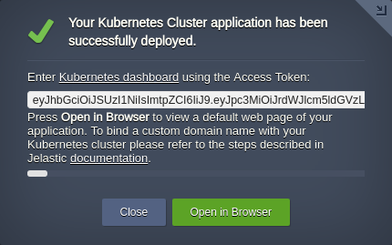
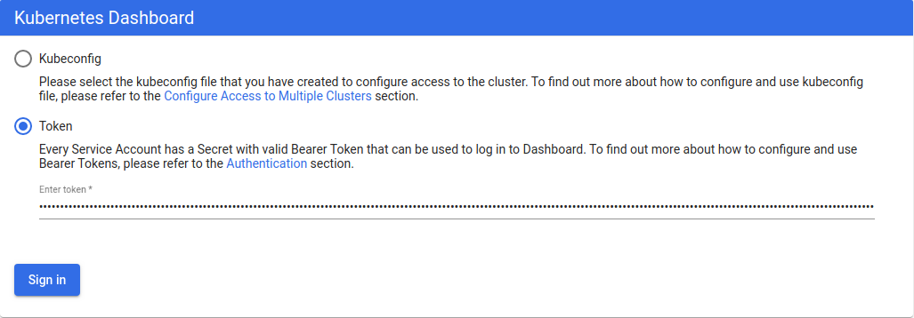
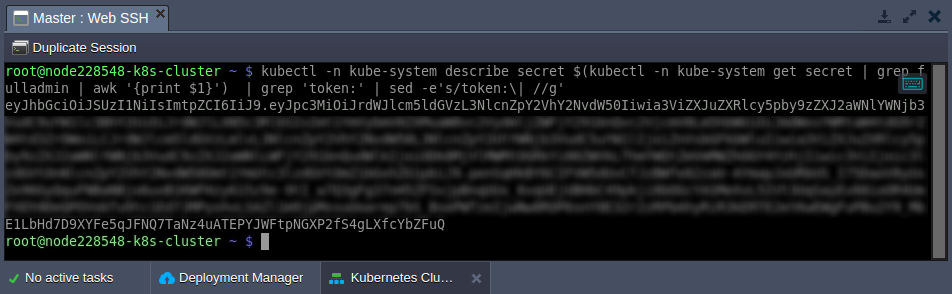
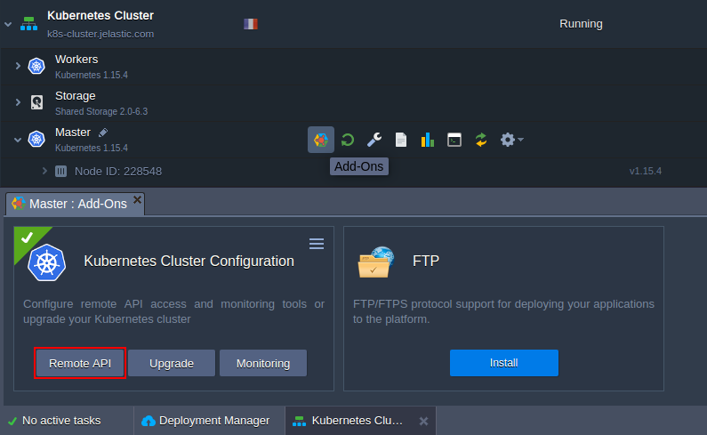
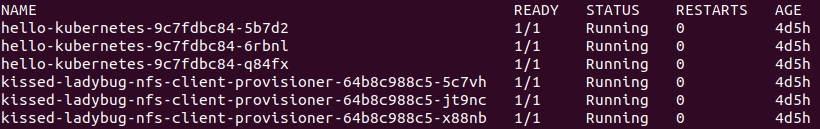

# Kubernetes Cluster Access

After the successful [installation of a cluster](/kubernetes-cluster-installation/), there are multiple ways to access it to start management:

* [Kubernetes Dashboard](#kubernetes-dashboard)
* [kubectl client](#kubectl-client)


### Kubernetes Dashboard

1\. The after installation pop-up provides all the necessary data to connect to the Kubernetes Dashboard - link and access token.



The same information is also provided via the appropriate email notification.

2\. Follow the link, select the **Token** option, and paste the required value.



{}**Tip:** It is also possible to log in with the ***kubeconfig*** file; however, you'll need to install *kubectl* and set the right context (see the [section](#kubectl-client) below).{}

3\. If you've lost an email with the Kubernetes cluster access token, it can be viewed by executing the following command on the master node (e.g. via [Web SSH](/web-ssh-client/)):

```
kubectl -n kube-system describe secret $(kubectl -n kube-system get secret | grep fulladmin | awk '{print $1}') | grep 'token:' | sed -e's/token:\| //g'
```



Now, you can access the Kubernetes Dashboard once again.


### Kubectl Client

**[Kubectl](https://kubernetes.io/docs/tasks/tools/install-kubectl/)** is a command-line tool to control a Kubernetes cluster. The platform automatically installs it on all master nodes during the environment creation. You can start working with your cluster using *kubectl* right away, just connect to the required node [over SSH](/ssh-access/).

1\. Follow the [installation steps](https://kubernetes.io/docs/tasks/tools/install-kubectl/) to use a local *kubectl*. Next, run a command to establish remote connection:

```
kubectl config set-cluster jelastic --server={api-endpoint} && \
kubectl config set-context jelastic --cluster=jelastic && \
kubectl config set-credentials user --token={token} && \
kubectl config set-context jelastic --user=user && \
kubectl config use-context jelastic
```

Replace the ***{api-endpoint}*** and ***{token}*** placeholders with the Remote API URL and access token respectively.

{}**Tip:** If you haven't enabled **Remote API** during installation, it can be done via the in-built add-on available for the master nodes in the platform dashboard.

{}

2\. You can check if *kubectl* has access to the cluster with the following command:

```
kubectl get pods
```



You should see information about pods in the default namespace.


## What's next?

* [Kubernetes Overview](/kubernetes-cluster/)
* [K8s Access Control](/kubernetes-access-control/)
* [K8s Cluster Troubleshooting](/kubernetes-troubleshooting/)
* [K8s Cluster Upgrade](/kubernetes-upgrade/)


