# Kubernetes Cluster: Velero Backups

**[Velero](https://velero.io/)** is an open-source backup and restoration tool for Kubernetes cluster disaster recovery. It also supports the migration of cluster resources and persistent volumes backup. Manual or scheduled backups to the external storage ensure your data safety and protection.

You can leverage Velero to achieve the following tasks:

- Back up your Kubernetes cluster or selected resources / persistent volumes and restore in case of cluster data loss.
- Replicate a whole Kubernetes cluster (e.g. create a development / testing instance based on the production one) or migrate selected resources to other clusters.

You can easily integrate Velero backups with the Kubernetes cluster on the platform. Just follow the simple steps below:

1\. Start by organizing the S3-compatible storage, which Velero will use to store your backups. For example, you can use *AWS S3*, *VHI S3*, or *MinIO cluster*.

In our guide, we'll proceed with the latter option so that you can have the whole setup under the same platform. You can install the ***[MinIO Cluster](https://www.virtuozzo.com/company/blog/s3-minio-cloud-storage-cluster-in-containers/)*** at the platform in a few clicks using the Marketplace (follow the steps in the linked guide).

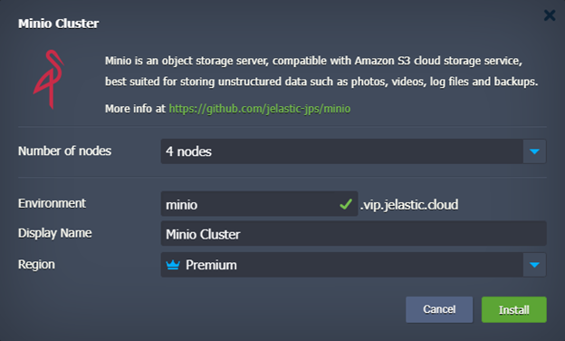

After the installation, you'll see your MinIO installation credentials (also sent via email). You'll need this data later on:

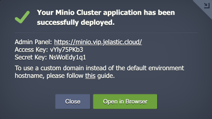

Waiting for the first server to format the disks.

2\. Connect to admin panel of your MinIO cluster and create a new bucket (e.g. *velero*) in the storage cluster.

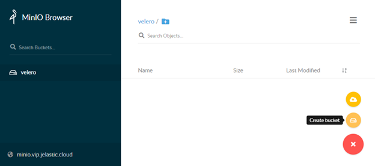

3\. Find the latest ***vmware-tanzu/velero*** [release](https://github.com/vmware-tanzu/velero/releases) (*v1.8.1* in our case), click the link in the *Download* section and copy the URL to the ***linux amd64*** archive.

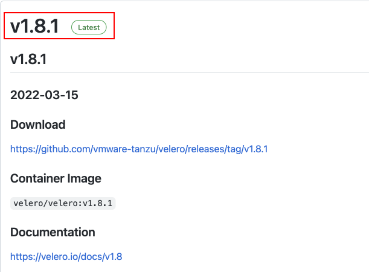

{}**Tip:** In our example, we’ll upload the *velero* binary to the Kubernetes Cluster server directly. However, you can keep it anywhere (e.g. locally) with the API access to the cluster.{}

4\. Connect to your Kubernetes Cluster control plane via SSH (e.g. [Web SSH](/web-ssh-client/)). Download the archive using the link from the previous step and extract the ***velero*** binary to the **/usr/local/sbin** directory.

```
wget https://github.com/vmware-tanzu/velero/releases/download/v1.8.1/velero-v1.8.1-linux-amd64.tar.gz
tar -zxvf velero-v1.8.1-linux-amd64.tar.gz -C /usr/local/sbin --strip-components=1 velero-v1.8.1-linux-amd64/velero
```

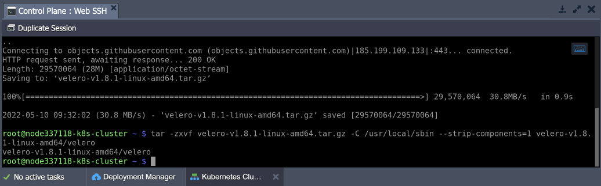

{}**Note:** If uploading via the [file manager](/configuration-file-manager/), you'll need to adjust the file permissions:

```
chmod 755 /usr/local/sbin/velero
```
{}

5\. Create the ***/root/credentials-velero*** file and put the S3 storage credential (see the first step):

```
[default]
aws_access_key_id = {accessKey}
aws_secret_access_key = {secretKey}
```

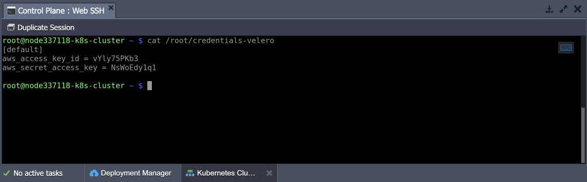

6\. Adjust the command below by providing the correct values and execute it to deploy Velero. The following placeholders need adjustment:

- ***{bucket}*** - a name of the bucket (*velero* in our case, see the second step)
- ***{s3Url}*** - an **http://** link to your S3 storage (*http\://minio.vip.jelastic.cloud/* in our case, see the first step)
- ***{image}*** - a velero container image (*velero/velero:v1.8.1* in our case, see the third step)

```
velero install --provider aws --plugins velero/velero-plugin-for-aws:v1.4.1 --bucket {bucket} --secret-file ./credentials-velero --use-volume-snapshots=true  --backup-location-config region=default,s3ForcePathStyle="true",s3Url={s3Url} --image {image} --snapshot-location-config region="default" --use-restic
```

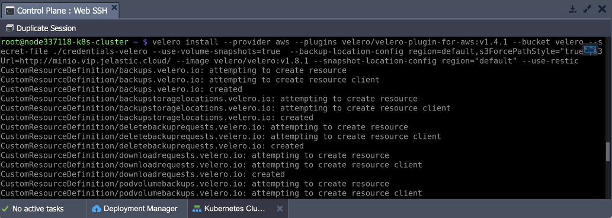

We use AWS emulation to work with S3 and ***[restic](https://restic.net/)*** add-on since we have NFS storages for which we don't have a native snapshot functionality.

7\. Let's deploy a test application with storage and mounts to test how Velero can perform backups. We'll use the following example application:

```
wget https://www.virtuozzo.com/application-platform-docs/kubernetes-velero-backups/test-instance.yaml
kubectl apply -f test-instance.yaml
```

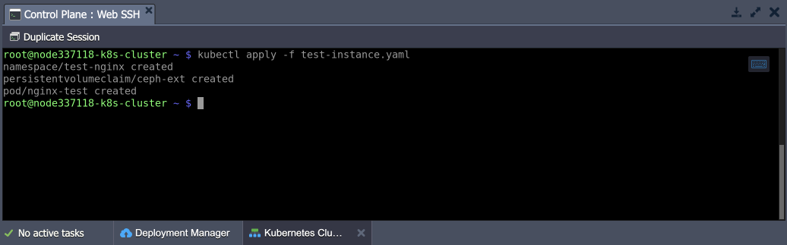

You can check the application with the following command:

```
kubectl get pods,pvc,pv -n test-nginx
```

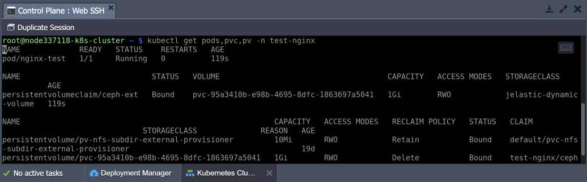

Execute the commands listed below to generate some random data that will emulate application usage.

```
kubectl -n test-nginx exec -it nginx-test -- /bin/bash
dd if=/dev/urandom of=/usr/share/nginx/html/test-file3.txt count=512000 bs=1024
ls -laSh /usr/share/nginx/html/
exit
```

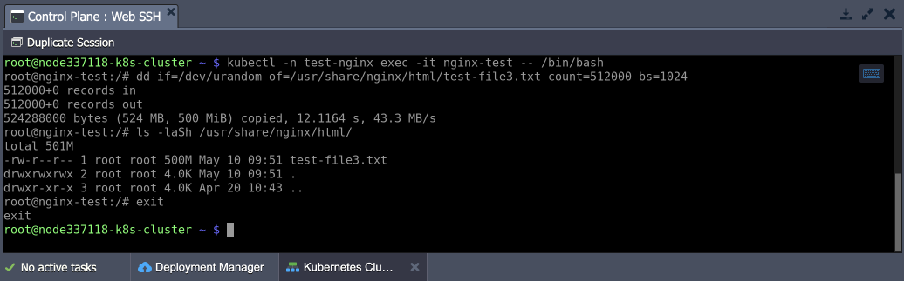

8\. You need to annotate your application pods to ensure the NFS storage data is included in the backup. You can get the required storage name from the deployed application (*mystorage* in our case).

{}**Note:** Without the annotation, [PV and PVC](https://kubernetes.io/docs/concepts/storage/persistent-volumes/) definitions are copied but not the data.{}

```
kubectl -n test-nginx annotate pod/nginx-test backup.velero.io/backup-volumes=mystorage
```

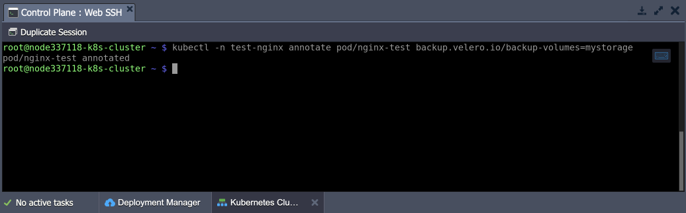

9\. Now, let’s create a backup of your test application:

```
velero backup create test-nginx-b4 --include-namespaces test-nginx --wait
```

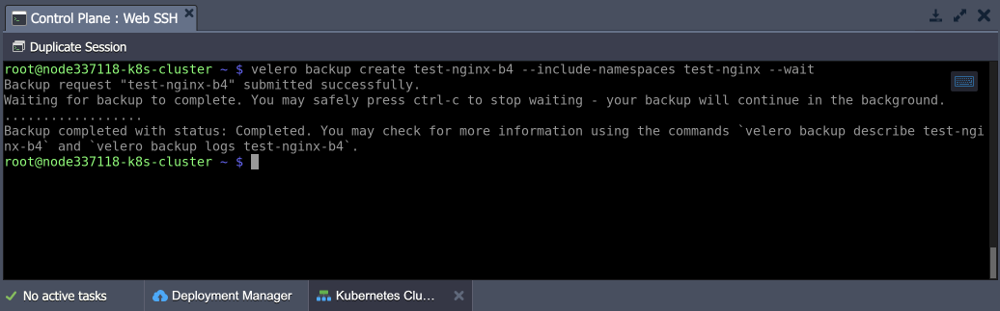

10\. Check your *MinIO* storage. The data from *Velero* and *restic* should be present.

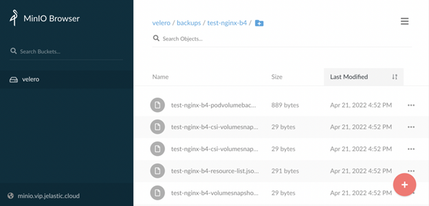

Also, check that the created backup exists and is fine.

```
velero get backups
```

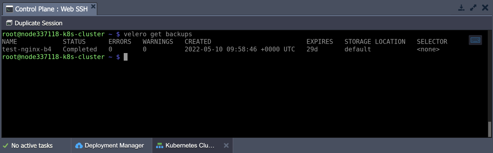

11\. Let’s completely remove the example application to test the restoration process properly.

```
kubectl delete ns test-nginx
```

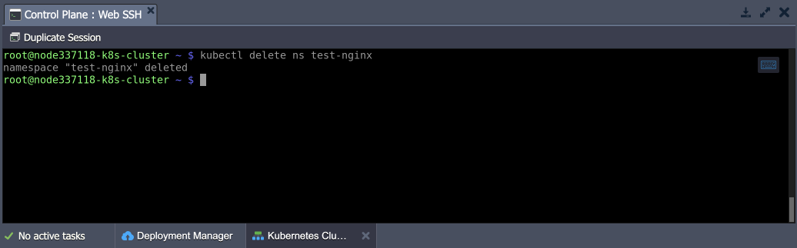

Clean up the Shared Storage data (in the **/data** directory) as well.

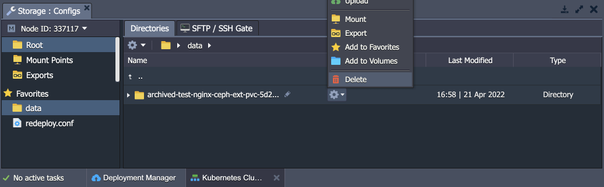

12\. Once ready, restore your application from the backup with the following command:

```
velero restore create --from-backup test-nginx-b4
```

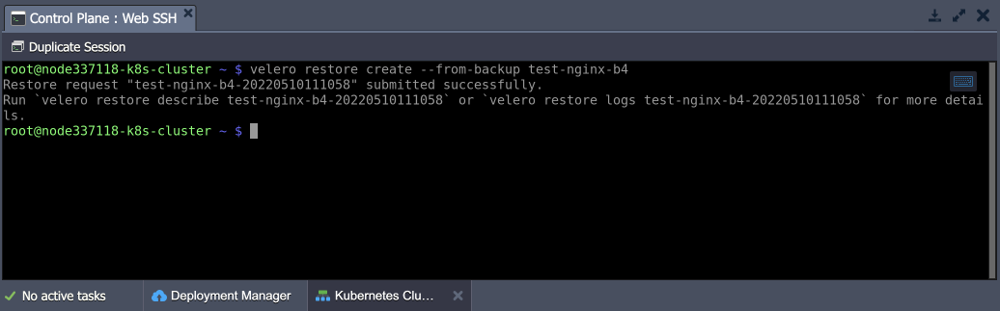

That’s it! You can verify that everything, including stored data, is restored.


## Backup Scheduling

Velero supports backup process automation through scheduling. You can create the required schedule template via *cron* notation (using the UTC timezone). The general syntax is the following:

```
velero schedule create {scheduleName} --schedule="{schedule}"
```

1\. Use the table below as a reference to set the required schedule using a standard cron expression:

**Character Position**|**Character Period**|**Acceptable Values**
---|---|---
1|Minute|0-59,\*
2|Hour|0-23,\*
3|Day of Month|1-31,\*
4|Month|1-12,\*
5|Day of Week|0-7,\*

For example, to create a backup every six hours:

```
velero schedule create myschedule --schedule="0 */6 * * *"
```

2\. The schedule can also be expressed using the ***@every {duration}*** syntax. The duration can be specified using a combination of *seconds (s)*, *minutes (m)*, and *hours (h)*.

For example, to create a backup every six hours:

```
velero schedule create myschedule --schedule="@every 6h"
```

3\. You can add additional scheduling options (to back up a specific namespace, set backups lifetime, etc.) via dedicated parameters. Use the ***help*** flag to view the complete list of parameters:

```
velero schedule create --help
```

Congratulations! Now you know how to automatically back up your Kubernetes projects with Velero.


## What's next?

* [K8s Cluster Access](/kubernetes-cluster-access/)
* [K8s Access Control](/kubernetes-access-control/)
* [K8s Cluster Troubleshooting](/kubernetes-troubleshooting/)
* [K8s Cluster Upgrade](/kubernetes-upgrade/)
* [Kubernetes Cluster Scaling](https://www.virtuozzo.com/company/blog/scaling-kubernetes/)