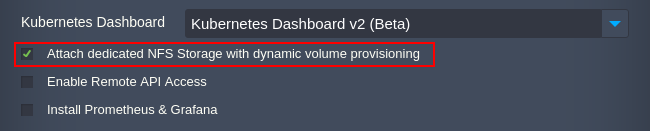
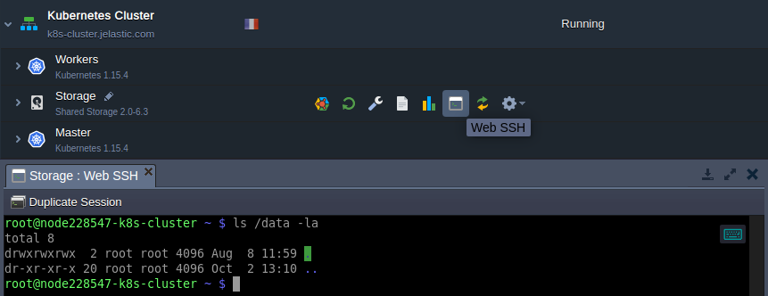

# Kubernetes Cluster: Volume Provisioner

**Kubernetes Cluster** implements persistent data with the help of *[Persistent Volumes](https://kubernetes.io/docs/concepts/storage/persistent-volumes/)* (PV) and *[Persistent Volume Claims](https://kubernetes.io/docs/concepts/storage/persistent-volumes/#persistentvolumeclaims)* (PVC). **PV** is storage provisioned by an administrator, which is similar to Volumes but with lifecycle independent of any individual pod. **PVC** is a request for the PV storage with a specific size and access mode.

The platform allows automatically configure NFS volume provisioner during [installation](/kubernetes-cluster-installation). Such a solution automatically provision a persistent volume each time PVC is created. Thus, there is no need to set up PVs with desired *AccessMode* or *[StorageClass](https://kubernetes.io/docs/concepts/storage/persistent-volumes/#class)* manually.

{}**Tip:** The platform implementation of the NFS volume provisioner for the Kubernetes Cluster package uses a dedicated [Shared Storage Container](/shared-storage-container). You can find it in the environment topology.

The ***jelastic-dynamic-volume*** is a default *StorageClass* in Kubernetes Cluster. Herewith, all data is stored in the **/data** directory.{}

## What's next?
* [K8s Helm Integration](/kubernetes-helm-integration)
* [Shared Storage Container](/shared-storage-container)
* [K8s Persistent Volume Claim](/kubernetes-persistent-volume-claim)
* [K8s Custom Storage](/kubernetes-custom-storage)

