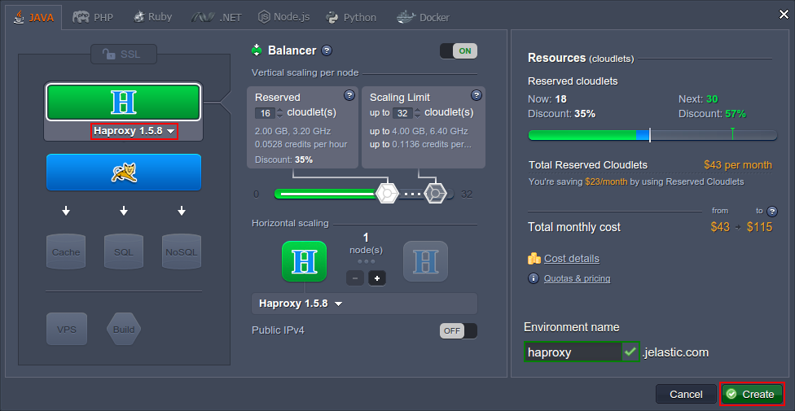
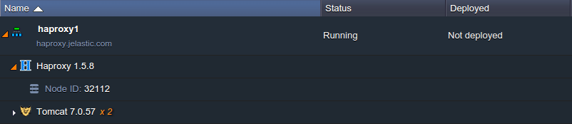
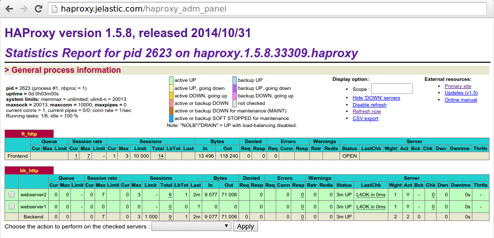
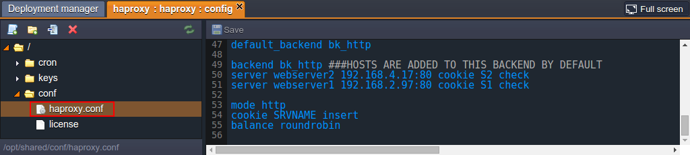
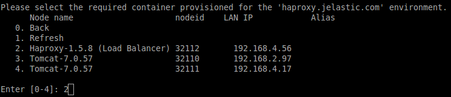

# HAProxy

**HAProxy** (which stands for *High Availability Proxy*) is a fast and reliable open-source solution, which is able to handle huge traffic and offers high availability, load balancing, and proxying for TCP and HTTP-based applications. Similar to Nginx-Balancer, it uses a single-process, event-driven model, which consumes a low (and stable) amount of memory, enabling HAProxy to process a large number of concurrent requests simultaneously, ensuring smooth load-balancing with smart persistence and DDOS mitigation.

HAProxy is focused on ensuring advanced load balancing through providing a huge array of tools and supported features to make it as fast, efficient (in RAM and CPU usage particularly) and stable as possible. Here are some key possibilities that HAProxy offers:

* back-end servers periodical check up
* advanced and custom logging
* owerful log analyzer tool (*halog*)
* full HTTP 1.1 support on both server and client sides
* graphical web interface with work statistics

{}**Note:** This template utilizes a modern ***systemd*** initialization daemon.{}

Get your own HAProxy load balancer server at the platform by following the steps below.


## HAProxy Deployment

1\. Log in to your PaaS account.

2\. Click the **New environment** button in the upper left corner of the dashboard.


3\. Load balancers work with any application server(s) and all other instances. So choose **Haproxy** within the *Balancing* section of the wizard using the corresponding drop-down list (circled in the image below):



Then select the other nodes you need for your environment and state the amount of allocated resources for each of them. Finally, type the environment name (e.g. *haproxy*) and click **Create**.

4\. Your environment will be created in a few minutes.



Now you have the installed and ready-to-work Haproxy load-balancer in front of your application and can start using it or, initially, adjust it according to your needs.


## HAProxy Configurations

As it was mentioned above, HAProxy is provided with the integrated admin panel, which can be accessed by clicking the **Open in Browser** button ({}{} ) and adding the ***/haproxy_adm_panel*** suffix to the environment URL in the browser address bar. After that, you just need to specify the balancer credentials (sent to you via email) in the appeared pop up authentication frame.



In the opened page you can see the list of your HAProxy balancer(s) and servers they are working with. Besides that, every instance is supplied with the detailed information on queues, sessions, warnings and errors, check up information and more. Some configuration actions can be done using the drop-down just under the tables.

Besides that, you can specify some additional settings in the following ways:

1\. Through the dashboard by editing the **conf > *haproxy.conf*** main configuration file.



Here, you can also link the application servers to your balancer (even from other environments) to be placed behind it. Just add the corresponding record to the **backend bk_http** section in the following format:

```
server webserver{n} {server_intenal_ip}:80 cookie S{n} check
```

where the values inside the curly brackets should be substituted with your custom ones:

* *{n}* - preferred identifier of the linking server
* *{server_internal_ip}* - address of the required server, which can be found through selecting the **Additionally** button next to it

Once these configurations are done, **Save** the made changes and **Restart** the load-balancer server to apply them.

2\. Through accessing the appropriate HAProxy node via the platform [SSH Gateway](/ssh-access/):



We hope that you will enjoy working with the HAProxy and take advantage out of its powerful GUI to get the most out of the management possibilities that the platform provides.


## What's next?

* [Load Balancing Overview](/load-balancing/)
* [NGINX Load Balancing](/nginx-load-balancer/)
* [LiteSpeed Web ADC](/litespeed-web-adc/)
* [Varnish](/varnish/)