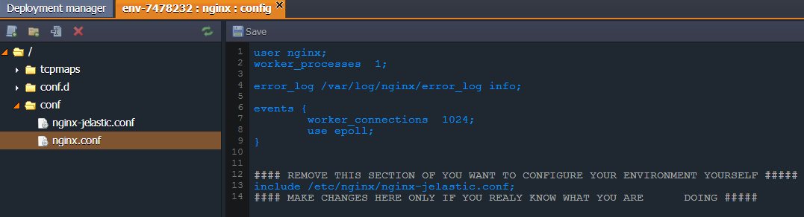
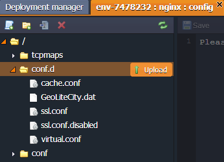
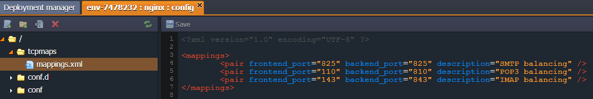

# NGINX Balancer Configuration

The following NGINX configuration files are available:

Folder|File|Path
---|---|---
[conf](#conf)|nginx.conf|/etc/nginx
[conf.d](#confd)||/etc/nginx/conf.d
[tcpmaps](#tcpmaps)|mappings.xmlf|/etc/nginx/tcpmaps

NGINX balancer is automatically added if you choose several app servers.

## CONF

For performing necessary configurations for NGINX balancer the ***nginx.conf*** file, located in **conf** folder, is used.

{}[Back to the list](#back){}

## CONF.D

With access to NGINX configs you can not only edit the existing files but also upload your own config files with custom settings to the **conf.d** folder.

{}[Back to the list](#back){}

## TCPMAPS

The **tcpmaps** folder contains the ***mappings.xml*** file where you can set the redirection of the TCP balancing ports. There you need to specify the pair of ports: one to listen to and the other to redirect to.

You can find more information in the [NGINX Load Balancing](/nginx-load-balancer/) and [TCP Load Balancing](/tcp-load-balancing/) documents.

To set [caching in NGINX](/nginx-caching/) click on the link and follow the instruction.

{}[Back to the list](#back){}

## What's next?

* [Load Balancing](/load-balancing/)
* [Caching in NGINX](/nginx-caching/)
* [Memcached Configuration](/memcached-configuration/)
* [Custom Error Page Settings via NGINX Balancer](/custom-error-page/)