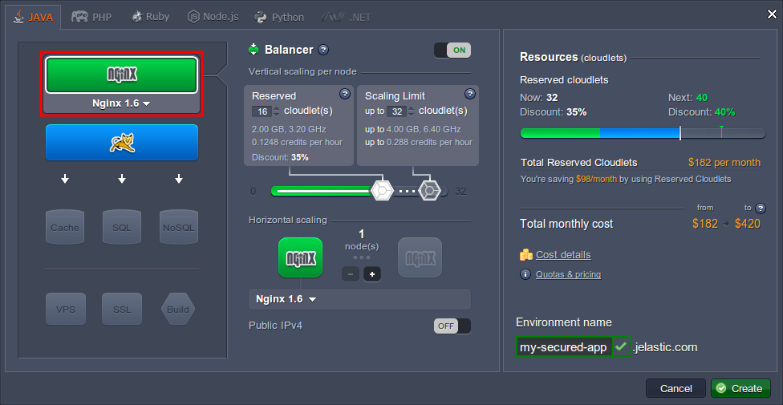
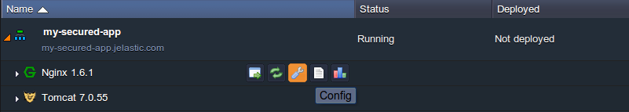
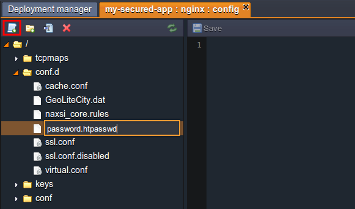
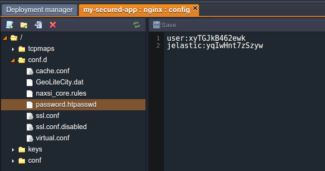
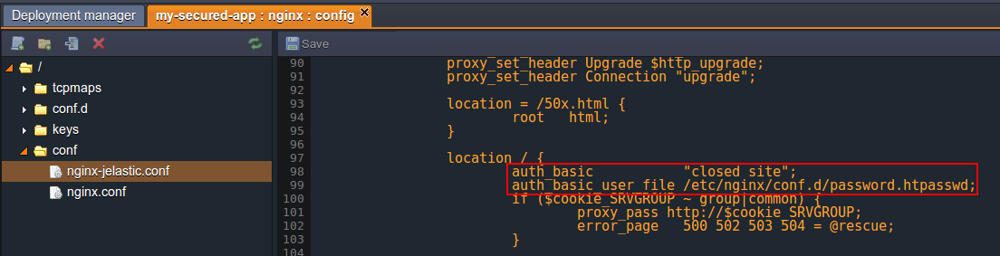
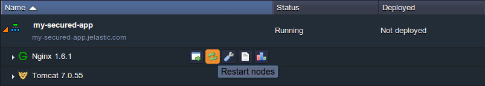
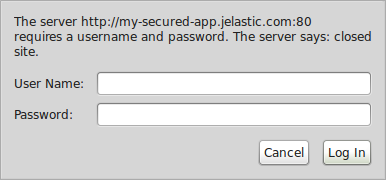
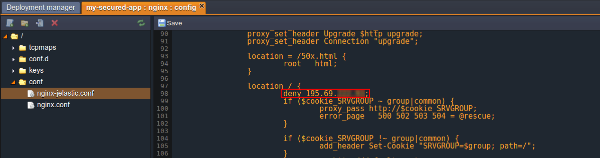
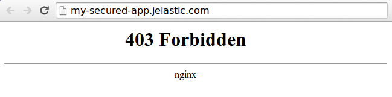
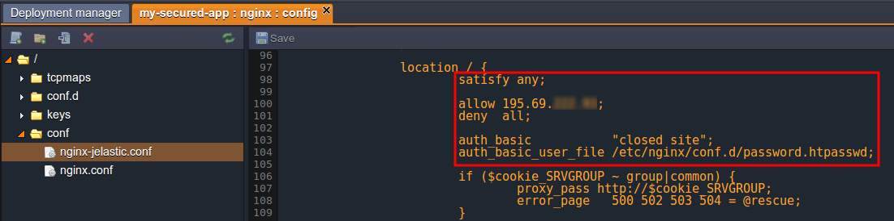

# Basic Security for Applications with NGINX Balancer

{}{}

As the amount of information shared through the internet is growing from year to year, as well as adoption of the Web as a mean for doing business, the protection of websites and web applications becomes one of the major Internet security issues. The obvious response to this is implementation of plenty of prevention tools. But before rushing to integrate some complex and/or costly protection solution, consider a few common security methods, as sometimes the most basic security becomes the most efficient one.

So, in this guide we'll show you how to set a couple of simple protection mechanisms, that are available for any application that uses **NGINX balancer** as a frontend, and which applying doesn't require any additional costs.

Primarily the NGINX load balancer server is intended for performing the smart requests distribution between multiple application server nodes and thus ensuring high system availability and reliability. Herewith, it can be used for processing both HTTP and TCP traffic types (details can be found within the [HTTP Load Balancing](/load-balancing/) and [TCP Load Balancing](/tcp-load-balancing/) docs).

Load balancing node is automatically added to an environment if you pick up more than one application server node, and in addition, it can be added manually even for a single server. To do this, just select the *Balancing* wizard block above the chosen application server in the **Environment Topology** window.



Now when the environment is ready, you can proceed to configuring the desired protection method using the instructions below:

* [Authentication](#authentication) makes application access protected with a password
* [IP Address Deny](#ip-address-deny) mechanism is used to forbid application access from a particular IP

We'll also pay the attention to the way of [combining](#methods-combination) the abovementioned methods for being used simultaneously. So, let's find out how to implement this to your environment. Here we go!


## Authentication

Authentication is a simple but powerful method to restrict application access and ensure that an unauthorised entity won't be able to cause any harm to it. In this example, we'll show you how to set up username/password protection.

1\. Obviously the password information can not be stored in an open form, so it needs to be protected itself. For that you need to generate a hash, based on the desired username and password using any *htpasswd* tool or one of the similar online services (for example, [http://www.htpasswdgenerator.net/](http://www.htpasswdgenerator.net/)).

2\. Save the character sequence you've received and switch back to the platform dashboard with your environment listed. There click the **Config** button for the **NGINX balancer** node.



3\. You'll see the **Configuration Manager** tab opened, wherein you need to create a **New file** (using the same-named button at the tools panel) inside the **conf.d** folder. Set any desired name for it but obligatory with the ***.htpasswd*** extension (e.g. *password.htpasswd*).



4\. After this is done, paste the hash that you've received at the first instruction step to the file's content. Remember that you can add as many accounts as you need (just don't forget to place every next one from a new line).



**Save** the changes when all the settings are done.

5\. Then choose the ***nginx-jelastic.conf*** file inside the **conf** folder and find the *location* block in the first *server* code section. Paste there the following lines in order to enable the authentication and apply the appropriate access rules:

```nginx
auth_basic           "closed site";  
auth_basic_user_file /etc/nginx/conf.d/{htpasswd_file};  
```

where ***{htpasswd_file}*** - name of the file you've inserted the hash with password(s) to (in our case this file is ***password.htpasswd***).



{}**Note:** that usually we recommend to modify the configurations in the ***nginx.conf*** file and keep the ***nginx-jelastic.conf*** one's content as the default/backup settings. But in this case, since the required changes are rather simple and we are pretty sure that we know what we are doing, it will be easier to work directly with the ***nginx-jelastic*** file.{}

6\. **Save** the changes you've made one more time and **Restart** the NGINX balancer node.



7\. Now when trying to **Open** your application **in Browser**, you (and any other client) will need to pass through the authentication window before accessing the application.



After the appropriate credentials (i.e. the ones you've generated the hash from) are specified, your application will be opened.


## IP Address Deny

If you suddenly notice some harm is caused to your application by a particular user, you can stop him by means of blocking any requests that are sent from that user's IP address and thereby deny your application access. This can be easily done by following the steps below.

1\. Open the platform dashboard with your environment and click the **Config** button for the **NGINX balancer** node.


2\. Click on the ***nginx-jelastic.conf*** file in the **conf** folder within the opened **Configuration Manager** tab. Then find the location block inside the first server code section and paste the following line there:

```nginx
deny {IP_ADDRESS};
```

where ***{IP_ADDRESS}*** - obviously the address you want to block the ability to open your application for.



{}**Notes:** 
* You can also set this parameter value to *all*, which means that no one will be able to access your application. In this case, it might be useful to specify one more *allow* directive here, that is used to define the IP address (or range of addresses) you'd like to grant the access for
* In case the above proposed simplified construction did not work for you (since this can be caused by specific configurations at a particular Platform), you can try the following one instead:
```nginx
if ($http_x_forwarded_for ~* {IP_ADDRESS}) {  
  return 403;
}
```
{}

3\. **Save** the changes and **Restart** your NGINX node using the appropriate buttons.


4\. As a result, a user with the denied IP address will be faced the *403 Forbidden* error while trying to access your application.




## Methods Combination

To combine both restriction by IP address and authentication methods implementation, you'll need to use the *[satisfy](http://nginx.org/en/docs/http/ngx_http_core_module.html#satisfy)* directive. By default (i.e. if not visibly declared in the configuration) it is set to **all**, which means that a user should meet both types of conditions to be granted access. If you specify this directive inside your configuration file and set its value to **any**, a user will be able to open the application if at least one condition is satisfied. Here is an example of such a configuration:



Thus, an unauthenticated user will be granted access if his IP address is listed among the allowed ones. Or, users with the denied IP addresses still will be able to access the website if they enter a valid username and password.

So, now you know a few basic ways to protect your app by granting the access permissions to the trusted users only, as well as denying it to the untrusted and possibly dangerous ones. Remember that spending some time on increasing your application's security now can save you a lot of time and money later and regardless, won't do any harm.


## What's next?

* [Tomcat Security](/tomcat-security/)
* [Jetty Security](/jetty-security/)
* [Apache Security](/apache-security-configurations/)
* [NGINX-PHP Security](/nginx-security-configurations/)