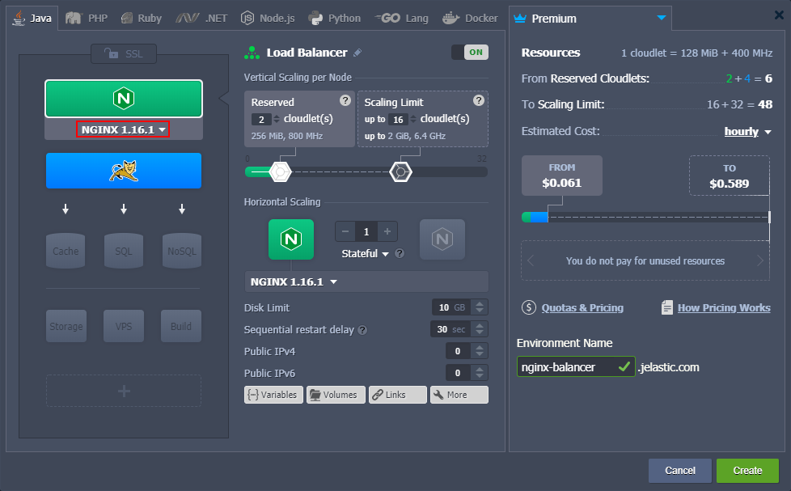
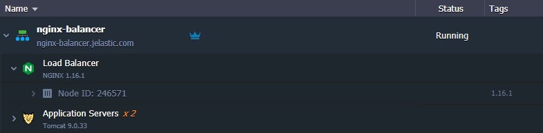

# NGINX Load Balancer

{}The *NGINX balancer* stack is [HTTP/3](/http3/) ready with the feature support enabled by default since the *1.16.1* release. However, a [public IP address](/public-ip/) is required to bypass the Shared Load Balancer and work directly with the server over HTTP/3.{}

**[NGINX](http://nginx.org/en/)** is an open-source TCP/UDP, HTTP, and reverse proxy server. It is one of the most popular solutions for load balancing in the world, which provides customers with high performance and efficient resource usage. The modular architecture of NGINX ensures personalized customization that can support all of the customers' needs, including such features as:

* generic proxying of TCP and UDP
* serving static files, auto-indexing
* accelerated reverse proxying with caching
* 3xx-5xx error codes redirection
* SSL and TLS SNI support
* access control, fault tolerance, and more

Load balancing with NGINX is suitable for most of the cases due to its scalability, security, reliability, and cost-efficiency. Creating a new NGINX-based load balancer is a straightforward process at the platform.

1\. Log in to the dashboard and click the **New Environment** button at the top-left corner.

2\. Within the automatically opened topology wizard, select **NGINX** at the *Balancing* section (circled in the image below). If a load balancer is added to the environment with the application server(s), all the required configurations to distribute requests among available instances will be applied automatically.

Next, you need to set the desired configurations for your NGINX balancer ([cloudlets](/cloudlet/), disk space, [IP addresses](/public-ip/), etc.), add any other needed stacks (e.g., application servers or databases), and click **Create**.

3\. Wait a moment for the platform to set up the environment for you.

Congrats, your NGINX load balancer is ready to work! Now, you can proceed to its configuration.

## What's next?

* [NGINX Balancer Security Configs](/nginx-balancer-security/)
* [TCP Load Balancing](/tcp-load-balancing/)
* [Testing Load Balancing](/testing-load-balancing/)
* [Caching in NGINX Balancer](/nginx-caching/)