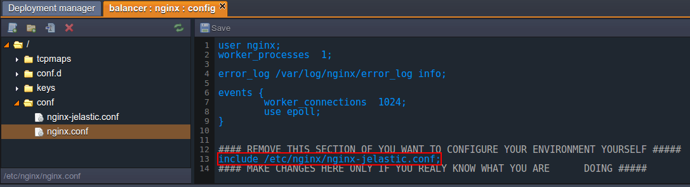

# How to Test Load Balancing

When your project becomes highly demanded and visited, you face a problem - necessity to increase your hardware productivity, as it should be able to handle and rapidly serve all the incoming users' requests. Adding more resources will temporarily improve the situation, saving your server from the failure, but won't solve the root issue. And this results in the need to set up a [clustering solution](/cluster-in-cloud/) with an embedded automatic load balancing.

Application cluster adjusting is quite easy with the platform - just add a few more application server instances to your environment [via the topology wizard](/horizontal-scaling/). In addition, you'll automatically get the NGINX-balancer server enabled in front of your project. It will be responsible for the even load distribution among the stated number of app server nodes, performed by virtue of the [load balancing](/load-balancing/).


In such a way, your application performance grows significantly, increasing the number of requests that can be served at one time. As a nice bonus, you decrease the risks of app inaccessibility, since if one server fails, all the rest continue working.

In order to prove this scheme is that efficient, we'll show you how to perform the load balancing testing with the help of [ApacheBench (ab)](https://httpd.apache.org/docs/2.4/programs/ab.html) tool. It provides a number of possibilities for testing the servers' ability to cope with the increasing and changeable load. Though ab was designed for Apache installations testing, it can be used to benchmark any HTTP server.

So, let's get started and test it in real time.


## Create an Environment and Deploy the Application

1\. Log into the platform and click the **Create environment** button in the upper left corner of the dashboard.


2\. The **Environment topology** dialog window will instantly appear. Here you can choose the desired programming language, application/web server and database.

As we are going to test the **Apache PHP** server loading, select it and specify the resource usage limits by means of cloudlets sliders. Then attach the **Public IP** address for this server and type the name of a new environment (e.g. *balancer*). Click **Create**.


3\. In just a minute your environment will appear at the dashboard.


4\. Once the environment is successfully created, you can deploy your application to it. Here we'll use the default **HelloWorld.zip** package, so you just need to **Deploy** it to the desired environment with the corresponding button and confirm the deployment in the opened frame.


## Control Point Testing

To analyze the results you'll need something to compare them with, so let's make a control point test, using the created environment with just a single application server node. 

As it was mentioned above, we'll use the *ApacheBench (ab)* tool for these purposes. It can generate a single-threaded load by sending the stated number of concurrent requests to a server. 

So, follow the steps below.

1\. ApacheBench is a part of standard Apache source distribution, so if you still don't have it, run the following command through your terminal (or skip this step if you do).  
```bash
apt-get install apache2-utils
```

Wait until the installation is successfully completed.  

{}**Note:** Detailed information about all the further used ab commands can be found by following [this link](https://httpd.apache.org/docs/2.4/en/programs/ab.html).{}

2\. Enter the next line in the terminal:  
```bash
ab -n 500 -c 10 -g res1.tsv {URL_to_your_env}
```

Substitute the *{URL_to_your_env}* part with a link to your environment (e.g. *<span>https</span>://balancer.jelastic.com/* in our case). In order to get it, click the **Open in Browser** button next to your environment and copy the corresponding URL from the browser's address bar.


The specified command will send the total amount of 500 requests to the stated environment, which are divided into the packs of 10 concurrent requests at one time. All the results will be stored in the *res1.tsv* file inside your **home** folder (or enter the full path to the desired directory if you would like to change the file location).   

Also, you can specify your custom parameters for the abovementioned command if you want.


This test may take some time depending on the parameters you've set, therefore be patient.

3\. The created file with results should look like the image below:


## Change the Environment Configuration

1\. Return to the platform dashboard and click **Change environment topology** for your *balancer* environment.


2\. Within the opened **Environment topology** frame, add more application servers (e.g. one more Apache instance) - use the **+** button in the *Horizontal scaling* wizard section for that. Then enable the **Public IP** feature and state the resource limits for the automatically added **NGINX-balancer** node, as it becomes the entry point of your application. Click **Apply** to proceed.


3\. When all of the required changes are successfully applied, you should disable the sticky sessions for the balancer server. Otherwise, all the requests from one IP address will be redirected to the same instance of the application server.

Therefore, click the **Config** button next to the Nginx node.


4\. Navigate to the **conf &gt; nginx-jelastic.conf** file. It's not editable, so copy all its content and paste it to the **nginx.conf** file (located in the same folder) instead of *include /etc/nginx/nginx-jelastic.conf;* line (circled at the following image).



5\. Then, find two mentions of the *sticky path* parameter in the code (in the *DEFAULT UPSTREAM* and *UPSTREAMS LIST* sections) and comment them as it is shown below.


{}**Note:** Don't miss the closing curly braces after those *sticky path* strings, they should be uncommented.{}

6\. **Save** the changes applied and **Restart** the NGINX server.


## Testing Balancer and Compare Results

Now let's proceed directly to [load balancing](/load-balancing/) testing.

1\. Switch back to your terminal and run the **ab** testing again with the same parameters (except the file with results - specify another name for it, e.g. *res2.tsv*).
```bash
ab -n 500 -c 10 -g res2.tsv {URL_to_your_env}
```


2\. In order to clarify the obtained results, we'll use the freely distributed **gnuplot** graphs utility. Install it (if you haven't done this before) and enter its shell with a *gnuplot* command.


3\. After that, you need to set up the parameters for our future graph:
```
set size 1, 1
set title "Benchmark testing"
set key left top
set grid y
set xlabel 'requests'
set ylabel "response time (ms)"
set datafile separator '\t'
```


4\. Now you're ready to compose the graph:
```
plot "/home/res1.tsv" every ::2 using 5 title 'single server' with lines, "/home/res2.tsv" every ::2 using 5 title 'two servers with LB' with lines
```

This *plot* command will build 2 graphs (separated with comma in the command body). Let's consider the used parameters in more detail:  
    
* *"/home/resN.tsv"* represents paths to the files with your testing results
* *every ::2* operator defines that gnuplot will start building from the second row (i.e. the first row with headings will be skipped)
* *using 5* means that the fifth *time* column (the total response time) will be used for graph building
* *title 'N'* option sets the particular graph name for the easier separation of the test results
* *with lines* is used for our graph to be a solid line


You'll get an automatically created and opened image similar to the following:


Due to the specified options, the red graph shows the performance of a single **Apache** server without balancer (control point testing results) and the green one - of two servers with **NGINX** load balancer (the second testing phase results).

{}**Note:** The received testing results (response time for each sent requests) are shown in the ascending order, i.e. not chronologically.{}
 
As you can see, while serving the low load, both configurations' performance is almost the same, but as the number of requests is increasing, the response time for an environment with a single app server instance grows significantly, what results in serving less requests simultaneously. So, if you are expecting a high load for your application server, increasing the number of its instances in a bundle with a balancer server will be the best way to keep your customers happy.

Enjoy all the advantages of the Cloud!


## What's next?

* [TCP Load Balancing](/tcp-load-balancing/)
* [Caching in NGINX Balancer](/nginx-caching/)
* [NGINX Balancer Configuration](/nginx-balancer-config/)