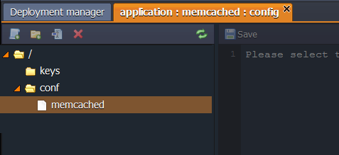
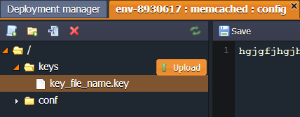

# Memcached Configuration

The following Memcached configuration files are available:

Folder|File|Path
---|---|---
[conf](#conf)|memcached|/etc/sysconfig
[keys](#keys)||/var/lib/jelastic/keys

More information about Memcached usage you can find in the [Memcached](/memcached/) document.

## CONF

The main Memcached configuration file is located in the **conf** folder.

## KEYS

The **keys** directory is used as a location for uploading any private key which is needed for your application.  
Generate the key, save it as a simple file and upload to the **key** folder.  
 Now you can use it for different cases by simply stating the path to your key: 

 */var/lib/jelastic/keys/{key_file_name}* 
 

## What's next?
* [Memcached System](/memcached/)
* [Session Replication via Memcached](/replication-memcached/)
* [PHP Sessions Clustering](/php-sessions-memcached/)
* [Maven Configuration](/maven-configuration/)