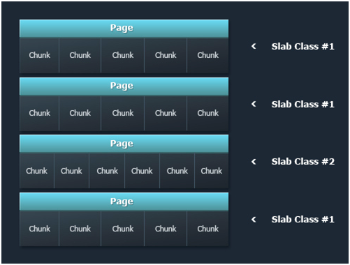
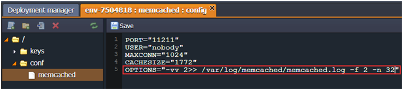

# Memcached Memory Allocation

**Memcached**, system of the distributed memory caching, is often used to increase the performance and availability of the hosted application through decreasing database load. It creates a common cache for all the application nodes and represents your application short-term memory.

Let's find out how the **memory allocation** in Memcached works and in what way can we get rid of memory fragmentation while using the platform.

Memcached system uses the **slab** instead of the item-by-item memory allocation. As a result it improves the usage of the memory and protects it from the fragmentation in case the data expires from the cache.

Each slab consists of several 1 MB size pages and each page, in its turn, consists of the equal amount of blocks or chunks. After every data storing the Memcached defines the data size and looks for a suitable allocation in all slabs. If such allocation exists, the data is written to it. If there is no suitable allocation, the Memcached creates a new slab and divides it into the blocks of the necessary size. In the case you update the already stored item and its new value exceeds the size of the block allocation it was stored in before, Memcached moves it to another, suitable slab.


As a result, every instance has multiple pages distributed and allocated within the Memcached memory. This method of allocation prevents the memory fragmentation. But on the other hand it can cause the waste of memory if you have not enough amount of items with equal allocation size, i.e. there are only a few filled chunks in every page. Thus one more important point is the distribution of the stored items.

With the platform, you get a possibility to modify the slab growth coefficient right during your application is running. For that click the **Config** button next to the Memcached node, navigate to the **conf** directory and open ***memcached*** file. Edit it, e.g. in the following way:

*OPTIONS="-vv 2&gt;&gt; /var/log/memcached/memcached.log -f 2 -n 32"*


In this example ***-f 2*** specifies that you will see 14 slabs with doubled size of chunks, and the value after the ***-n*** defines the minimum space allocated for the key, flags and value.

We've got the following results:

* **Chunk details:**
```
#  Item_Size  Max_age   Pages   Count   Full?  Evicted Evict_Time    OOM
3     320B       550s       1     113     yes        0        0       0
4     640B       681s       1     277     yes        0        0       0
```

* **Memory usage:**
```              
total          used        free      shared    buffers     cached
Mem:           128          84         43          0          0         70
-/+ buffers/cache:          14        113
Swap:            0            0
```

Now let's enter the default settings again and check what values we'll get:

*OPTIONS="-vv 2&gt;&gt; /var/log/memcached/memcached.log"*

* **Chunk details:**
```
#  Item_Size  Max_age   Pages   Count   Full?  Evicted Evict_Time OOM
5     240B       765s       1      27     yes        0        0     0
6     304B       634s       1      93     yes        0        0     0
7     384B       634s       1     106     yes        0        0     0
8     480B       703s       1     133     yes        0        0     0
9     600B       634s       1      57     yes        0        0     0
```

* **Memory usage:**
```              
total       used       free     shared    buffers     cached
Mem:           128         87         40          0          0         70
-/+ buffers/cache:         17        110
Swap:            0          0          0
```

Also you can add the ***-L*** parameter to increase the memory page size and in such a way reduce the number of TLB misses and improve the performance.

Thanks to this easy and straightforward optimization we can improve the usage of the allocated memory.


## What's next?
* [Memcached System](/memcached/)
* [Session Replication via Memcached](/replication-memcached/)
* [PHP Sessions in Memcached](/php-sessions-memcached/)