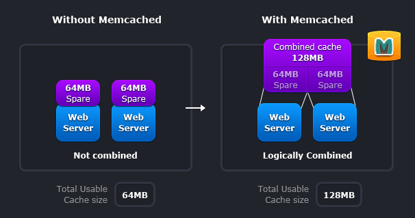
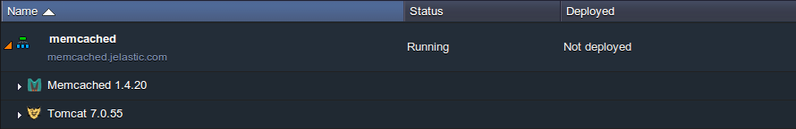

# Memcached Caching System

**[Memcached](http://memcached.org/)** is a free & open source, high-performance, distributed memory object caching system, generic in nature, but intended for use in speeding up dynamic web applications by alleviating database load.

You can think of it as a short-term memory for your applications.

**Memcached's APIs** provide a giant hash table distributed across multiple machines. When the table is full, subsequent inserts cause older data to be purged in least recently used order. Applications using Memcached typically layer requests and additions into RAM before falling back on a slower backing store, such as a database.

The system uses a client server architecture. The servers maintain a key-value associative array; the clients populate this array and query it. Keys are up to 250 bytes long and values can be at most 1 megabyte in size.

**Memcached** also allows you to make better use of your memory.

The given scheme represents two deployment scenarios:

* **Without Memcached** - in this case each node is completely independent.
* **With Memcached** - in this case each node can make use of memory from other nodes.

**The first** scenario illustrates the classic deployment strategy, however you'll find that it's both wasteful in the sense that the total cache size is a fraction of the actual capacity of your web farm, but also in the amount of effort required to keep the cache consistent across all of those nodes.

**With Memcached**, you can see that all of the servers are looking into the same virtual pool of memory. This means that a given item is always stored and always retrieved from the same location in your entire web cluster.

Also, as the demand for your application grows to the point where you need to have more servers, it generally also grows in terms of the data that must be regularly accessed. A deployment strategy where these two aspects of your system scale together just makes sense.

To get **Memcached** in your environment, simply:

1\. Log into the platform dashboard.

2\. Click **Create Environment**.

3\. In the **Environment Topology** dialog, pick your application server (for example, **Tomcat**). Switch on **Memcached**. Scale it vertically. Then type your environment name, for example, *memcached*, and click **Create**.

That's all you need to do! Now, Memcached is available in your environment.

## What's next?

* [Memcached Memory Allocation](/memcached-memory-allocation/)
* [Memcached Configuration](/memcached-configuration/)
* [Session Replication via Memcached](/replication-memcached/)
* [PHP Sessions in Memcached](/memcached-php-sessions/)