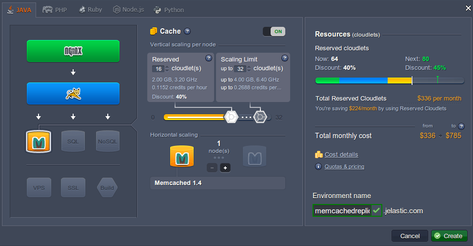
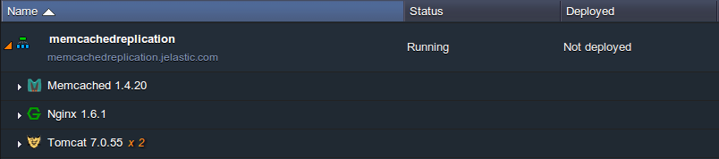
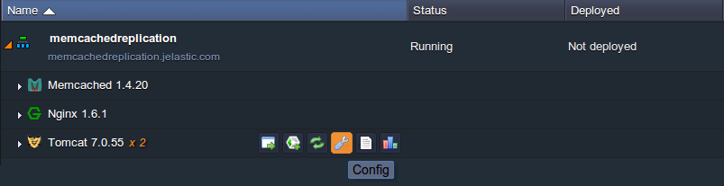
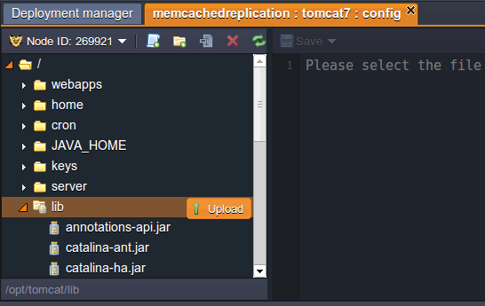
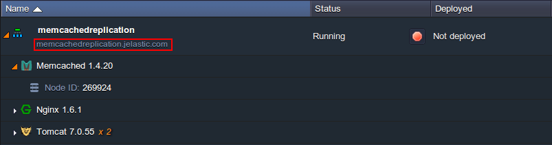

# Session Replication via Memcached

The platform provides [Session Replication](/session-replication/) between instances of web-servers with a help of multicast. But also you can use **Session Replication via Memcached**.

To use memcached for session replication follow this instruction.


## Create Environment

1\. Log into the PaaS account.

2\. Click **Create environment**.

3\. In the **Environment topology** window choose two or more servers you want to use (for example, two instances of **Tomcat**) and **Memcached** node. Type the name of the environment (for example, *memcachedreplication*) and click **Create**.



4\. In a minute your environment will be created.




## Configure application server

1\. Download .jar file of [Memcached session manager](http://code.google.com/p/memcached-session-manager/). As the example we used [memcached-session-manager-1.6.2 ](http://code.google.com/p/memcached-session-manager/).

Also download [memcached-session-manager-tc7-1.6.2.jar](http://code.google.com/p/memcached-session-manager/downloads/detail?name=memcached-session-manager-tc7-1.6.2.jar), [spymemcached-2.8.4.jar](http://code.google.com/p/spymemcached/downloads/detail?name=spymemcached-2.8.4.jar), [msm-kryo-serializer-1.6.1.jar](http://code.google.com/p/memcached-session-manager/downloads/detail?name=msm-kryo-serializer-1.6.1.jar&can=2&q=), [kryo-1.03.jar](http://code.google.com/p/memcached-session-manager/downloads/detail?name=kryo-1.03.jar&can=2&q=), [reflectasm-0.9.jar](http://code.google.com/p/memcached-session-manager/downloads/detail?name=reflectasm-0.9.jar&can=2&q=), [kryo-serializers.jar](https://mvnrepository.com/artifact/de.javakaffee/kryo-serializers), [joda-time.jar](https://repo1.maven.org/maven2/joda-time/joda-time/1.5.2/joda-time-1.5.2.jar) and [minlog-1.2.jar](http://code.google.com/p/memcached-session-manager/downloads/detail?name=minlog-1.2.jar&can=2&q=).

2\. Click **Config** for Tomcat.


 
3\. In the opened window choose **lib** folder and upload the **.jar** file you've just downloaded.



4\. Choose **server** folder and open **context.xml** file.

5\. Update **context.xml** so that it contains the Manager configuration for the memcached-session-manager, like this:
```xml
<Context path="" docBase="ROOT">
 <Manager className="de.javakaffee.web.msm.MemcachedBackupSessionManager"
   memcachedNodes="n1:host:11211"
   requestUriIgnorePattern=".*\.(png|gif|jpg|css|js)$"
   sessionBackupAsync="false"
   sessionBackupTimeout="100"
   copyCollectionsForSerialization="false"
   transcoderFactoryClass="de.javakaffee.web.msm.serializer.kryo.KryoTranscoderFactory"
   customConverter="de.javakaffee.web.msm.serializer.kryo.JodaDateTimeRegistration"
   />
</Context>
```

You can use any other [serialization strategy](http://code.google.com/p/memcached-session-manager/wiki/SerializationStrategies) according to your needs, in our case we use [Kryo](http://code.google.com/p/kryo/), an extremely fast binary serialization library.


6\. In the string ***memcachedNodes*** add your memcached **host** and default **port** (*11211*). In our case we have:

*n1:memcached-memcachedreplication.jelastic.com:11211*

In order to get your memcached host, simply add the '*memcached-*' prefix to your environment hostname (which is displayed in a string just under the name of your environment).

 

7\. **Save** the changes and **Restart** your server node (in our case Tomcat).

That's all. Now your have a high available cluster with all the advantages of **Memcached**.


## What's next?

* [Memcached Configuration](/memcached-configuration/)
* [Memcached Memory Allocation](/memcached-memory-allocation/)
* [PHP Sessions in Memcached](/memcached-php-sessions/)