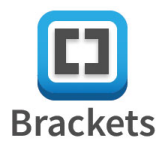
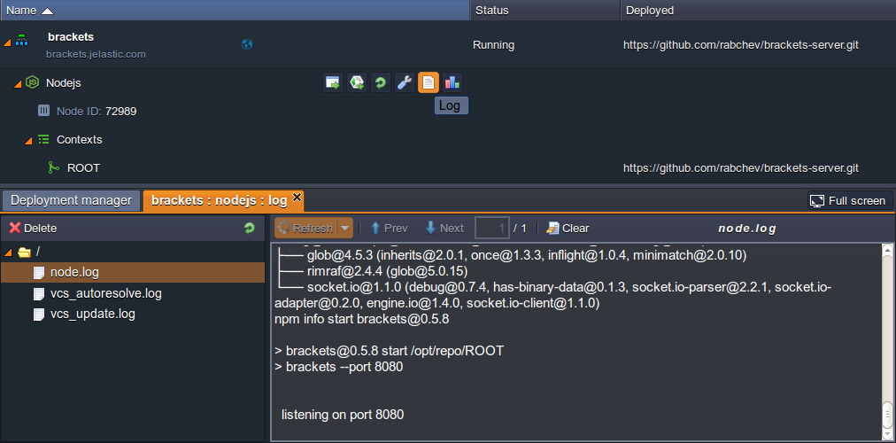

# How to Install Brackets

{}{}
**Brackets** is an open source code editor for web designers and front-end developers. It can be loaded directly in a web browser and does not require any additional installations or browser extensions, providing significant convenience for web development. The main Brackets benefit is the live HTML development feature, which means that all HTML changes are instantly pushed to a browser without the necessity to save the changes or reload the page. And since Brackets is an open source project, it grows and develops quickly - new features and extensions appear every few weeks.

This editor is both visually attractive and powerful, so we believe you'll enjoy writing code within Brackets, whilst this tutorial will help you to host it at the platform through following the next steps:

* [create an environment](#create)
* [deploy Brackets via GitHub](#deploy)
* <a id="create" href="#launch">launch the application</a>


## Create an Environment

1\. Click the **New environment** button at the dashboard once you've logged in to your PaaS account.


2\. Proceed to creating a **Node.js** project by choosing the corresponding tab, wherein the required **NodeJS** application server will be already chosen by default. Therefore, just define its resource usage limits by means of sliders for reserved and dynamic cloudlets, type your environment name (for example, *brackets*), choose the [region](/environment-regions) for it to be located at and click **Create**.


3\. In just a minute your environment will appear at the dashboard.
<a id="deploy"></a>


## Deploy Brackets via GitHub

Once you've got the base for your own Brackets installation in the form of a suitable environment, let's deploy this code editor to it.

1\. Since Brackets is an open source project, you can find it at [GitHub](https://github.com/rabchev/brackets-server). There, you need to copy its GIT repository link with the **Copy to clipboard** button at the top pane (circled in the image below).


2\. Then, return to the platform dashboard and select the **Add project** button for your NodeJS application server.


3\. In the appeared dialog frame, switch to the **Git** tab and insert the link you've just copied to its **URL** input field. Click **Add** to proceed.


Wait a minute for your Brackets project to be built and <a id="launch"></a>deployed.


## Launch the Application

Now you need to accomplish a few small configurations in order to make Brackets work properly.

1\. Click the **Config** button for your NodeJS server.


2\. Through the opened Configuration Manager tab, navigate to the ***package.json*** file inside the **webroot/ROOT** directory and add the next strings to its *scripts* section (it starts approximately at the *69th* line):
```yaml
"start": "brackets --port 8080",
"prestart": "sudo npm install brackets -g",
```

{}**Note:** Do not miss the commas at the end of each line, otherwise the script will throw an exception.{}

3\. **Save** the changes you've made and **Restart** your NodeJS server with the appropriate button.

{}**Note:** You'll need to wait until Brackets is successfully installed before proceeding to the next steps. To see the progress, click the **Log** button for your application server and navigate to the *node.log* file in the opened tab.

Seeing *&ldquo;listening on port 8080&rdquo;* string in the log output means all of the operations are eventually done.{}

4\. Next, return to the *scripts* section in the same ***package.json*** file and delete the *prestart* line from the scripts section (this is required for avoiding repetitive Brackets re-installations during subsequent server restarts):

**Save** the changes with the appropriate button at the top pane.

5\. Once all these actions are completed, you can run your application with the **Open in browser** button next to your environment.


Congrats! You've just hosted your own Brackets editor with the help of the platform.


Your application is completely ready-to-work, so you can start coding immediately (if you are familiar with this editor), or explore it initially if this is your first time of using Brackets. Good luck!
{}
If you face any issues while running or configuring Brackets, feel free to appeal for our technical experts' assistance at [Stackoverflow](http://stackoverflow.com/questions/tagged/jelastic).
{}


## What's next?
* [Node.js Tutorials](/nodejs-tutorials)
* [Tutorials by Category](/tutorials-by-category/)