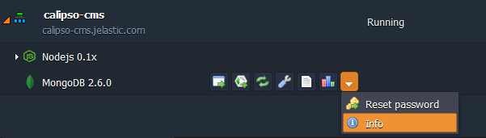

# How to Deploy Calipso CMS

**Calipso** is a free and open-source content management system (CMS), powered by Node.js. Built within modular approach, it was designed to be light-weight, flexible and fast, allowing you to easily make your site up and running. Integrated modules (such as scheduler, feed, taxonomy, etc.) give you a set of additional features, and ability to create and add your own module provides you with an outstanding extensibility.

So, let's examine the easy way to deploy Calipso CMS within PaaS Node.js hosting. Just follow the steps in the instruction below.

## Create an Environment

1\. Log into the platform dashboard within your credentials and press **Create environment** button.

2\. In the opened topology wizard navigate to the **Node.js** tab. Pick **Mongo** database in addition to the automatically added Node.js application server. State cloudlets limits for both nodes, specify environment name, and click **Create** button at the bottom of the frame.

3\. Within a seconds a new environment with the appropriate composition will appear at the dashboard. 

## Database Configurations

1\. Press **Open in browser** button next to the MongoDB server in your environment in order to access its admin panel. 

2\. Log in with credentials you've received via email after the environment creation and navigate to the **Databases** section. Click **Create new Database**.

3\. In the opened tab just specify the desired name of a new database (*calipso* in our case) and press **Create**.  

4\. Here it is! Once you've pressed **Create**, a new database appeared in the left hand list.

## Application Deployment
The easiest way to deploy a Calipso CMS is to use its source code at the GitHub. It would take just three steps:

1\. Open the [repository](https://github.com/cliftonc/calipso) and copy the **HTTPS URL** at the right.

2\. Press **Add project** button next to the Node.js server. In the opened frame paste the link you've just copied to the **URL** field and click **Add**.

3\. In a few minutes your project will be built and deployed.

## Configuring the Application
Let's perform a few configurations in order to get ability to launch our Calipso CMS.

1\. Open application server's Configuration Manager by pressing **Config** button next to it.

2\. In the opened tab at the panel below navigate to the **webroot > ROOT > conf** folder and select the ***development.json*** file.

3\. Find the **"uri"** parameter and substitute its value with the following line:  
***"mongodb://admin:{password}@{internal_IP}:27017/{DB_name}"***
where

* ***password*** - password for MongoDB *admin* user (you've received it via email)
* ***internal_IP*** - IP of the database node, can be seen at the dashboard:  

* ***DB_name*** - name of the database you've created via DB admin panel (*calipso* in our case)

4\. In the same file find the ***"url": "http://localhost:3000"*** string a little bit lower and insert your environment hostname instead of *localhost:3000* value.  
You should get something like following:

5\. **Save** the changes and **Restart** your Node.js server in order to apply them.

## Install and Run Calipso CMS

1\. Click **Open in browser** button for your environment with Calipso deployed.

2\. You'll see the installation wizard opened in a new browser tab. As you can notice, it requires an installation password:

Therefore, switch back to the platform dashboard and open Node.js **logs** by pressing the appropriate button.

3\. In the appeared tab open the ***node*** logs and copy the value inside the quotes.

Paste it to the corresponding field of Calipso installation wizard and click **Let's Start** button.

4\. On the next step of database configuring substitute the automatically pasted value in the **MongoDB URI** field with the string of the following format:  
***{DB_node_IP}:27017/{DB_name}***

Click **Create Database** button in order to proceed to the next stage.

5\. Pass through the last two wizard steps specifying the necessary data for creation of the administrator CMS account and defining the list of modules you consider to be useful in your work.   Press **Save Configuration and Install** button.

6\. Congratulations! Your Calipso CMS has been successfully installed.

For accessing the administration panel, click **Log In** link in the top right page corner. In the opened pop-up frame enter the admin user credentials you've specified in the installation wizard.

For now you can start filling your new website with the desired content. Enjoy!