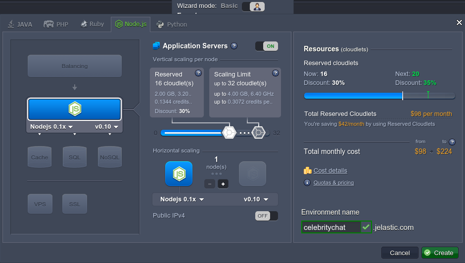
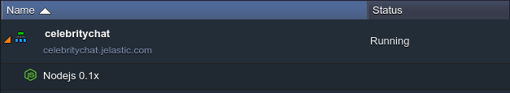
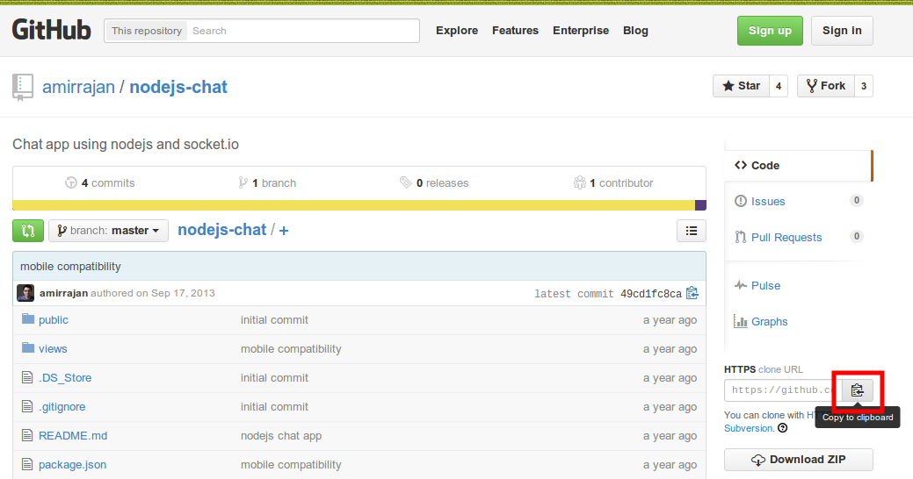
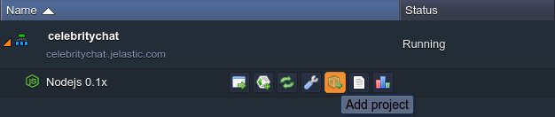
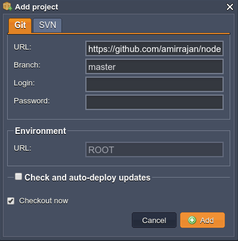
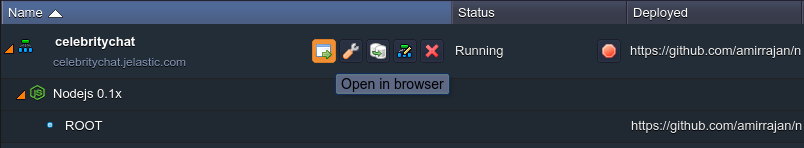
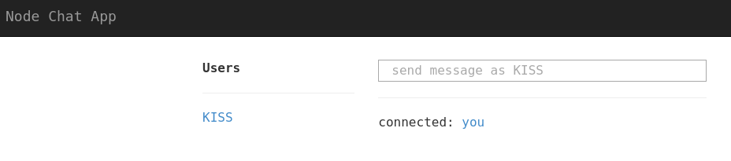

# How to Install Celebrity Chat

**Celebrity Chat** is a simple chat application, where each person that comes to the page gets assigned the name of a celebrity. You can chat with each other. Role play. Keep it PG.

This app with a fairly simple code shows the killer feature of NodeJS: websockets. It exchanges a few messages with server and client in real time. The libraries used are *express*, *ejs*, and a websockets library called *socket.io*.

Let's examine how to get the Celebrity Chat application hosted just in a few minutes with the help of the platform.

## Create an Environment

1\. Log in to the platform within your credentials and click **Create environment** button in the upper left corner.

2\. In the opened dialog box switch to the **Node.js** tab. Application server will be already chosen as the only available one, therefore determine the required resources amount for it using the cloudlets sliders, type your environment name (e.g. *celebritychat*), and click **Create** button.

3\. Your environment will be created in a minute.

## Add Project

1\. Navigate to the Celebrity Chat project at [GitHub](https://github.com/amirrajan/nodejs-chat). Click **Copy to clipboard** button at the **HTTPS** *clone URL* field.

2\. Then return to the platform dashboard and click **Add project** icon next to your NodeJS server.

3\. In the opened frame switch to the **Git** tab and fill in the **URL** text field with an HTTPS link you've just copied at GitHub.

Click **Add** button to proceed.

4\. Wait until the project is successfully added and built. Then just run the application by means of pressing **Open in Browser** icon next to your environment.

Congrats! Now you can start use your own Celebrity Chat.

Share with your friends and have fun!

## What's next?

* [Tutorials by Category](/tutorials-by-category/)
* [Node.js Tutorials](/nodejs-tutorials/)
* [Node.js Dev Center](/nodejs-center/)