# How to Deploy Cloud9 IDE

**Cloud9** is an outstanding IDE with a support of more than 40 programming languages, devoted to the applications' development in the cloud. It provides programmer with an online code-editor and a complete Ubuntu workspace, facilitating the development process with a number of available features, such as sharing your workspace with a colleague, joint development, ability to track and review all the changes in your code, pushing to the GIT repository, in-built image editor, etc.

Cloud9 use Node.js on a back-end, so, let's examine how to run it with PaaS Node.js hosting!

## Create a New Environment
To start with, let's create a new environment Cloud9 will be deployed to. 

1\. Log in to your PaaS account and click the **Create Environment** button at the dashboard's top panel in order to access the environment topology wizard.

2\. In the opened frame select the tab with **Node.js** engine. Application server will be already chosen. Therefore, just enable **Public IP** address for it and define the resource limits via cloudlet sliders in the central pane.  
Then enter a name for your environment (e.g. *cloud9*) and press **Create** button.
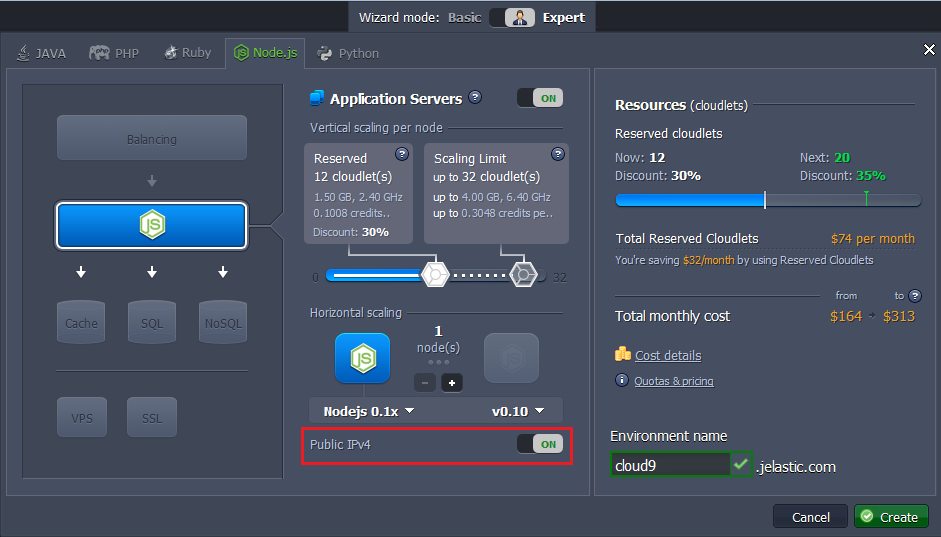

3\. In a minute or so a newly created environment will be added to the list of your environments at the dashboard.
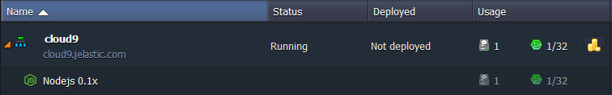

## Cloud9 Deployment
Let's proceed to the deployment itself.

1\. Cloud9 is an open-source project, therefore its source code is available at [GitHub](https://github.com/ajaxorg/cloud9). Navigate to the repository and copy the **HTTPS URL** at the right.
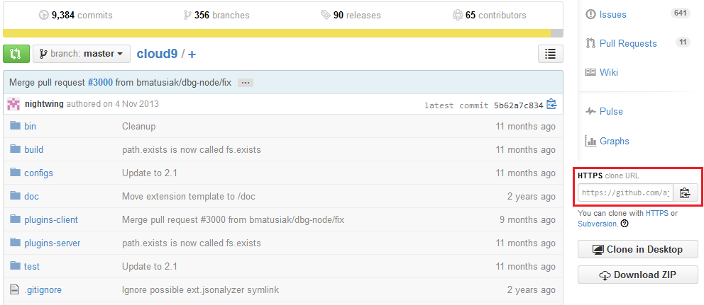

2\. Switch back to the platform dashboard and press **Add project** button next to the Node.js application server.
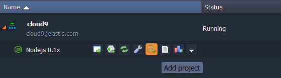

3\. In the opened frame paste the link you've copied earlier to the **URL** field. 

<table><colgroup><col width="*"></colgroup><tbody><tr><td>Don't change the *master* value in the **Branch** field.
</td></tr></tbody></table>

Press **Add** button.

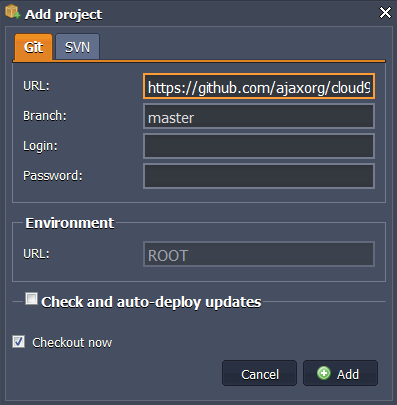

4\. Wait until the project is built and deployed. After that ***ROOT*** context for your Node.js server will appear.
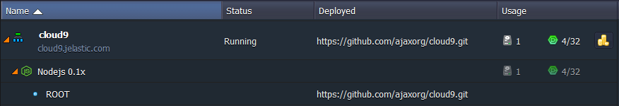

## Configure and Run Cloud9
Finally, let's configure our IDE and run it.

1\. Press **Config** button next to the Node.js server in order to access its Configuration Manager.
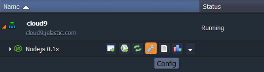

2\. In the opened tab navigate to the **webroot > ROOT > configs** folder and click on the ***default.js*** file.
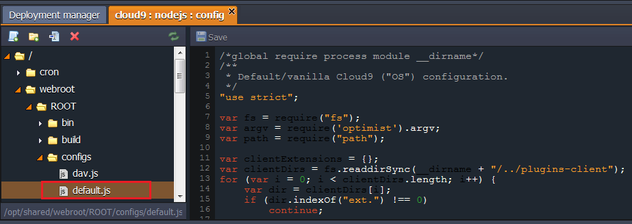

3\. Find the ***var host = argv.l || process.env.IP || "localhost";*** line and substitute the *localhost* value with the external IP you've attached to your Node.js server.

<table><colgroup><col width="*"></colgroup><tbody><tr><td>

The External IP address of a node (if attached) can be seen at the dashboard:
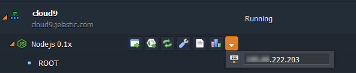
</td></tr></tbody></table>

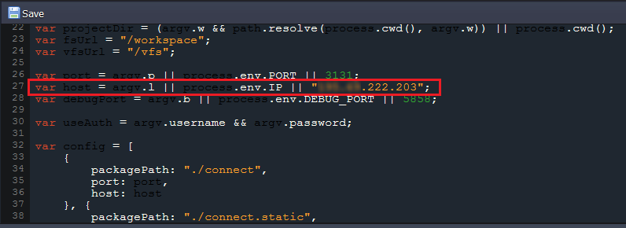

4\. **Save** the changes and **Restart** your application server.
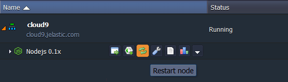

5\. Finally, click **Open in browser** next to the environment.
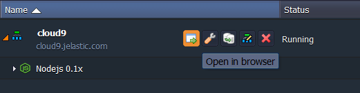

Great! Now you have your own web-integrated IDE running with the platform.
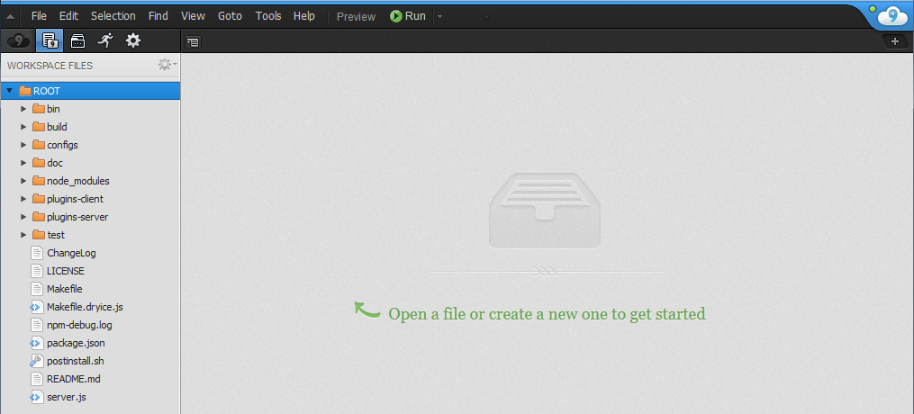

Enjoy the power of cloud computing!