# How to Install Hexo

**Hexo** is an extremely fast, simple and powerful blog framework, powered by Node.js.

This application is featured as:

* *rapid:* incredible generating speed - hundreds of files are built just in seconds;
* *extensible:* has a powerful plugins system for extending functionality;
* *customizable:* dozens of themes are available, so be sure you'll find at least one you like.

Follow the simple steps below in order to install your Hexo application to the platform.

## Create an Environment

1\. Log in to your PaaS account and click the **Create environment** button.


2\. In the opened frame, switch to the **Node.js** tab, wherein the default **NodeJS** application server will be already chosen. Therefore, specify the required amount of resources for it within cloudlet sliders in the *Vertical scaling* section, type your environment name (for example, *hexo-blog*), and click the **Create** button.

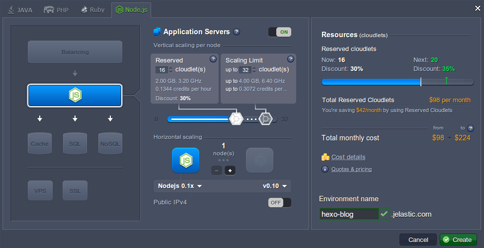

3\. The process of creation will take up to a few minutes. Once it's completed, you'll see your environment at the dashboard.

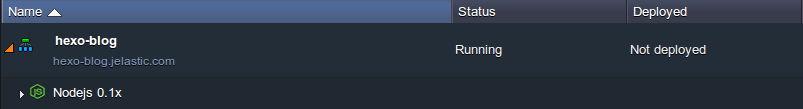


## Add Project

1\. Hexo is an open source project, therefore just visit its [page](https://github.com/hexojs/hexo)  at GitHub and copy the corresponding link in the _**HTTPS** clone URL_ section (use the highlighted button at the image below) to your clipboard.

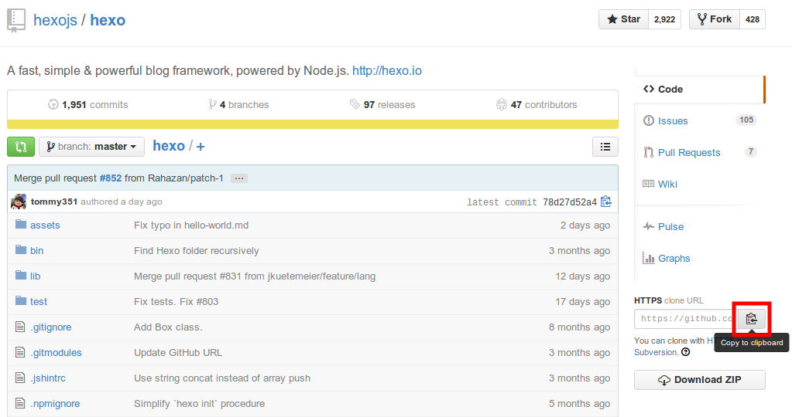

2\. Then return to the platform dashboard and click the **Add project** icon next to your NodeJS application server.

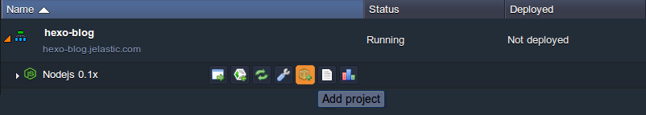

3\. In the **Git** tab of the appeared **Add project** dialog frame, paste the previously copied link to the **URL** input field.

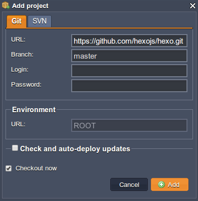

Click **Add** at the bottom of the screen and wait until your project is built and deployed.


## Configure Hexo

In order to successfully run the Hexo application, you need to install several additional modules and specify a few configurations.

1\. Click the **Config** icon for your NodeJS application server.

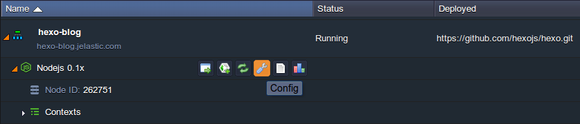

2\. Locate the ***package.json*** file in the **webroot/ROOT** directory and add the following string to its ***scripts*** section:

```
"prestart": "sudo npm install hexo -g; hexo init; npm install",
```

{}**Note:** Unusual operation of calling NPM installation inside itself stems from a desire to avoid the [SSH protocol](/ssh-gate/) usage (as its availability depends on hosting provider's settings) and, in such a way, provide all the users (i.e. no matter billing or trial) with a possibility to deploy this application.{}

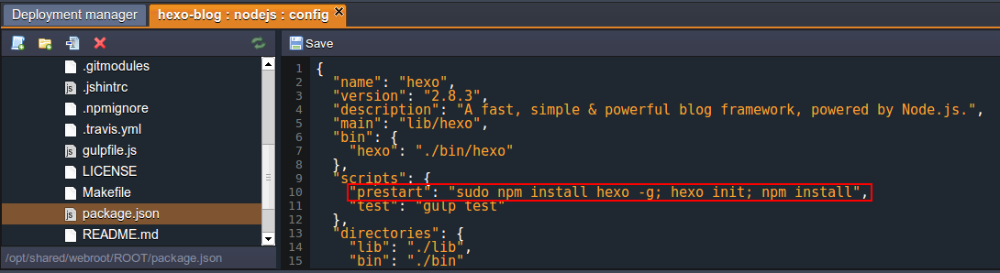

3\. **Save** the changes you've made and **Restart** the NodeJS server with the corresponding button.

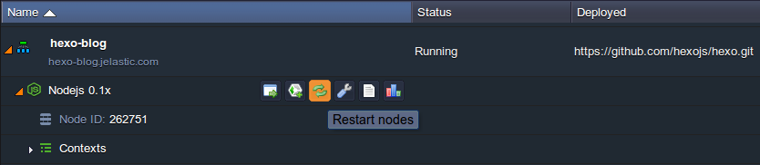

{}**Note:** You'll need to wait until the Hexo module and all the required dependencies are successfully installed and initialized. Check the progress with the help of **Logs** (use the corresponding button next to the application server):

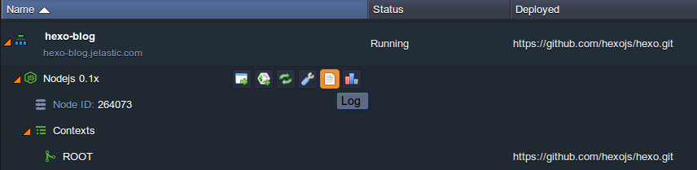

Use the **Refresh** button at the top tools panel of the appeared tab in order to track the process of initialization.

.png){}

4\. As a result of *Hexo init* command execution, some files were edited/added, thus you need to **Refresh** the list of folders in order to see these changes:

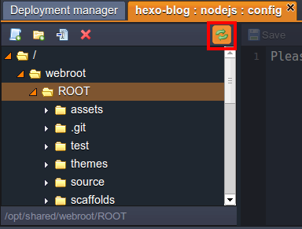

5\. Now you can find a new ***_config.yml*** file in this directory. Substitute the **url** variable's value in its **# URL** section with a link to your environment (*http://hexo-blog.jelastic.com* in our case).

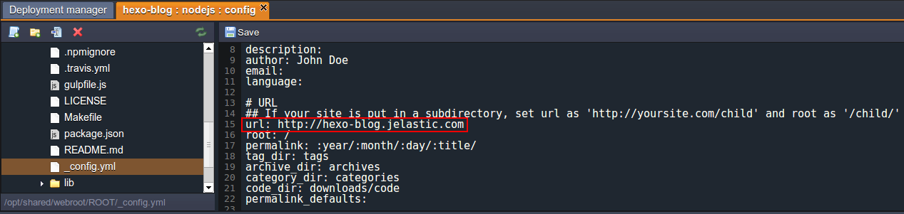

Then, scroll down to the **# Server** section and set the *port* (8080) and *server ip* (the one which is attached to your NodeJS application server) settings' values.

{}**Note:** You can find the required IP address using the gear icon at the **Node ID** line of your application server.

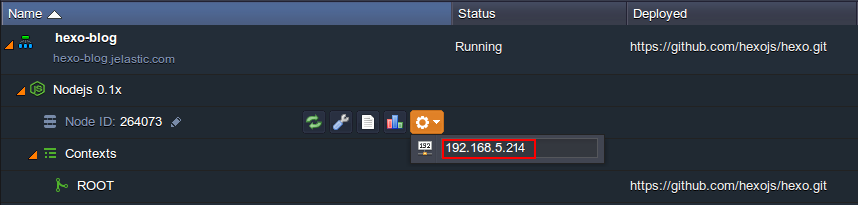
{}

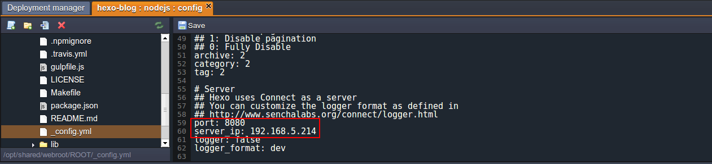

Don't forget to **Save** the new configurations!

6\. Open the ***package.json*** file again (still in the **ROOT** folder) and add the ***scripts*** section with the next options to it:

```
"scripts": {
  "start": "./bin/hexo server"
}
```

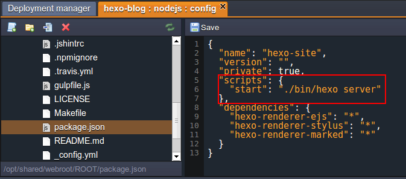

7\. **Save** changes and **Restart** the application server in the same way you did it before.


## Run Application

Finally, open your application with the help of the **Open in Browser** button, located next to your environment.

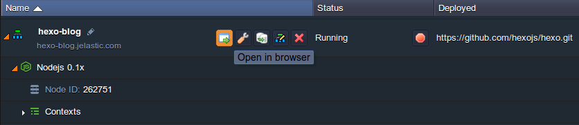

Congrats! Now you have your own Hexo blog platform, easily hosted within PaaS.

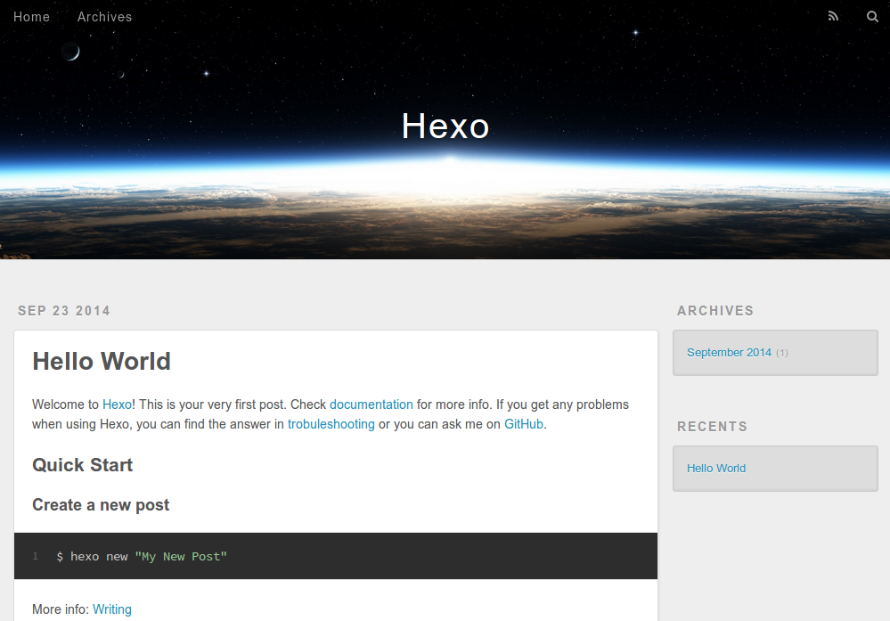

Get all the benefits of cloud hosting with the platform!


## What's next?

* [Tutorials by Category](/tutorials-by-category/)
* [Node.js Tutorials](/nodejs-tutorials/)
* [Setting Up Environment](/setting-up-environment/)